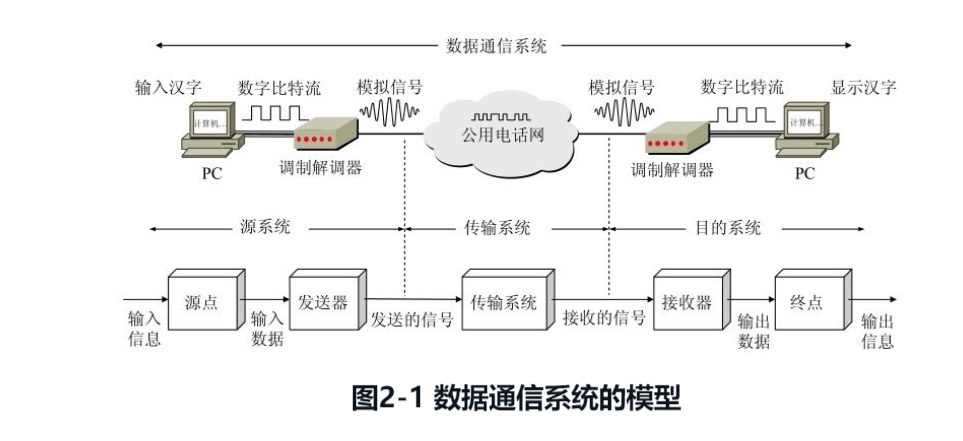

# 2.1 物理层的基本概念
{: id="20201207090109-muzpi30"}

首先要强调指出，物理层考虑的是怎样才能在连接各种计算机的传输媒体上传输数据比特流，而不是指具体的传输媒体。大家知道，现有的计算机网络中的硬件设备和传输媒体的种类非常繁多，而通信手段也有许多不同方式。物理层的作用正是要尽可能地屏蔽掉这些传输媒体和通信手段的差异，使物理层上面的数据链路层感觉不到这些差异，这样就可使数据链路层只需要考虑如何完成本层的协议和服务，而不必考虑网络具体的传输媒体和通信手段是什么。用于物理层的协议也常称为物理层规程(procedure)。其实物理层规程就是物理层协议。只是在“协议”这个名词出现之前人们就先使用了“规程”这一名词。
{: id="20201207090127-dgvwrf5"}

可以将物理层的主要任务描述为确定与传输媒体的接口有关的一些特性，即：
{: id="20201207090345-xkqigdm"}

1. {: id="20201207090417-41ajttw"}**机械特性** 指明接口所用接线器的形状和尺寸，引脚数目和排列，固定和锁定装置，等等。平时常见的各种规格的接插件都有严格的标准化的规定。
2. {: id="20201207090438-8fry0vx"}**电气特性** 指明在接口电缆的各条线上出现的电压的范围。
3. {: id="20201207090452-w65s7i1"}**功能特性** 指明某条线上出现的某一电平的电压表示何种意义。
4. {: id="20201207090503-ryd03el"}**过程特性** 指明对于不同功能的各种可能事件的出现顺序。
{: id="20201207090411-o6olxwa"}

{: id="20201207090627-n6c31ta"}

# 2.2  数据通信的基础知识
{: id="20201207090514-t5aowpq"}

### 2.2.1 数据通信系统的模型
{: id="20201207090635-bgjs8tl"}

下面我们通过一个最简单的例子来说明数据通信系统的模型。这个例子就是两个 PC 经过普通电话机的连线，再经过公用电话网进行通信。
{: id="20201207090648-cizi25g"}

如图 2-1 所示，一个数据通信系统可划分为三大部分，即**源系统**（或**发送端**、**发送方**）、**传输系统**（或**传输网络**）和**目的系统**（或**接收端**、**接收方**）。
{: id="20201207090713-zuenmn6"}

{: id="20201207090351-rdctq6n"}

{: id="20201207090830-c2mxoks"}

源系统一般包括以下两个部分：
{: id="20201207090848-vbiadj5"}

- {: id="20201207090914-jlf34pn"}**源点（source）** ：源点设备产生要传输的数据，例如，从 PC 的键盘输入汉字，PC 产生输出的数字比特流。源点又称为**源站**，或**信源**。
- {: id="20201207090946-46o2xx7"}**发送器** ： 通常，源点生成的数字比特流要通过发送器编码后才能够在传输系统中进行传输。典型的发送器就是调制器。现在很多 PC 使用内置的调制解调器。
{: id="20201207090909-lrh0c84"}

目的系统一般包括以下两个部分：
{: id="20201207091014-n8whqc2"}

- {: id="20201207091043-to9qblx"}**接收器** ： 接收传输系统传送过来的信号，并把它转换为能够被目的设备处理的信息。典型的接收器就是解调器，它把来自传输线路上的模拟信号进行解调，提取出在发送端置入的消息，还原出发送端产生的数字比特流。
- {: id="20201207091051-jy4lja8"}**终点（destination）** ： 终点设备从接收器获取传送来的数字比特流，然后把信息输出（例如，把汉字在 PC 屏幕上显示出来）。终点又称为**目的站**，或**信宿**。
{: id="20201207091038-y0qc47j"}

### 2.2.2 有关信道的几个基本概念
{: id="20201207091123-nsfwozr"}

在许多情况下，我们要使用“**信道(channel)**”这一名词。信道和电路并不等同。信道一般都是用来表示向某一个方向传送信息的媒体。因此，一条通信电路往往包含一条发送信道和一条接收信道。
{: id="20201207091216-7cjb8am"}

从通信的双方信息交互的方式来看，可以有以下三种基本方式：
{: id="20201207091211-4sc4ubw"}

**（1）单向信道（又称为单工通信）** ： 即只能有一个方向的通信而没有反方向的交互。无
{: id="20201207091250-8g51wzf"}

**（2）双相交替信道（又称为半双工通信）** ： 即通信的双方都可以发送信息，但不能双方同时发送（当然也就不能同时接收）。这种通信方式是一方发送另一方接收，过一段时间后再反过来。
{: id="20201207091340-z8vksja"}

**（3）双向同时通信（又称为全双工通信）** ： 即通信的双方可以同时发送和接收信息。
{: id="20201207091421-gnrf71g"}

{: id="20201207091707-a7tlwe9"}

# 2. 3
{: id="20201207091454-x27oexf"}
