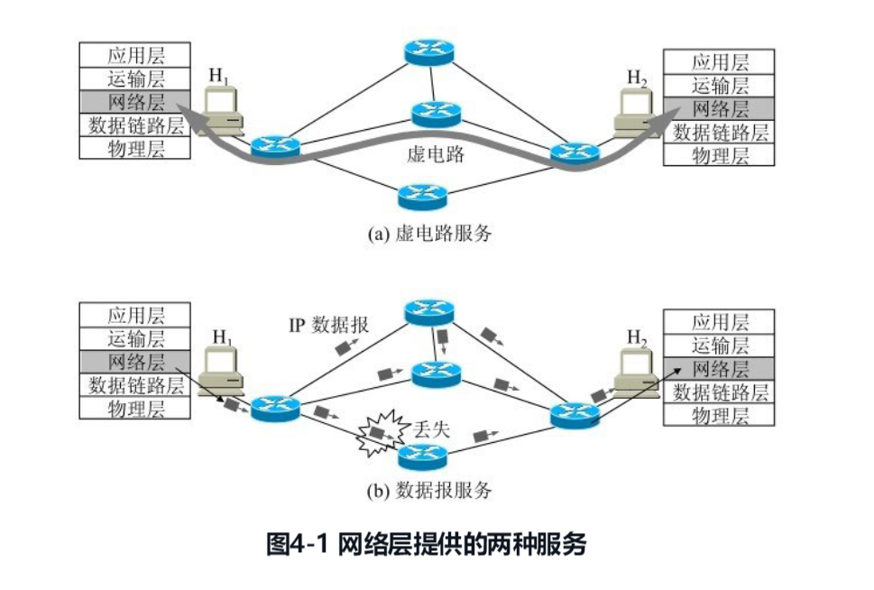
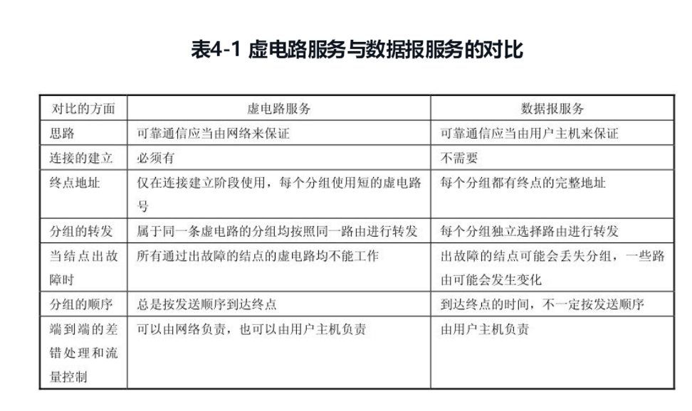
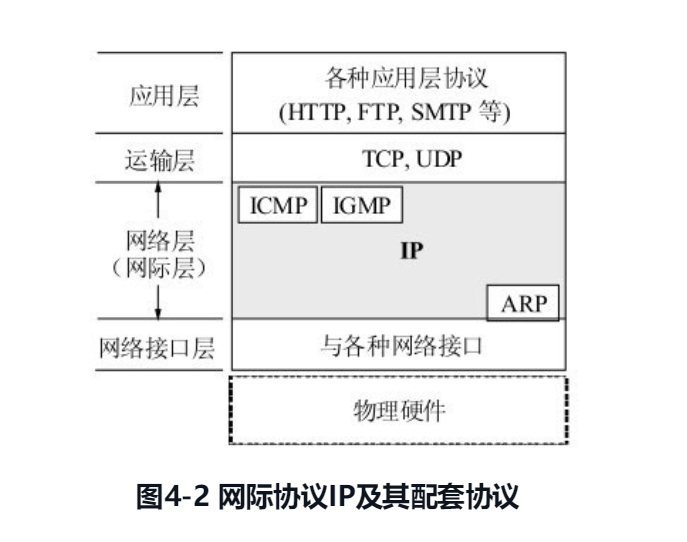

# 4.1 网络层提供的两种服务

在计算机网络领域，网络层应该向运输层提供怎样的服务（“面向连接”还是“无连接”）曾引起了长期的争论。争论焦点的实质就是：在计算机通信中，可靠交付应当由谁来负责？是网络还是端系统？

**网络层向上只提供简单灵活的、无连接的、尽最大努力交付的数据报服务**。网络在发送分组时不需要先建立连接。每一个分组（也就是 IP 数据报）独立发送，与其前后的分组无关（不进行编号）。**网络层不提供服务质量的承诺**。也就是说，所传送的分组可能出错、丢失、重复和失序（即不按序到达终点），当然也不保证分组交付的时限。

# 4.2 网际协议 IP

网际协议 IP 是 TCP/IP 体系中两个最主要的协议之一[STEV94][COME06][FORO10]，也是最重要的因特网标准协议之一。与 IP 协议配套使用的还有三个协议：

- **地址解析协议 ARP**(Address Resolution Protocol)
- **网际控制报文协议 ICMP** (Internet Control Message Protocol)
- **网际组管理协议 IGMP** (Internet Group Management Protocol)

图 4-2 画出了这三个协议和网际协议 IP 的关系。在这一层中，ARP 画在最下面，因为 IP 经常要使用这个协议。ICMP 和 IGMP 画在这一层的上部，因为它们要使用 IP 协议。这三个协议将在后面陆续介绍。由于网际协议 IP 是用来使互连起来的许多计算机网络能够进行通信，因此 TCP/IP 体系中的网络层常常称为**网际层(internetlayer)**，或 **IP 层**。

### 4.2.1 虚拟互连网络
