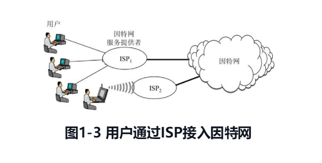
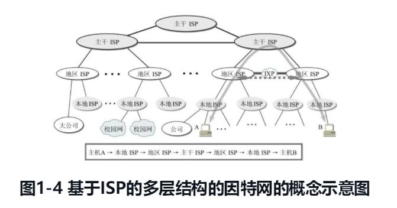
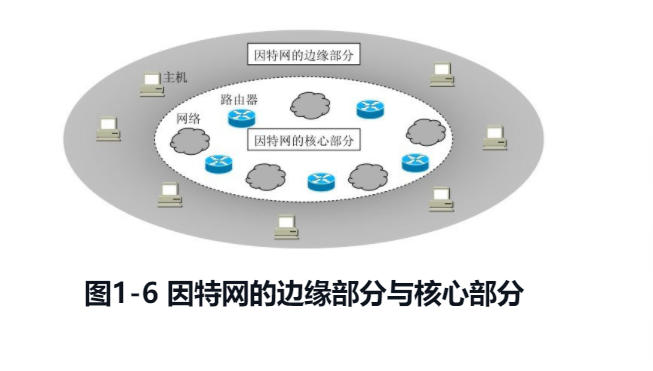
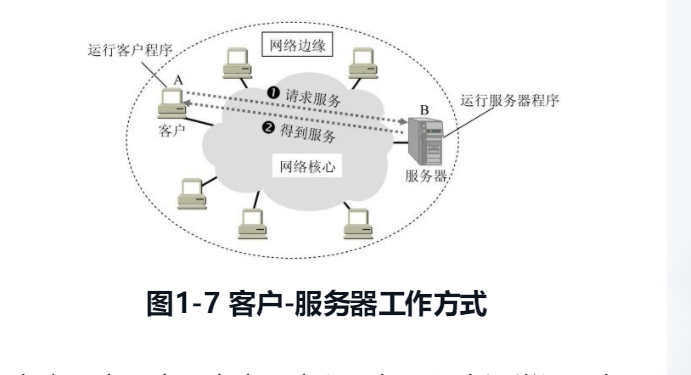
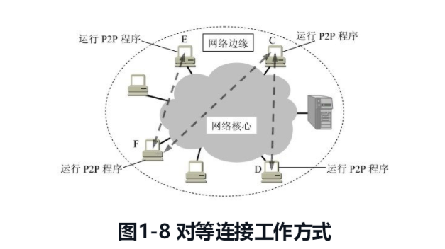
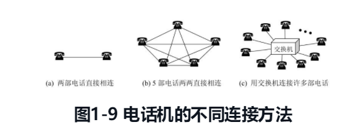

{: id="20201205104312-f6lp54q"}

# 1.1 计算机网络在信息时代的作用
{: id="20201205104323-ag9j1x3"}

网络指的是“三网”，即**电信网络**、**有线电视网络**和**计算机网络**。电信网络可以提供电话、电报、传真等服务。有线电视网络可以向用户提供各种电视节目。计算机网络则可使用户能够迅速传送数据文件，以及从网络上查找并获取各种有用资料，包括图像和视频等。其中计算机网络发展最快，并起到核心作用。随着技术发展，电信网络和有线电视网络都逐渐融入了现代计算机网络的技术，这就产生了“**网络融合**”的概念，现在的计算机网络不仅能够传送数据，同时也能向用户提供打电话、听音乐和观看视频节目的服务。
{: id="20201205104347-crrl5rl"}

计算机网络向用户提供的最重要的功能就是两个：
{: id="20201205105041-zxu32pt"}

1. {: id="20201205105135-x8jk5v3"}连通性
2. {: id="20201205105135-mb9f82n"}共享
{: id="20201205105127-wlkyyqt"}

所谓连通性（connectivity），就是计算机网络使上网用户直接都可以交换信息，好像这些计算机都可以彼此直接连通一样。
{: id="20201205105139-0jjw1mw"}

所谓共享就是指的资源共享。资源共享的含义是多方面的，可以是共享信息、软件共享，也是可以是硬件共享，由于网络的存在，这些资源就像在用户身边一样。
{: id="20201205105255-dp8dxrk"}

## 1.2 因特网概述
{: id="20201205105401-p9xvreb"}

### 1.2.1 网络的网络
{: id="20201205105426-y6lflgk"}

**网络（network）** 是由若干 **节点（node）** 和连接这些节点的 **链路（link）** 组成的。网络中的节点可以是计算机、集成器、交换机或路由器等。
{: id="20201205105435-uwmul0x"}

{: id="20201205105604-ir9vhxi"}

网络和网络还可以通过路由器互连起来，这样就构成了一个覆盖范围更大的网络，即互联网，因此互联网是“**网络的网络**”。
{: id="20201205104529-yaw8lzi"}

**因特网（Internet）** 是世界上最大的互联网络。习惯上，大家把连接在因特网上的计算机都成为 **主机（host）**。
{: id="20201205105907-2jally2"}

**网络把许多计算机连接在一起，而因特网则把许多网络连接在一起**。
{: id="20201205110013-um9pf69"}

### 1.2.2 因特网发展的三个阶段
{: id="20201205110104-yq99a56"}

**第一阶段** 是从单个网络 ARPANET 向互联网发展的过程。1969 年美国国防部的第一个分组交换网 APANET 最初只是一个单个的分组交换网（并不是一个互连的网络）。1983 年 TCP/IP 协议成为 ARPANET 上的标准协议，使得所有使用 TCP/IP 协议的计算机都能利用互连网相互通信，因而人们把 1983 年作为因特网的诞生时间。
{: id="20201205110136-8883gnc"}

**注意**：internet 和 Internet 是有区别的
{: id="20201205110458-nvxg7sr"}

**internet （互连网或者互联网）**是一个通用的名词，它泛指由多个计算机网络互连而成的网络。在这些网络之间的通信协议（即通信规则）可以是任意的。
{: id="20201205110530-z4ot9it"}

**Internet（因特网）** 则是一个专用名词，它指当前全球最大的、开放的、由众多网络相互连接而成的特定的计算机网络，它采用 TCP/IP 协议族作为通信规则，其前身是美国的 ARPANET。
{: id="20201205110640-m2zesnu"}

**第二阶段** 的特点是建成了 **三级结构的因特网** 。 从 1985 年起，美国国家科学基金会（National Science Foundation）就围绕六个大型计算机中心建成计算机网络，即国家科学基金网 NSFNET。它是一个三级计算机网络，分为主干网、地区网和校园网（或企业网）。
{: id="20201205113220-vsongcx"}

**第三阶段** 的特点是逐渐形成了 **多层次 IPS 结构的因特网**。从 1993 年开始，由美国政府资助的 NSFNET 逐渐被若干个商用的因特网主干网替代，而政府机构不在负责因特网的运营。这样就出现了一个新的名词：**因特网服务提供商 ISP（Internet Srevice Provider）**。在许多情况下，因特网服务提供者 ISP 就是一些进行商业活动的公司，因此 ISP 又常翻译为 **因特网服务提供商** 。例如中国移动、中国电信和中国联通就是我国最有名的 ISP。
{: id="20201205144900-3ah3oja"}

{: id="20201205113217-e58bbwk"}

{: id="20201205113217-edvglq4"}

{: id="20201205145735-kac7kmk"}

根据提供服务的覆盖面积大小以及所拥有的 IP 地址数目的不同，ISP 也分为不同的层次：主干 ISP、地区 ISP 和本地 ISP。
{: id="20201205110515-z05g69u"}

主干 ISP 由几个专门的公司创建和维持，服务面积最大（一般都能够覆盖国家范围），并且还拥有高速主干网（例如 10Gb/s 或更高）。
{: id="20201205145824-czv7auz"}

地区 ISP 是一些较小的 ISP。这些地区 ISP 通过一个或多个主干 ISP 连接起来。它们位于等级中的第二层，数据率也低一些。
{: id="20201205150052-5br07al"}

本地 ISP 给端用户提供直接的服务，本地 ISP 可以连接到地区 ISP，也可以直接连接到主干 ISP。本地 ISP 可以是一个仅仅提供因特网服务的公司，也可以是一个拥有网络并向自己的雇员提供服务的企业，或者是一个运行自己的网络的非营利机构（如学院或大学）。
{: id="20201205150157-ubavwva"}

{: id="20201205150346-upqm7hx"}

{: id="20201205150702-7c3u0lo"}

# 1.3 因特网的组成
{: id="20201205150354-evatu4l"}

{: id="20201205150710-oyv58ef"}

{: id="20201205150707-vciyu9r"}

因特网的拓补结构虽然非常复杂，并且在地理上覆盖了全球，但从其工作方式上看，可以划分为以下的两大块：
{: id="20201205150655-i46esql"}

##### （1）边缘部分
{: id="20201205150824-f83fazt"}

由所有连接在因特网上的主机组成。这部分是用户直接使用的，用来进行通信（传输数据、音频或视频）和资源共享。
{: id="20201205150838-nx6miyo"}

{: id="20201205150917-d4ydcke"}

##### （2）核心部分
{: id="20201205150830-jwyymi4"}

由大量网络和连接这些网络的路由器组成，这部分是为边缘部分提供服务的（提供连通性和交换）。
{: id="20201205150936-n1wlgj2"}

{: id="20201205151012-ik8y4qq"}

{: id="20201205150931-qlpwcmt"}

{: id="20201205151135-3tf3cvt"}

### 1.3.1 因特网的边缘部分
{: id="20201205150923-2vl4m3t"}

处在因特网边缘的部分就是连接在因特网上的所有的主机，这些主机又称为 **端系统（end system）**。 “端”就是“末端”的意思（即因特网的末端）。端系统在功能上可能有很大的差别，小的端系统可以是一台普通的个人电脑（包括笔记本电脑或者平板电脑）和 具有上网功能的手机，甚至是一个很小的网络摄像头，而大的端系统则可以是一台非常复杂和昂贵的大型计算机。边缘部分利用核心部分所提供的服务，使众多主机之间能够互相通信并交换或共享信息。
{: id="20201205151147-bppf9xl"}

通常我们说的“主机 A 和主机 B 进行通信”，实际上指的是：“运行在主机 A 上的程序和运行在主机 B 上的另一程序进行通信”。由于“进程”就是“运行着的程序”，因此这就是指：“**主机 A 上的某个进程和主机 B 上的另一个进程进行通信**”。这种比较严密的说法，通常可以简称为“**计算机之间通信**”。
{: id="20201205151553-xlw1sgd"}

在网络边缘的端系统之间的通信方式可以划分为两大类：客户-服务器方式（C/S 方式）和对等的（P2P 方式）。
{: id="20201205151801-08z4enu"}

##### 客户-服务器方式
{: id="20201205151858-7ln7dqz"}

这种方式在因特网上是最常用的，也是传统的方式。我们在网上发送电子邮件或在网站上查找资料时，都是使用的客户-服务器方式。**客户（client）** 和 **服务器（server）** 都是指通信中所涉及的两个应用进程。**客户是服务的请求放，服务器是服务的提供方。**
{: id="20201205152052-115jl4u"}

{: id="20201205152138-mg4ix9i"}

{: id="20201205152323-bfsawny"}

##### 对等连接方式
{: id="20201205152332-4u89siz"}

**对等连接（peer-to-peer 简写为 P2P）** 是指两个主机在通信时并不区分哪一个是服务请求方还是服务提供方。只要两个主机都运行了对等连接软件（P2P 软件）。实际上，对等连接方式从本质上看仍然是使用客户-服务器方式，只是对等连接中的每一个主机既是客户又同时是服务器。例如主机 C，当 C 请求 D 的服务时，C 是客户，D 是服务器。但如果 C 又同时向 F 提供服务，那么 C 又同时起着服务器的作用。
{: id="20201205152343-2qglcaz"}

{: id="20201205152552-909s96l"}

{: id="20201205152522-pzcwx4o"}

### 1.3.2 因特网的核心部分
{: id="20201205152606-0enxjsy"}

网络核心部分是因特网中最复杂的部分，因为网络中的核心部分要向网络边缘中的大量主机提供连通性，使边缘部分中的任何一台主机都能够向其他主机通信。
{: id="20201205152615-auwsosv"}

在网络核心部分起特殊作用的是 **路由器（router）** ，它是一种专用计算机（但不是主机）。**路由器是实现分组交换（packge switching）** 的关键构件，其任务是 **转发收到的分组**，这是网络核心部分最重要的功能。为了弄清楚分组交换，下面介绍一下电路交换的基本概念。
{: id="20201205152721-678xo8c"}

{: id="20201205153311-zqjlfrh"}

##### 电路交换的主要特点
{: id="20201205153307-jaunpge"}

在电话问世后不久，人们就发现要让所有的电话机都两两相连是不现实的。两部电话只需要一对电线就能够互相连接起来。但若是有 5 部电话要两两相连，则需要是对电线。若有 N 部电话要两两相连，就需要 N/(n - 1)/2 对电线。当电话机的数量很大时，这种连接方式需要的电线数量就太大了。于是人们认识到，要使得每一部电话能够很方便地和另一部电话进行通信，就应当使用电话交换机将这些电话连接起来，如图 1-9(c)所示。每一部电话都连接到交换机上，而交换机使用交换的方法，让电话用户彼此之间可以很方便地通信。
{: id="20201205153321-nt9uikn"}

{: id="20201205153700-ibvpumy"}

{: id="20201205152914-5ghf8q0"}
