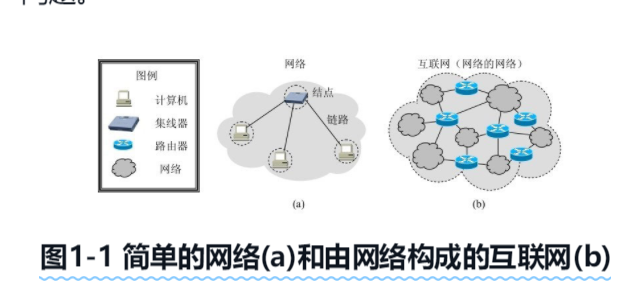

# 概述
{: id="20201205104312-f6lp54q"}

## 1.1 计算机网络在信息时代的作用
{: id="20201205104323-ag9j1x3"}

网络指的是“三网”，即**电信网络**、**有线电视网络**和**计算机网络**。电信网络可以提供电话、电报、传真等服务。有线电视网络可以向用户提供各种电视节目。计算机网络则可使用户能够迅速传送数据文件，以及从网络上查找并获取各种有用资料，包括图像和视频等。其中计算机网络发展最快，并起到核心作用。随着技术发展，电信网络和有线电视网络都逐渐融入了现代计算机网络的技术，这就产生了“**网络融合**”的概念，现在的计算机网络不仅能够传送数据，同时也能向用户提供打电话、听音乐和观看视频节目的服务。
{: id="20201205104347-crrl5rl"}

计算机网络向用户提供的最重要的功能就是两个：
{: id="20201205105041-zxu32pt"}

1. {: id="20201205105135-x8jk5v3"}连通性
2. {: id="20201205105135-mb9f82n"}共享
{: id="20201205105127-wlkyyqt"}

所谓连通性（connectivity），就是计算机网络使上网用户直接都可以交换信息，好像这些计算机都可以彼此直接连通一样。
{: id="20201205105139-0jjw1mw"}

所谓共享就是指的资源共享。资源共享的含义是多方面的，可以是共享信息、软件共享，也是可以是硬件共享，由于网络的存在，这些资源就像在用户身边一样。
{: id="20201205105255-dp8dxrk"}

## 1.2 因特网概述
{: id="20201205105401-p9xvreb"}

### 1.2.1 网络的网络
{: id="20201205105426-y6lflgk"}

**网络（network）** 是由若干 **节点（node）** 和连接这些节点的 **链路（link）** 组成的。网络中的节点可以是计算机、集成器、交换机或路由器等。
{: id="20201205105435-uwmul0x"}

{: id="20201205105604-ir9vhxi"}

网络和网络还可以通过路由器互连起来，这样就构成了一个覆盖范围更大的网络，即互联网，因此互联网是“**网络的网络**”。
{: id="20201205104529-yaw8lzi"}

**因特网（Internet）** 是世界上最大的互联网络。习惯上，大家把连接在因特网上的计算机都成为 **主机（host）**。
{: id="20201205105907-2jally2"}

**网络把许多计算机连接在一起，而因特网则把许多网络连接在一起**。
{: id="20201205110013-um9pf69"}

### 1.2.2 因特网发展的三个阶段
{: id="20201205110104-yq99a56"}

**第一阶段** 是从单个网络 ARPANET 向互联网发展的过程。1969 年美国国防部的第一个分组交换网 APANET 最初只是一个单个的分组交换网（并不是一个互连的网络）。1983 年 TCP/IP 协议成为 ARPANET 上的标准协议，使得所有使用 TCP/IP 协议的计算机都能利用互连网相互通信，因而人们把 1983 年作为因特网的诞生时间。
{: id="20201205110136-8883gnc"}

**注意**：internet 和 Internet 是有区别的
{: id="20201205110458-nvxg7sr"}

**internet （互连网或者互联网）**是一个通用的名词，它泛指由多个计算机网络互连而成的网络。在这些网络之间的通信协议（即通信规则）可以是任意的。
{: id="20201205110530-z4ot9it"}

**Internet（因特网）** 则是一个专用名词，它指当前全球最大的、开放的、由众多网络相互连接而成的特定的计算机网络，它采用 TCP/IP 协议族作为通信规则，其前身是美国的 ARPANET。
{: id="20201205110640-m2zesnu"}

**第二阶段** 的特点是建成了 **三级结构的因特网** 。 从 1985 年起，美国国家科学基金会（National Science Foundation）就围绕六个大型计算机中心建成计算机网络，即国家科学基金网 NSFNET。它是一个三级计算机网络，分为主干网、地区网和校园网（或企业网）。
{: id="20201205113220-vsongcx"}

**第三阶段** 的特点是逐渐形成了 **多层次 IPS 结构的因特网**。从 1993 年开始，由美国政府资助的 NSFNET 逐渐被若干个商用的因特网主干网替代，而政府机构不在负责因特网的运营。这样就出现了一个新的名词：**因特网服务提供商 ISP（Internet Srevice Provider）**。在许多情况下，因特网服务提供者 ISP 就是一些进行商业活动的公司，因此 ISP 又常翻译为 **因特网服务提供商** 。例如中国移动、中国电信和中国联通就是我国最有名的 ISP。
{: id="20201205144900-3ah3oja"}

{: id="20201205113217-e58bbwk"}

{: id="20201205113217-edvglq4"}

{: id="20201205110515-z05g69u"}
