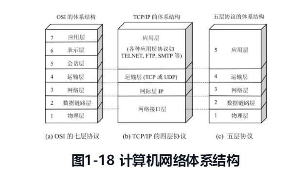

# 1.1 计算机网络在信息时代的作用
{: id="20201207083719-1ep2p8c"}

网络指的是“三网”，即**电信网络**、**有线电视网络**和**计算机网络**。电信网络可以提供电话、电报、传真等服务。有线电视网络可以向用户提供各种电视节目。计算机网络则可使用户能够迅速传送数据文件，以及从网络上查找并获取各种有用资料，包括图像和视频等。其中计算机网络发展最快，并起到核心作用。随着技术发展，电信网络和有线电视网络都逐渐融入了现代计算机网络的技术，这就产生了“**网络融合**”的概念，现在的计算机网络不仅能够传送数据，同时也能向用户提供打电话、听音乐和观看视频节目的服务。
{: id="20201207083719-gqzf0g4"}

计算机网络向用户提供的最重要的功能就是两个：
{: id="20201207083719-4qt0f7u"}

1. {: id="20201207083719-dqfrixr"}连通性
2. {: id="20201207083719-x03iyjt"}共享
{: id="20201207083719-cz5jnq3"}

所谓连通性（connectivity），就是计算机网络使上网用户直接都可以交换信息，好像这些计算机都可以彼此直接连通一样。
{: id="20201207083719-v9r8u1b"}

所谓共享就是指的资源共享。资源共享的含义是多方面的，可以是共享信息、软件共享，也是可以是硬件共享，由于网络的存在，这些资源就像在用户身边一样。
{: id="20201207083719-wnn07ui"}

## 1.2 因特网概述
{: id="20201207083719-8yr7zjd"}

### 1.2.1 网络的网络
{: id="20201207083719-ca8io9x"}

**网络（network）** 是由若干 **节点（node）** 和连接这些节点的 **链路（link）** 组成的。网络中的节点可以是计算机、集成器、交换机或路由器等。
{: id="20201207083719-or488l8"}

{: id="20201207083719-hrq013g"}

网络和网络还可以通过路由器互连起来，这样就构成了一个覆盖范围更大的网络，即互联网，因此互联网是“**网络的网络**”。
{: id="20201207083719-kenbeq3"}

**因特网（Internet）** 是世界上最大的互联网络。习惯上，大家把连接在因特网上的计算机都成为 **主机（host）**。
{: id="20201207083719-0ipf38h"}

**网络把许多计算机连接在一起，而因特网则把许多网络连接在一起**。
{: id="20201207083719-1qinm7d"}

### 1.2.2 因特网发展的三个阶段
{: id="20201207083719-5gg3so5"}

**第一阶段** 是从单个网络 ARPANET 向互联网发展的过程。1969 年美国国防部的第一个分组交换网 APANET 最初只是一个单个的分组交换网（并不是一个互连的网络）。1983 年 TCP/IP 协议成为 ARPANET 上的标准协议，使得所有使用 TCP/IP 协议的计算机都能利用互连网相互通信，因而人们把 1983 年作为因特网的诞生时间。
{: id="20201207083719-ji0uysk"}

**注意**：internet 和 Internet 是有区别的
{: id="20201207083719-nhe2vh2"}

**internet （互连网或者互联网）** 是一个通用的名词，它泛指由多个计算机网络互连而成的网络。在这些网络之间的通信协议（即通信规则）可以是任意的。
{: id="20201207083719-bl3qwga"}

**Internet（因特网）** 则是一个专用名词，它指当前全球最大的、开放的、由众多网络相互连接而成的特定的计算机网络，它采用 TCP/IP 协议族作为通信规则，其前身是美国的 ARPANET。
{: id="20201207083719-1w57cv2"}

**第二阶段** 的特点是建成了 **三级结构的因特网** 。 从 1985 年起，美国国家科学基金会（National Science Foundation）就围绕六个大型计算机中心建成计算机网络，即国家科学基金网 NSFNET。它是一个三级计算机网络，分为主干网、地区网和校园网（或企业网）。
{: id="20201207083719-56tq8xp"}

**第三阶段** 的特点是逐渐形成了 **多层次 IPS 结构的因特网**。从 1993 年开始，由美国政府资助的 NSFNET 逐渐被若干个商用的因特网主干网替代，而政府机构不在负责因特网的运营。这样就出现了一个新的名词：**因特网服务提供商 ISP（Internet Srevice Provider）**。在许多情况下，因特网服务提供者 ISP 就是一些进行商业活动的公司，因此 ISP 又常翻译为 **因特网服务提供商** 。例如中国移动、中国电信和中国联通就是我国最有名的 ISP。
{: id="20201207083719-ywkyyzu"}

{: id="20201207083719-sosyvi7"}

根据提供服务的覆盖面积大小以及所拥有的 IP 地址数目的不同，ISP 也分为不同的层次：主干 ISP、地区 ISP 和本地 ISP。
{: id="20201207083719-0ertheb"}

主干 ISP 由几个专门的公司创建和维持，服务面积最大（一般都能够覆盖国家范围），并且还拥有高速主干网（例如 10Gb/s 或更高）。
{: id="20201207083719-56v4tai"}

地区 ISP 是一些较小的 ISP。这些地区 ISP 通过一个或多个主干 ISP 连接起来。它们位于等级中的第二层，数据率也低一些。
{: id="20201207083719-ceumwnb"}

本地 ISP 给端用户提供直接的服务，本地 ISP 可以连接到地区 ISP，也可以直接连接到主干 ISP。本地 ISP 可以是一个仅仅提供因特网服务的公司，也可以是一个拥有网络并向自己的雇员提供服务的企业，或者是一个运行自己的网络的非营利机构（如学院或大学）。
{: id="20201207083719-fu4122b"}

{: id="20201207083719-1y0h8vs"}

# 1.3 因特网的组成
{: id="20201207083719-fox9cwj"}

因特网的拓补结构虽然非常复杂，并且在地理上覆盖了全球，但从其工作方式上看，可以划分为以下的两大块：
{: id="20201207083719-0vkzs02"}

##### （1）边缘部分
{: id="20201207083719-trt4vnh"}

由所有连接在因特网上的主机组成。这部分是用户直接使用的，用来进行通信（传输数据、音频或视频）和资源共享。
{: id="20201207083719-keym0sh"}

##### （2）核心部分
{: id="20201207083719-4tlh1rv"}

由大量网络和连接这些网络的路由器组成，这部分是为边缘部分提供服务的（提供连通性和交换）。
{: id="20201207083719-t14kjl7"}

{: id="20201207083719-a5eroq9"}

### 1.3.1 因特网的边缘部分
{: id="20201207083719-o1nwb4x"}

处在因特网边缘的部分就是连接在因特网上的所有的主机，这些主机又称为 **端系统（end system）**。 “端”就是“末端”的意思（即因特网的末端）。端系统在功能上可能有很大的差别，小的端系统可以是一台普通的个人电脑（包括笔记本电脑或者平板电脑）和 具有上网功能的手机，甚至是一个很小的网络摄像头，而大的端系统则可以是一台非常复杂和昂贵的大型计算机。边缘部分利用核心部分所提供的服务，使众多主机之间能够互相通信并交换或共享信息。
{: id="20201207083719-arhl1to"}

通常我们说的“主机 A 和主机 B 进行通信”，实际上指的是：“运行在主机 A 上的程序和运行在主机 B 上的另一程序进行通信”。由于“进程”就是“运行着的程序”，因此这就是指：“**主机 A 上的某个进程和主机 B 上的另一个进程进行通信**”。这种比较严密的说法，通常可以简称为“**计算机之间通信**”。
{: id="20201207083719-x9o617j"}

在网络边缘的端系统之间的通信方式可以划分为两大类：客户-服务器方式（C/S 方式）和对等的（P2P 方式）。
{: id="20201207083719-r959qpo"}

##### 客户-服务器方式
{: id="20201207083719-j56y8gx"}

这种方式在因特网上是最常用的，也是传统的方式。我们在网上发送电子邮件或在网站上查找资料时，都是使用的客户-服务器方式。**客户（client）** 和 **服务器（server）** 都是指通信中所涉及的两个应用进程。**客户是服务的请求放，服务器是服务的提供方。**
{: id="20201207083719-w1y9te8"}

{: id="20201207083719-1odm12s"}

##### 对等连接方式
{: id="20201207083719-wqzg0he"}

**对等连接（peer-to-peer 简写为 P2P）** 是指两个主机在通信时并不区分哪一个是服务请求方还是服务提供方。只要两个主机都运行了对等连接软件（P2P 软件）。实际上，对等连接方式从本质上看仍然是使用客户-服务器方式，只是对等连接中的每一个主机既是客户又同时是服务器。例如主机 C，当 C 请求 D 的服务时，C 是客户，D 是服务器。但如果 C 又同时向 F 提供服务，那么 C 又同时起着服务器的作用。
{: id="20201207083719-kfzss1s"}

{: id="20201207083719-sgw54ku"}

### 1.3.2 因特网的核心部分
{: id="20201207083719-318vkl8"}

网络核心部分是因特网中最复杂的部分，因为网络中的核心部分要向网络边缘中的大量主机提供连通性，使边缘部分中的任何一台主机都能够向其他主机通信。
{: id="20201207083719-61zy6po"}

在网络核心部分起特殊作用的是 **路由器（router）** ，它是一种专用计算机（但不是主机）。**路由器是实现分组交换（packge switching）** 的关键构件，其任务是 **转发收到的分组**，这是网络核心部分最重要的功能。为了弄清楚分组交换，下面介绍一下电路交换的基本概念。
{: id="20201207083719-lmu040z"}

##### 电路交换的主要特点
{: id="20201207083719-z41jz23"}

在电话问世后不久，人们就发现要让所有的电话机都两两相连是不现实的。两部电话只需要一对电线就能够互相连接起来。但若是有 5 部电话要两两相连，则需要是对电线。若有 N 部电话要两两相连，就需要 N/(n - 1)/2 对电线。当电话机的数量很大时，这种连接方式需要的电线数量就太大了。于是人们认识到，要使得每一部电话能够很方便地和另一部电话进行通信，就应当使用电话交换机将这些电话连接起来，如图 1-9(c)所示。每一部电话都连接到交换机上，而交换机使用交换的方法，让电话用户彼此之间可以很方便地通信。
{: id="20201207083719-iuow5ak"}

{: id="20201207083719-5c3giou"}

从通信资源的分配角度来看，**交换（switching）** 就是按照某种方式动态地分配传输线路的资源。在使用电路交换打电话之前，必须先拨号请求建立连接。当被叫用户听到交换机送来的拨号音并摘机后，从主叫端到被叫端就建立了一条连接，也就是一条 **专用的物理通路** 。这条连接保证了双方通话时所需的通信资源，而这些资源在双方通信时不会被其他用户占用。此后主叫和被叫双方就能互相通电话。通话完毕挂机后，交换机释放刚才使用的这条专用的物理通路（即把刚才占用的所有通信资源归还给电信网）。这种必须经过 **“建立连接（占用通信资源）→ 通话（一直占用通信资源）→ 释放连接（归还通信资源）”三个步骤的交换方式称为电路交换** 。
{: id="20201207083719-13i80cs"}

{: id="20201207083719-6ddr1tp"}

**电路交换的一个重要特点就是在通话的全部时间内，通话的两个用户始终占用端到端的通信资源。**
{: id="20201207083719-jnhncav"}

当使用电路交换来传送计算机数据时，其线路的传输效率往往很低。这是因为计算机数据是突发式地出现在传输线路上的，因此线路上真正用来传送数据的时间往往不到 10% 甚至低到 1%。已被用户占用的通信线路资源在绝大部分时间里都是空闲的。例如，当用户阅读终端屏幕上的信息或用键盘输入和编辑一份文件时，或计算机正在进行处理而结果尚未返回时，宝贵的通信线路资源并未被利用而是白白被浪费了。
{: id="20201207083719-yqu7rlc"}

##### 分组交换的主要特点
{: id="20201207083719-vttz2l7"}

分组交换则采用 **存储转发** 技术。通常我们把要发送的整块数据称为一个 **报文（message）** 。在发送报文之前，先把较长的报文划分成为一个个更小的等长数据段，
{: id="20201207083719-kba9ny0"}

例如，每个数据段为 1024bit。在每一个数据段前面，加上一些必要的控制信息组成 **首部（header）** 后，就构成了一个 **分组（packet）** 。分组又称为“**包**”，而分组的首部也可以称为 **包头** 。分组是在因特网中传送的数据单元。分组的 “首部”是非常重要的，正是由于分组的首部包含了诸如目的地址和源地址等重要控制信息，每一个分组才能在因特网中独立地选择传输路径，并正确地交付到分组传输的终点。
{: id="20201207083719-q2vlm4x"}

{: id="20201207083719-li4cgdy"}

强调因特网的核心部分是由许多网络和把它们互连起来的路由器组成的，而主机处在因特网的边缘部分。在因特网核心部分的路由器之间一般都用高速链路相连接，而在网络边缘的主机接入到核心部分则通常以相对较低速率的链路相连接。
{: id="20201207083719-0fx7zny"}

{: id="20201207083719-bxytwoh"}

位于网络边缘的主机和位于网络核心部分的路由器都是计算机，但它们的作用却很不一样。**主机是为用户进行信息处理的** ，并且可以和其他主机通过网络交换信息。**路由器则是用来转发分组的，即进行分组交换的**。
{: id="20201207083719-ecfphb3"}

路由器收到一个分组，先暂时存储一下，检查其首部，查找转发表，按照首部中的目的地址，找到合适的接口转发出去，把分组交给下一个路由器。这样一步一步地（有时会经过几十个不同的路由器）以存储转发的方式，把分组交付最终的目的主机。各路由器之间必须经常交换彼此掌握的路由信息，以便创建和维持在路由器中的转发表，使得转发表能够在整个网络拓扑发生变化时及时更新。
{: id="20201207083719-aq45da9"}

路由器暂时存储的是一个个短分组，而不是整个的长报文。短分组是暂存在路由器的存储器（即内存）中而不是存储在磁盘中的。这就保证了较高的交换速率。
{: id="20201207083719-loho39q"}

分组交换在传送数据之前不必先占用一条端到端的通信资源。分组在哪一段链路上传送时，才占用这段链路的通信资源。分组到达一个路由器后，先暂时存储下来，查找转发表，然后从另一条合适的链路转发出去。分组在传输时就这样一段段地断续占用通信资源，而且还省去了建立连接和释放连接的开销，因而数据的传输效率更高。
{: id="20201207083719-sr03wev"}

从以上所述可知，采用存储转发的分组交换，实质上采用了在数据通信的过程中断续（或动态）分配传输带宽的策略（关于带宽的进一步讨论见后面的 1.6.1 节）。这对传送突发式的计算机数据非常合适，使得通信线路的利用率大大提高了。为了提高分组交换网的可靠性，因特网的核心部分常采用网状拓扑结构，使得当发生网络拥塞或少数结点、链路出现故障时，路由器可灵活地改变转发路由而不致引起通信的中断或全网的瘫痪。此外，通信网络的主干线路往往由一些高速链路构成，这样就能以较高的数据率迅速地传送计算机数据。
{: id="20201207083719-cc3wlxw"}

# 1.5 计算机网络的类别
{: id="20201207083719-5q8to7j"}

### 1.5.1 计算机网络的定义
{: id="20201207083719-1l2gue9"}

关于计算机网络的最简单的定义是： **一些互相连接的、自治的计算机的集合** 。这里“自治”的概念即独立的计算机，它有自己的硬件和软件，可以单独运行使用，而“互相连接”是指计算机之间能够进行数据通信或交换信息。
{: id="20201207083719-7ihi1bm"}

### 1.5.2 几种不同的计算机网络
{: id="20201207083719-ewstqjk"}

##### 按照网络的作用范围进行分类
{: id="20201207083719-wjq3vqt"}

**（1）广域网 WAN（Wide Area Network）** 广域网的作用范围通常为几十到几千公里，因而有时也被称为  **远程网（long haul network）** 。广域网是因特网的核心部分，其任务是通过长距离（例如，跨越不同的国家）运送主机所发送的数据。连接广域网各结点交换机的链路一般都是高速链路，具有较大的通信容量。
{: id="20201207083719-wpz89mg"}

**（2）局域网 MAN（Metropolitan Area Network）** 城域网的作用范围一般是一个城市，可跨越几个街区甚至整个的城市，其作用距离约为 5～50km。城域网可以为一个或几个单位所拥有，但也可以是一种公用设施，用来将多个局域网进行互连。目前，很多城域网采用的是以太网技术，因此城域网有时也常纳入局域网的范围进行讨论。
{: id="20201207083719-qn1sxkm"}

**（3）局域网 LAN（Local Area Network）** 局域网一般用微型计算机或工作站通过高速通信线路相连（速率通常在 10Mb/s 以上），但地理上则局限在较小的范围（如 1km 左右）。在局域网发展的初期，一个学校或工厂往往只拥有一个局域网，但现在局域网已非常广泛地使用，一个学校或企业大都拥有许多个互连的局域网（这样的网络常称为校园网或企业网）
{: id="20201207083719-kifhtmc"}

**（4）个人区域网 PAN（Personal Area Network）** 个人区域网就是在个人工作的地方把属于个人使用的电子设备（如便携式电脑等）用无线技术连接起来的网络，因此也常称为 **无线个人区域网 WPAN(Wireless PAN)** ，其范围大约在 10 m 左右。
{: id="20201207083719-ppli0fi"}

##### 按照网络的使用者进行分类
{: id="20201207083719-mbt6x56"}

**（1）公用网（public network）** 这是指电信公司（国有或私有）出资建造的大型网络。“公用”的意思就是所有愿意按电信公司的规定交纳费用的人都可以使用这种网络。因此公用网也可称为公众网，如 CHINANET。
{: id="20201207083719-lcyapa8"}

**（2）专用网（private network）** 这是某个部门、某个行业为各自的特殊业务工作需要而建造的网络。这种网络不对外人提供服务。例如，政府、军队、银行、铁路、电力、公安等系统均有本系统的专用网。
{: id="20201207083719-dml5tzf"}

# 1.6 计算机网络的性能
{: id="20201207083719-uvxbpcc"}

### 1.6.1 计算机网络的性能指标
{: id="20201207083719-rei59b1"}

性能指标从不同的方面来度量计算机网络的性能。下面介绍常用的七个性能指标。
{: id="20201207083719-qfkvbrs"}

##### 1. 速率
{: id="20201207083719-pn0sd64"}

我们知道，计算机发送出的信号都是数字形式的。**比特（bit）** 是计算机中数据量的单位，也是信息论中使用的 **信息量的单位** 。英文单词 bit 来源于 binary digit，意思是一个“ **二进制数字** ”，因此一个比特就是二进制数字中的一个 1 或 0。网络技术中的速率指的是连接在计算机网络上的主机在数字信道上 **传送数据的速率** ，它也称为 **数据率(datarate)** 或  **比特率(bit rate)** 。速率是计算机网络中最重要的一个性能指标。速率的单位是 b/s（比特每秒）(或 bit/s，有时也写为 bps，即 bit persecond)。当数据率较高时，就可以用 kb/s（k =103 =千）、Mb/s（M = 106 = 兆）、Gb/s（G= 109 = 吉）或 Tb/s（T = 1012 = 太）①。现在人们常用更简单的但很不严格的记法来描述网络的速率，如 100M 以太网，而省略了单位中的 b/s，它的意思是速率为 100Mb/s 的以太网。顺便指出，上面所说的速率往往是指额定速率或标称速率。
{: id="20201207083719-if1uo8g"}

##### 2. 带宽
{: id="20201207083719-4qrs32q"}

“**带宽（bandwidth）**”有以下两种不同的意义：
{: id="20201207083719-nfgb474"}

（1）带宽本来是指某个 **信号具有的频带宽度** 。信号的带宽是指该信号所包含的各种不同频率成份所占据的频率范围。例如，在传统的通信线路上传送的电话信号的标准带宽是 3.1kHz （从 300 Hz 到 3.4kHz，即话音的主要成分的频率范围）。这种意义的带宽的单位是赫（或千赫、兆赫、吉赫等）。在过去很长的一段时间，通信的主干线路传送的是模拟信号（即连续变化的信号）。因此，表示通信线路允许通过的信号频带范围就称为线路的 **带宽** （或**通频带**）。
{: id="20201207083719-juu14f5"}

（2）在计算机网络中，带宽用来表示网络的 **通信线路** 传送数据的能力，因此网络带宽表示在单位时间内从网络中的某一点到另一点所能通过的“最高数据率”。在本书中在提到“带宽”时，主要是指这个意思。这种意义的 **带宽的单位是“比特每秒”**，记为 b/s。在这种单位的前面也常常加上千（k）、兆（M）、吉（G）或太（T）这样的倍数。
{: id="20201207083719-po3y08j"}

##### 3. 吞吐量
{: id="20201207083719-udgyi9k"}

**吞吐量（throughput）** 表示在单位时间内通过某个网络（或信道、接口）的数据量。
{: id="20201207083719-7fv205h"}

##### 4. 时延
{: id="20201207083719-o2odiqj"}

**时延(delay 或 latency)** 是指数据（一个报文或分组，甚至比特）从网络（或链路）的一端传送到另一端所需的时间。时延是个很重要的性能指标，它有时也称为延迟或迟延。
{: id="20201207083719-ddcouwo"}

(1) 发送时延 发送时延(transmission delay)是主机或路由器发送数据帧所需要的时间，也就是从发送数据帧的第一个比特算起，到该帧的最后一个比特发送完毕所需的时间。
{: id="20201207083719-rbluixg"}

(2) 传播时延 传播时延(propagation delay)是电磁波在信道中传播一定的距离需要花费的时间。
{: id="20201207083719-scmxcvb"}

(3) 处理时延 主机或路由器在收到分组时要花费一定的时间进行处理，例如分析分组的首部、从分组中提取数据部分、进行差错检验或查找适当的路由等等，这就产生了处理时延。
{: id="20201207083719-wovy88q"}

(4) 排队时延 分组在经过网络传输时，要经过许多路由器。但分组在进入路由器后要先在输入队列中排队等待处理。
{: id="20201207083719-9z6kbkc"}

##### 5. 时延带宽积
{: id="20201207083719-2ofy71h"}

把以上讨论的网络性能的两个度量——**传播时延**和**带宽**——相乘，就得到另一个很有用的度量：**传播时延带宽积**
{: id="20201207083719-4rp0pzu"}

##### 6. 往返时间 RTT
{: id="20201207083719-fg34fkf"}

在计算机网络中，**往返时间 RTT (Round-TripTime)** 也是一个重要的性能指标，它表示从发送方发送数据开始，到发送方收到来自接收方的确认（接收方收到数据后便立即发送确认），总共经历的时间。
{: id="20201207083719-gl506xj"}

##### 7. 利用率
{: id="20201207083719-pf3a5u5"}

利用率有**信道利用率**和**网络利用率**两种。信道利用率指出某信道有百分之几的时间是被利用的（有数据通过）。完全空闲的信道的利用率是零。网络利用率则是全网络的信道利用率的加权平均值。信道利用率并非越高越好。
{: id="20201207083719-aionpjz"}

# 1.7 计算机网络体系结构
{: id="20201207083719-jkw2xlf"}

OSI 的七层协议体系结构（图 1-18(a)）的概念清楚，理论也较完整，但它既复杂又不实用。TCP/IP 体系结构则不同，它现在已经得到了非常广泛的应用。TCP/IP 是一个四层的体系结构（图 1-18(b)），它包含应用层、运输层、网际层和网络接口层（用网际层这个名字是强调这一层是为了解决不同网络的互连问题）。不过从实质上讲，TCP/IP 只有最上面的三层，因为最下面的网络接口层基本上和一般的通信链路在功能上没有多大差别，对于计算机网络来说，这一层并没有什么特别新的具体内容。因此在学习计算机网络的原理时往往采取折中的办法，即综合 OSI 和 TCP/IP 的优点，采用一种只有五层协议的体系结构，这样既简洁又能将概念阐述清楚。
{: id="20201207083719-7y03fyy"}

{: id="20201207083719-jso26r2"}

{: id="20201207085915-sc5lamw"}

### （1）应用层（application layer）
{: id="20201207083719-x5p4tf7"}

应用层是体系结构中的最高层。应用层的任务是**通过应用进程间的交互来完成特定网络应用**。应用层协议定义的是应用进程间通信和交互的规则。这里的进程(process)就是指主机中正在运行的程序。对于不同的网络应用需要有不同的应用层协议。在因特网中的应用层协议很多，如支持万维网应用的 HTTP 协议，支持电子邮件的 SMTP 协议，支持文件传送的 FTP 协议，等等。我们将应用层交互的数据单元称为报文(message)。
{: id="20201207083719-ynuzoel"}

### (2) 运输层（transport layer）
{: id="20201207083719-wzkimpl"}

运输层的任务就是负责向**两个主机中进程之间的通信提供通用的数据传输**服务。应用进程利用该服务传送应用层报文。
{: id="20201207083719-rywlhzp"}

运输层主要使用以下两种协议：
{: id="20201207083719-olwza1y"}

- {: id="20201207083719-tomtryt"}**传输控制协议 TCP（Transmission Control Protocol）** 它提供一个面向连接的、可靠的数据传输服务，其数据传输的单位是 **报文段（segment）**。
- {: id="20201207083719-bi19636"}**用户数据报协议 UDP（User Datagram Protocol）** 它提供一个无连接的、尽最大努力的数据传输服务（不保证数据传输的可靠性），其数据传输的单位是 **用户数据报**
{: id="20201207083719-fors9we"}

### (3）网络层（network layer）
{: id="20201207083719-5a1vurx"}

网络层负责为分组交换网上的不同主机提供通信服务。在发送数据时，网络层把运输层产生的报文段或用户数据报封装成 **分组** 或 **包(packet)** 进行传送。在 TCP/IP 体系中，由于网络层使用 IP 协议，因此分组也叫作  **IP 数据报** ，或简称为 **数据报(datagram)** 。**本书把“分组”和“数据报”作为同义词使用** 。
{: id="20201207083719-zgur2mm"}

因特网主要的网络层协议是无连接的 **网际协议**  IP (Internet Protocol)和许多种路由选择协议，因此因特网的网络层也叫做 **网际层** 或 **IP 层** 。在本书中，网络层、网际层和 IP 层都是同义语。
{: id="20201207083719-tis7vr1"}

### （4）数据链路层（data link layer）
{: id="20201207083719-pb1df0a"}

数据链路层常简称为 **链路层** 。我们知道，两台主机之间的数据传输，总是在一段一段的链路上传送的，这就需要使用专门的链路层的协议。在两个相邻结点之间传送数据时，数据链路层将网络层交下来的 IP 数据报 **组装成帧（framing）**，在两个相邻结点间的链路上传送 **帧（frame）**。每一帧包括数据和必要的**控制信息**（如同步信息、地址信息、差错控制等）。
{: id="20201207083719-os4wmzx"}

### （5）物理层（phsical layer）
{: id="20201207083719-tpi5cnh"}

在物理层上所传数据的单位是比特。发送方发送 1（或 0）时，接收方应当收到 1（或 0）而不是 0（或 1）。因此物理层要考虑用多大的电压代表“1”或“0”，以及接收方如何识别出发送方所发送的比特。物理层还要确定连接电缆的插头应当有多少根引脚以及各条引脚应如何连接。当然，解释比特代表的意思，就不是物理层的任务。请注意，传递信息所利用的一些物理媒体，如双绞线、同轴电缆、光缆、无线信道等，并不在物理层协议之内而是在物理层协议的下面。因此也有人把物理媒体
{: id="20201207083719-v6oohll"}

{: id="20201207083719-instxbz"}
