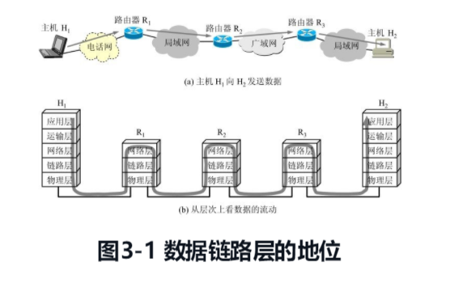

数据链路层属于计算机网络的低层。数据链路层使用的信道主要有以下两种类型：
{: id="20201207092607-8w0fscq"}

**（1）点对点信道** 这种信道使用一对一的点对点通信方式。
{: id="20201207092608-rw5xs7v"}

**（2）广播信道** 这种信道使用一对多的广播通信方式，因此过程复杂。
{: id="20201207092710-fat12tv"}

本章的主要内容是：
{: id="20201207092819-dqbtpkz"}

1. {: id="20201207092833-sddpvdg"}数据链路层的点对点信道和广播信道的特点，以及这两种信道所使用的协议（PPP 协议以及 CSMA/CD 协议）的特点。
2. {: id="20201207092840-ond26pp"}数据链路层的三个基本问题：封装成帧、透明传输和差错检测。
3. {: id="20201207092846-nfpniqm"}以太网 MAC 层的硬件地址。
4. {: id="20201207092851-l6md1cj"}适配器、转发器、集线器、网桥、以太网交换机的作用以及使用场合。
{: id="20201207092825-l3ex8yc"}

{: id="20201207092929-dcmtr1w"}

{: id="20201207092939-tc2dw7e"}

# 3.1 使用点对点信道的数据链路层
{: id="20201207093000-han9i3q"}

### 3.1.1 数据链路和帧
{: id="20201207093025-g87d7rh"}

{: id="20201207093133-yxgppaf"}
