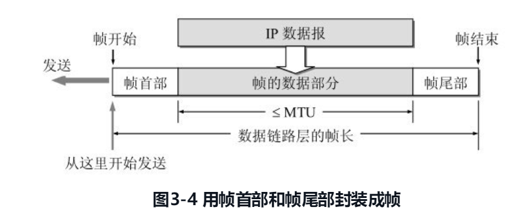
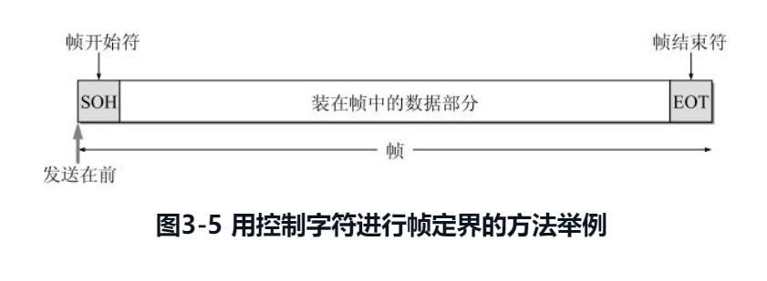
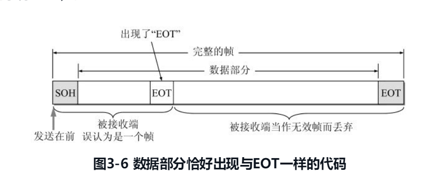
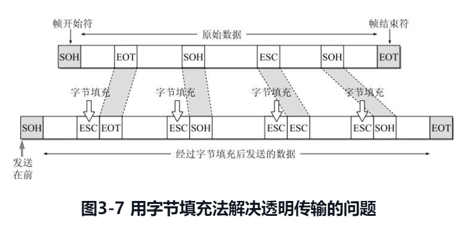
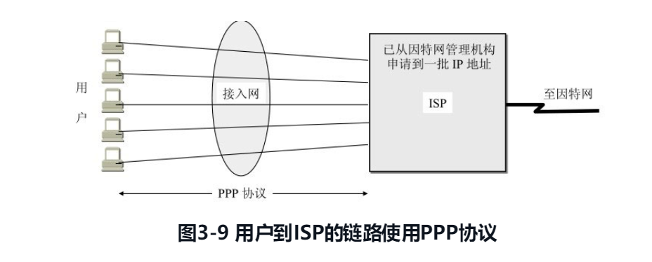
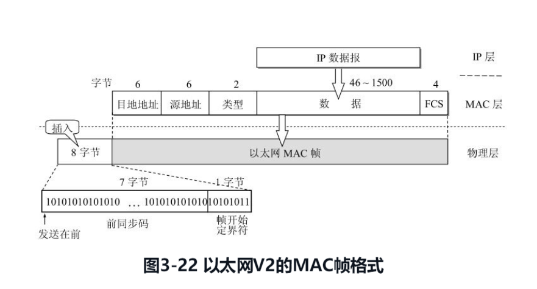

数据链路层属于计算机网络的低层。数据链路层使用的信道主要有以下两种类型：
{: id="20201207092607-8w0fscq"}

**（1）点对点信道** 这种信道使用一对一的点对点通信方式。
{: id="20201207092608-rw5xs7v"}

**（2）广播信道** 这种信道使用一对多的广播通信方式，因此过程复杂。
{: id="20201207092710-fat12tv"}

本章的主要内容是：
{: id="20201207092819-dqbtpkz"}

1. {: id="20201207092833-sddpvdg"}数据链路层的点对点信道和广播信道的特点，以及这两种信道所使用的协议（PPP 协议以及 CSMA/CD 协议）的特点。
2. {: id="20201207092840-ond26pp"}数据链路层的三个基本问题：封装成帧、透明传输和差错检测。
3. {: id="20201207092846-nfpniqm"}以太网 MAC 层的硬件地址。
4. {: id="20201207092851-l6md1cj"}适配器、转发器、集线器、网桥、以太网交换机的作用以及使用场合。
{: id="20201207092825-l3ex8yc"}

{: id="20201207092929-dcmtr1w"}

{: id="20201207092939-tc2dw7e"}

# 3.1 使用点对点信道的数据链路层
{: id="20201207093000-han9i3q"}

### 3.1.1 数据链路和帧
{: id="20201207093025-g87d7rh"}

### 3.1.2 三个基本问题
{: id="20201207093133-yxgppaf"}

数据链路层协议有许多种，但有三个基本问题则是共同的。这三个基本问题是：**封装成帧**、**透明传输**和**差错检测**。下面分别讨论这三个基本问题。
{: id="20201207102226-s542vdq"}

##### 1. 封装成帧
{: id="20201207102240-6lefu8c"}

**封装成帧(framing)** 就是在一段数据的前后分别添加首部和尾部，这样就构成了一个帧。接收端在收到物理层上交的比特流后，就能根据首部和尾部的标记，从收到的比特流中识别帧的开始和结束。
{: id="20201207102306-hvgpbfo"}

我们知道，分组交换的一个重要概念就是：所有在因特网上传送的数据都是以分组（即 IP 数据报）为传送单位的。网络层的 IP 数据报传送到数据链路层就成为帧的数据部分。在帧的数据部分的前面和后面分别添加上首部和尾部，构成了一个完整的帧。这样的帧就是数据链路层的数据传送单元。一个帧的帧长等于帧的数据部分长度加上帧首部和帧尾部的长度。首部和尾部的一个重要作用就是进行 **帧定界**（即确定帧的界限）。
{: id="20201207102333-p2gv2u2"}

{: id="20201207102409-8smsehc"}

当数据是由可打印的 ASCII 码组成的文本文件时，帧定界可以使用特殊的帧定界符。我们知道，ASCII 码是 7 位编码，一共可组合成 128 个不同的 ASCII 码，其中可打印的有 95 个[插图]，而不可打印的控制字符有 33 个。图 3-5 的例子可说明帧定界的概念，一个控制字符 SOH (Start Of Header)放在一帧的最前面，表示帧的首部开始。另一个控制字符 EOT (End Of Transmission)表示帧的结束。请注意，SOH 和 EOT 都是控制字符的名称。它们的十六进制编码分别是 01（二进制是 00000001）和 04（二进制是 00000100）。SOH（或 EOT）并不是 S，O，H（或 E，O，T）三个字符。
{: id="20201207102524-of4etrk"}

{: id="20201207102643-dfp4rx1"}

{: id="20201207102718-ghfnxul"}

##### 2. 透明传输
{: id="20201207102719-og8pslt"}

由于帧的开始和结束的标记是使用专门指明的控制字符，因此，所传输的数据中的任何 8 比特的组合一定不允许和用作帧定界的控制字符的比特编码一样，否则就会出现帧定界的错误。当传送的帧是用文本文件组成的帧时（文本文件中的字符都是从键盘上输入的），其数据部分显然不会出现像 SOH 或 EOT 这样的帧定界控制字符。可见不管从键盘上输入什么字符都可以放在这样的帧中传输过去，因此这样的传输就是透明传输。
{: id="20201207102727-lduah34"}

{: id="20201207103238-evwcn2s"}

{: id="20201207103033-62u9aun"}

像图 3-6 所示的帧的传输显然就不是“透明传输”，因为当遇到数据中碰巧出现字符“EOT”时就传不过去了。数据中的“EOT”将被接收端错误地解释为“传输结束”的控制字符，而在其后面的数据因找不到“SOH”被接收端当作是无效帧而丢弃。但实际上在数据中出现的字符“EOT”并非控制字符而仅仅是二进制数据 00000100。
{: id="20201207103004-2dtumbz"}

前面提到的“**透明**”是一个很重要的术语。它表示：**某一个实际存在的事物看起来却是好像不存在一样**（例如，你看不见在你前面有块 100% 透明的玻璃的存在）。**“在数据链路层透明传送数据”表示无论什么样的比特组合的数据都能够通过这个数据链路层。**
{: id="20201207103034-ip7xmj6"}

为了解决透明传输问题，就必须设法使数据中可能出现的控制字符“SOH”和“EOT”在接收端不被解释为控制字符。具体的方法是：发送端的数据链路层在数据中出现控制字符“SOH”或“EOT”的前面插入一个 **转义字符** “ESC”(其十六进制编码是 1B，二进制是 00011011)。而在接收端的数据链路层在把数据送往网络层之前删除这个插入的转义字符。这种方法称为 **字节填充(byte stuffing)** 或字符填充(character stuffing)。如果转义字符也出现在数据当中，那么解决方法仍然是在转义字符的前面插入一个转义字符。因此，当接收端收到连续的两个转义字符时，就删除其中前面的一个。图 3-7 表示用字节填充法解决透明传输的问题。
{: id="20201207103053-vzf3s2z"}

{: id="20201207103136-oo2cj5v"}

{: id="20201207103248-7r5ytws"}

##### 3. 差错控制
{: id="20201207103257-s67aujg"}

现实的通信链路都不会是理想的。这就是说，比特在传输过程中可能会产生差错：1 可能会变成 0，而 0 也可能变成 1。这就叫做比特差错。比特差错是传输差错中的一种。本小节所说的“差错”，如无特殊说明，就是指“比特差错”。在一段时间内，传输错误的比特占所传输比特总数的比率称为误码率 BER (Bit Error Rate)。例如，误码率为 10-10 时，表示平均每传送 1010 个比特就会出现一个比特的差错。误码率与信噪比有很大的关系。如果设法提高信噪比，就可以使误码率减小。实际的通信链路并非是理想的，它不可能使误码率下降到零。因此，为了保证数据传输的可靠性，在计算机网络传输数据时，必须采用各种差错检测措施。目前在数据链路层广泛使用了 **循环冗余检验 CRC (Cyclic Redundancy Check)** 的检错技术。
{: id="20201207103305-rjqatrt"}

{: id="20201207103448-nj634pw"}

# 3.2 点对点协议 PPP
{: id="20201207103449-7axzbaj"}

我们知道，因特网用户通常都要连接到某个 ISP 才能接入到因特网。PPP 协议就是用户计算机和 ISP 进行通信时所使用的数据链路层协议（图 3-9）
{: id="20201207103501-ex0jxqx"}

{: id="20201207103530-47glnji"}

{: id="20201207103614-8g4yl9q"}

##### 1. PPP 协议应满足的需求
{: id="20201207103455-iewzjx8"}

**（1）简单**
{: id="20201207103629-hypp1lk"}

**（2）封装成帧**
{: id="20201207103650-wo3shc4"}

**（3）透明性**
{: id="20201207103720-5dyym4n"}

**（4）多种网络层协议**
{: id="20201207103732-s4x0xk4"}

**（5）多种类型链路**
{: id="20201207103742-83g2piu"}

**（6）差错控制**
{: id="20201207103804-vcylnko"}

**（7）检测连接状态**
{: id="20201207103816-w1ndfqm"}

**（8）最大传送单元**
{: id="20201207103840-hqz8ocs"}

**（9）网络层地址协商**
{: id="20201207103849-7mstqj3"}

**（10）数据压缩协商**
{: id="20201207103902-qt7kf3s"}

{: id="20201207103931-kgpd5zp"}

##### 2. PPP 协议的组成
{: id="20201207103912-x58yxyx"}

PPP 协议有三个部分
{: id="20201207103945-lr9i288"}

（1）一个将 IP 数据报封装到串行链路的方法。PPP 既支持异步链路（无奇偶检验的 8 比特数据），也支持面向比特的同步链路。IP 数据报在 PPP 帧中就是其信息部分。这个信息部分的长度受最大传送单元 MTU 的限制。
{: id="20201207103953-f6v034a"}

（2）一个用来建立、配置和测试数据链路连接的链路控制协议 LCP (Link ControlProtocol)。通信的双方可协商一些选项。在 RFC 1661 中定义了 11 种类型的 LCP 分组。
{: id="20201207104001-bm4x9ns"}

（3）一套**网络控制协议 NCP (Network Control Protocol)**，其中的每一个协议支持不同的网络层协议，如 IP、OSI 的网络层、DECnet，以及 AppleTalk 等。
{: id="20201207104008-puvbe8l"}

{: id="20201207104026-1o9wbht"}

{: id="20201207104103-ea0797u"}

# 3.3 使用广播信道的数据链路层
{: id="20201207104103-ue85r5s"}

# 3.4 使用广播信道以外的以太网
{: id="20201207104528-vg4dzmi"}

### 3.4.3 以太网的 MAC 层
{: id="20201207104120-hnd6vne"}

##### 1. MAC 层的硬件地址
{: id="20201207104638-2kogs7w"}

在局域网中，硬件地址又称为物理地址或 MAC 地址（因为这种地址用在 MAC 帧中）。
{: id="20201207104651-q8yvqpg"}

大家知道，在所有计算机系统的设计中，标识系统(identification system)[插图]都是一个核心问题。在标识系统中，地址就是为识别某个系统的一个非常重要的标识符。在讨论地址问题时，很多人常常引用著名文献[SHOC78]给出的如下定义：“名字指出我们所要寻找的那个资源，地址指出那个资源在何处，路由告诉我们如何到达该处。”这个非形式的定义固然很简单，但有时却不够准确。严格地讲，名字应当与系统的所在地无关。这就像我们每一个人的名字一样，不随我们所处的地点而改变。但是 IEEE 802 标准为局域网规定了一种 48 位的全球地址（一般都简称为“地址”），是指局域网上的每一台计算机中固化在适配器的 ROM 中的地址。因此，
{: id="20201207104658-9ix3j8r"}

(1) 假定连接在局域网上的一台计算机的适配器坏了而我们更换了一个新的适配器，那么这台计算机的局域网的“地址”也就改变了，虽然这台计算机的地理位置一点也没有变化，所接入的局域网也没有任何改变。
{: id="20201207104741-tske9e5"}

(2) 假定我们把位于南京的某局域网上的一台笔记本电脑携带到北京，并连接在北京的某局域网上。虽然这台电脑的地理位置改变了，但只要电脑中的适配器不变，那么该电脑在北京的局域网中的“地址”仍然和它在南京的局域网中的“地址”一样。
{: id="20201207104751-rg4mb2c"}

因此，**MAC 地址也叫作硬件地址(hardware address)或物理地址** 。可见“MAC 地址”实际上就是适配器地址或适配器标识符 EUI-48。当这块适配器插入（或嵌入）到某台计算机后，适配器上的标识符 EUI-48 就成为这台计算机的 MAC 地址了。
{: id="20201207105124-gyzrq1n"}

##### 2. MAC 帧的格式
{: id="20201207105205-z0pexff"}

常用的以太网 MAC 帧格式有两种标准，一种是 DIX Ethernet V2 标准（即以太网 V2 标准），另一种是 IEEE 的 802.3 标准。这里只介绍使用得最多的以太网 V2 的 MAC 帧格式（图 3-22）。图中假定网络层使用的是 IP 协议。实际上使用其他的协议也是可以的。
{: id="20201207105215-1lo055b"}

{: id="20201207105221-n220kg9"}

{: id="20201207105243-b9cmcw5"}

{: id="20201207105245-id3ygka"}
