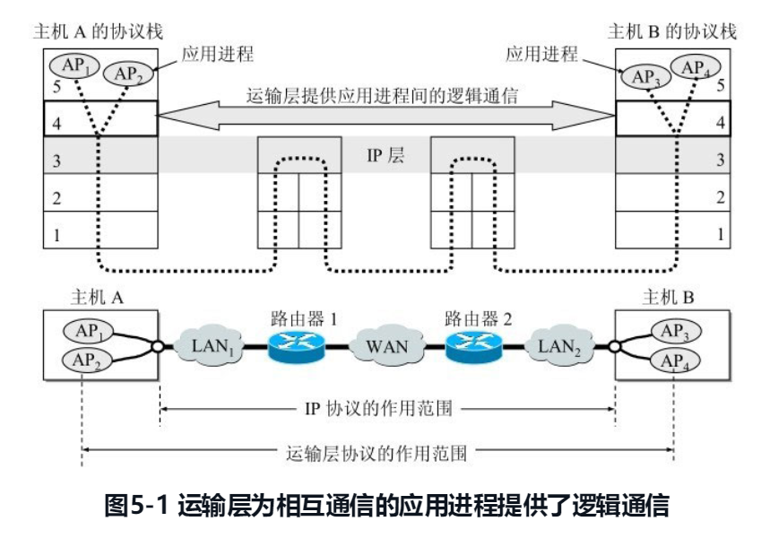
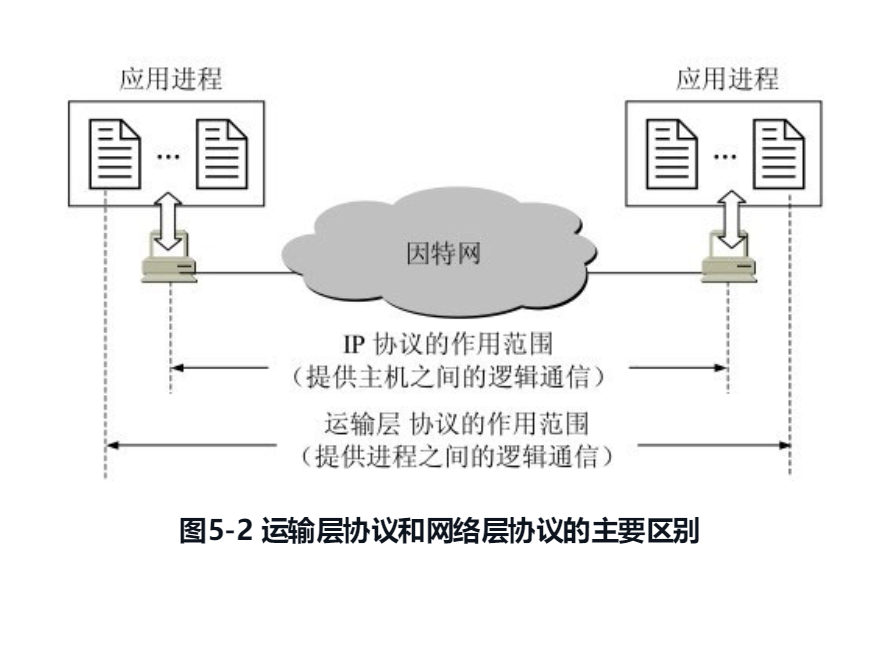
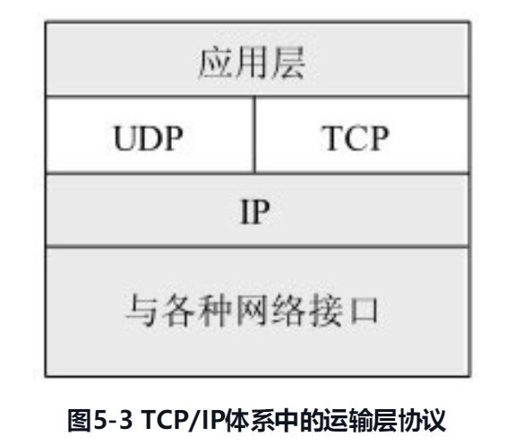
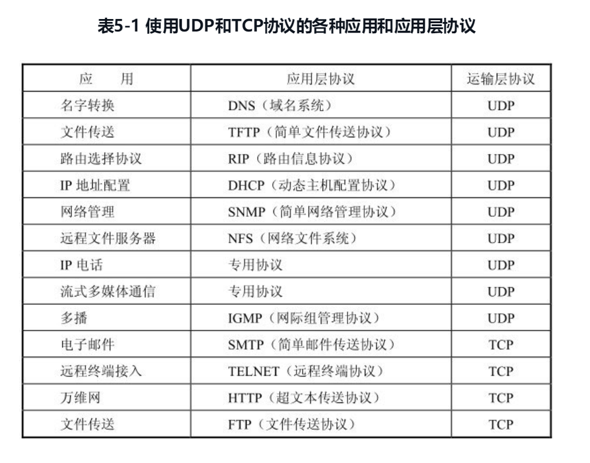
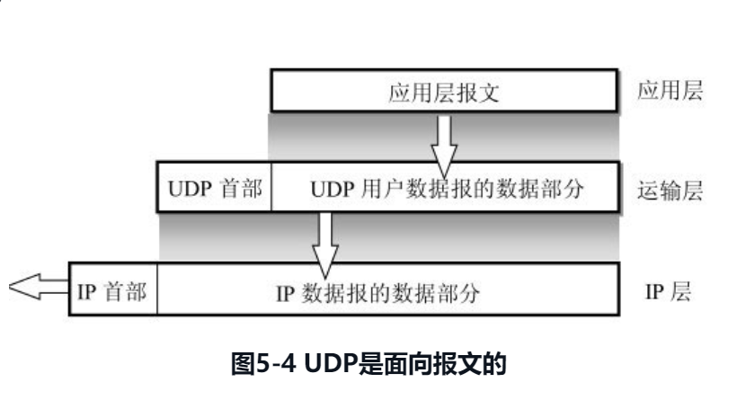
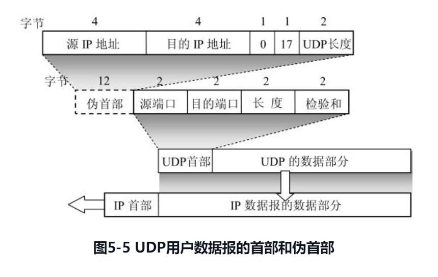
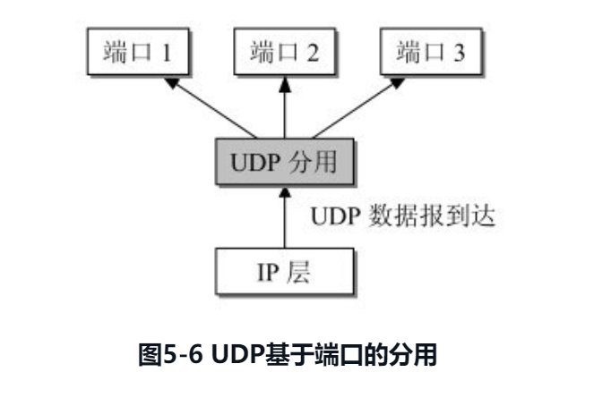
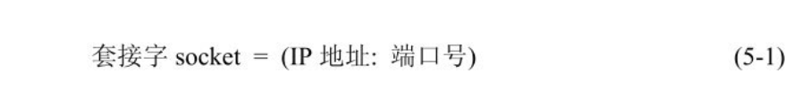

本章先概括介绍运输层协议的特点，以及进程之间的通信以及端口等重要概念。然后讲述比较简单的 UDP 协议。其余的篇幅都是讨论较为复杂但非常重要的 TCP 协议[插图]和可靠传输的工作原理，包括停止等待协议和 ARQ 协议。在详细讲述 TCP 报文段的首部格式之后，讨论 TCP 的三个重要问题：滑动窗口、流量控制和拥塞控制机制。最后，介绍 TCP 的连接管理。
{: id="20201209085702-u7acfx9"}

**运输层**是整个网络体系结构中的关键层次之一。一定要弄清以下一些重要概念：
{: id="20201209085702-smz3ltf"}

1. {: id="20201209085702-jeh1g79"}运输层为相互通信的应用进程提供逻辑通信。
2. {: id="20201209085702-42ug4zm"}端口和套接字的意义。
3. {: id="20201209085702-929es61"}无连接的 UDP 的特点。
4. {: id="20201209085702-8fufc83"}面向连接的 TCP 的特点。
5. {: id="20201209085702-u4d0m1b"}在不可靠的网络上实现可靠传输的工作原理，停止等待协议和 ARQ 协议。
6. {: id="20201209085702-hp2z3yp"}TCP 的滑动窗口、流量控制、拥塞控制和连接管理。
{: id="20201209085702-am2s5ps"}

# 5.1 运输层协议概述
{: id="20201209085702-olfyh8n"}

### 5.1.1 进程之间的通信
{: id="20201209085702-vhhbc9t"}

**严格地讲，两个主机进行通信就是两个主机中的应用进程互相通信**。IP 协议虽然能把分组送到目的主机，但是这个分组还停留在主机的网络层而没有交付主机中的应用进程。从运输层的角度看，通信的真正端点并不是主机而是主机中的进程。也就是说，端到端的通信是应用进程之间的通信。在一个主机中经常有多个应用进程同时分别和另一个主机中的多个应用进程通信。
{: id="20201209085702-k5hjurf"}

{: id="20201209085702-2ce81je"}

**从这里可以看出网络层和运输层有明显的区别。网络层是为主机之间提供逻辑通信，而运输层为应用进程之间提供端到端的逻辑通信**。
{: id="20201209085702-osuyfwt"}

根据应用程序的不同需求，运输层需要有两种不同的运输协议，即**面向连接的 TCP** 和 **无连接的 UDP**。
{: id="20201209085702-rer11b5"}

{: id="20201209085702-3qalz4d"}

### 5.1.2 运输层的两个主要协议
{: id="20201209085702-f170v50"}

TCP/IP 运输层的两个主要协议都是因特网的正式标准，即：
{: id="20201209085702-lvtoq4o"}

1. {: id="20201209085702-f496w84"}用户数据报协议 UDP (User Datagram Protocol)
2. {: id="20201209085702-zhr1sip"}传输控制协议 TCP (Transmission Control Protocol)
{: id="20201209085702-dabebho"}

这两种协议在协议栈中的位置：
{: id="20201209085702-rxp0j09"}

{: id="20201209085702-bqcuwn2"}

按照 OSI 的术语，两个对等运输实体在通信时传送的数据单位叫作**运输协议数据单元 TPDU (Transport Protocol Data Unit)**。但在 TCP/IP 体系中，则根据所使用的协议是 TCP 或 UDP，分别称之为 **TCP 报文段**(segment) 或 **UDP 用户数据报**。
{: id="20201209085702-8rtfnjz"}

**使用 UDP 和 TCP 协议的各种应用和应用层协议**
{: id="20201209085702-92nxgc0"}

{: id="20201209085702-0qaf7zi"}

### 5.1.3 运输层的端口
{: id="20201209085702-sbiv8ic"}

在后面将讲到的 UDP 和 TCP 的首部格式中，我们将会看到（图 5-5 和图 5-14）它们都有源端口和目的端口这两个重要字段。当运输层收到 IP 层交上来的运输层报文时，就能够根据其首部中的目的端口号把数据交付应用层的目的应用进程。
{: id="20201209085702-bdkjf54"}

# 5.2 用户数据报协议 UDP
{: id="20201209085702-jx0ym7t"}

### 5.2.1 UDP 概述
{: id="20201209085702-dx112xc"}

用户数据报协议 UDP 只在 IP 的数据报服务之上增加了很少一点的功能，这就是复用和分用的功能以及差错检测的功能。UDP 的主要特点是：
{: id="20201209085702-r22ryy8"}

1. {: id="20201209085702-h56567c"}UDP 是**无连接的**，即发送数据之前不需要建立连接（当然，发送数据结束时也没有连接可释放），因此减少了开销和发送数据之前的时延。
2. {: id="20201209085702-jbf6tko"}UDP 使用**尽最大努力交付**，即不保证可靠交付，因此主机不需要维持复杂的连接状态表（这里面有许多参数）。
3. {: id="20201209085702-kutm3xl"}UDP 是面向报文的。发送方的 UDP 对应用程序交下来的报文，在添加首部后就向下交付 IP 层。UDP 对应用层交下来的报文，既不合并，也不拆分，而是保留这些报文的边界。这就是说，应用层交给 UDP 多长的报文，UDP 就照样发送，即一次发送一个报文，如图 5-4 所示。在接收方的 UDP，对 IP 层交上来的 UDP 用户数据报，在去除首部后就原封不动地交付上层的应用进程。也就是说，UDP 一次交付一个完整的报文。因此，应用程序必须选择合适大小的报文。若报文太长，UDP 把它交给 IP 层后，IP 层在传送时可能要进行分片，这会降低 IP 层的效率。反之，若报文太短，UDP 把它交给 IP 层后，会使 IP 数据报的首部的相对长度太大，这也降低了 IP 层的效率。
   
4. {: id="20201209085702-gv1h6gp"}UPD **没有拥塞控制**，因此网络出现的拥塞不会使源主机的发送速率降低。这对某些实时应用是很重要的。很多的实时应用（如 IP 电话、实时视频会议等）要求源主机以恒定的速率发送数据，并且允许在网络发生拥塞时丢失一些数据，但却不允许数据有太大的时延。UDP 正好适合这种要求。
5. {: id="20201209085702-s132tay"}UDP **支持一对一、一对多、多对一和多对多的交互通信**。
6. {: id="20201209085702-j7iqsy9"}UDP 的**首部开销小**，只有 8 个字节，比 TCP 的 20 个字节的首部要短。
{: id="20201209085702-kv583hx"}

### 5.2.2 UPD 的首部格式
{: id="20201209085702-gmln4a7"}

用户数据报 UDP 有两个字段：数据字段和首部字段。首部字段很简单，只有 8 个字节(图 5-5)，由四个字段组成，**每个字段的长度都是两个字节**。各字段意义如下：
{: id="20201209085702-yn1tis3"}

{: id="20201209085702-5f1rcdd"}

**（1）源端口**，即源端口号，在需要对方回信时选用。不需要时可用全 0。
{: id="20201209085702-6b2ajfs"}

**（2）目的端口** ，目的端口号。这在终点交付报文时必须要使用到。
{: id="20201209085702-vsoy2mz"}

**（3）长度** ，UDP 用户数据报的长度，其最小值是 8（仅有首部）。
{: id="20201209085702-8sbvm1y"}

**（4）检验和**，检测 UDP 用户数据报在传输中是否有错。有错就丢弃。
{: id="20201209085702-0klogt6"}

当运输层从 IP 层收到 UDP 数据报时，就根据首部中的目的端口，把 UDP 数据报通过相应的端口，上交最后的终点——应用进程。图 5-6 是 UDP 基于端口分用的示意图。
{: id="20201209085702-18sw679"}

{: id="20201209085702-3kvwlpu"}

# 5.3 传输控制协议 TCP 概述
{: id="20201209085702-721ei42"}

### 5.3.1 TCP 最主要的特点
{: id="20201209085702-nque5ek"}

TCP 是 TCP/IP 体系中非常复杂的一个协议。下面介绍 TCP 最主要的特点。
{: id="20201209085702-4s17mxb"}

**（1）TCP 是面向连接的运输层协议**，这就是说，应用程序在使用 TCP 协议之前，必须先建立 TCP 连接。在传送数据完毕后，必须释放已经建立的 TCP 连接。也就是说，应用进程之间的通信好像在“打电话”：通话前要先拨号建立连接，通话结束后要挂机释放连接。
{: id="20201209085702-v3uxaxe"}

**（2）** 每一条 TCP 连接只能有两个端点(endpoint)，每一条 TCP 连接只能是点对点的（一对一）。这个问题后面还要进一步讨论。
{: id="20201209091810-5blmow8"}

**（3）** TCP 提供可靠交付的服务。通过 TCP 连接传送的数据，无差错、不丢失、不重复、并且按序到达。
{: id="20201209091829-z6ku7bs"}

**（4）** TCP 提供**全双工通信**。TCP 允许通信双方的应用进程在任何时候都能发送数据。TCP 连接的两端都设有发送缓存和接收缓存，用来临时存放双向通信的数据。在发送时，应用程序在把数据传送给 TCP 的缓存后，就可以做自己的事，而 TCP 在合适的时候把数据发送出去。在接收时，TCP 把收到的数据放入缓存，上层的应用进程在合适的时候读取缓存中的数据。
{: id="20201209091850-628a2gq"}

**（5）** **面向字节流**。TCP 中的“流”(stream)指的是流入到进程或从进程流出的字节序列。“面向字节流”的含义是：虽然应用程序和 TCP 的交互是一次一个数据块（大小不等），但 TCP 把应用程序交下来的数据看成仅仅是一连串的无结构的字节流。TCP 并不知道所传送的字节流的含义
{: id="20201209091914-si3eics"}

### 5.3.2 TCP 的连接
{: id="20201209092008-i5887zf"}

**TCP 把连接作为最基本的抽象**。TCP 的许多特性都与 TCP 是面向连接的这个基本特性有关。因此我们对 TCP 连接需要有更清楚的了解。
{: id="20201209092047-d0ek6nr"}

前面已经讲过，每一条 TCP 连接有两个端点。那么，TCP 连接的端点是什么呢？不是主机，不是主机的 IP 地址，不是应用进程，也不是运输层的协议端口，TCP 连接的端点叫做**套接字(socket)** 或**插口**。
{: id="20201209092213-65xggt2"}

根据 RFC 793 的定义：端口号拼接到(contatenated with) IP 地址即构成了套接字。因此，套接字的表示方法是在点分十进制的 IP 地址后面写上端口号，中间用冒号或逗号隔开。例如，若 IP 地址是 192.3.4.5 而端口号是 80，那么得到的套接字就是(192.3.4.5: 80)。总之，我们有：
{: id="20201209092147-ewboa56"}

{: id="20201209092254-5rghav4"}

**每一条 TCP 连接唯一地被通信两端的两个端点（即两个套接字）所确定**。即：
{: id="20201209092346-o764abx"}

{: id="20201209092345-l9h7bpo"}

这里 IP1 和 IP2 分别是两个端点主机的 IP 地址，而 port1 和 port2 分别是两个端点主机中的端口号。TCP 连接的两个套接字就是 socket1 和 socket2。可见套接字 socket 是个很抽象的概念。
{: id="20201209092413-45o0rhk"}

总之，TCP 连接就是由协议软件所提供的一种抽象。虽然有时为了方便，我们也可以说，在一个应用进程和另一个应用进程之间建立了一条 TCP 连接，但一定要记住：**TCP 连接的端点是个很抽象的套接字，即（IP 地址：端口号）**。也还应记住：同一个 IP 地址可以有多个不同的 TCP 连接，而同一个端口号也可以出现在多个不同的 TCP 连接中。
{: id="20201209092444-i2tt8s2"}

{: id="20201209092702-425idpz"}

# 5.4 可靠传输的工作原理
{: id="20201209092702-8i1rai2"}

我们知道，TCP 发送的报文段是交给 IP 层传送的。但 IP 层只能提供尽最大努力服务，也就是说，TCP 下面的网络所提供的是不可靠的传输。因此，TCP 必须采用适当的措施才能使得两个运输层之间的通信变得可靠。理想的传输条件有以下两个特点：
{: id="20201209092851-n5kqm8a"}

(1) 传输信道不产生差错。
{: id="20201209092940-u0dgakc"}

(2) 不管发送方以多快的速度发送数据，接收方总是来得及处理收到的数据。
{: id="20201209092943-3gjozwx"}

在这样的理想传输条件下，不需要采取任何措施就能够实现可靠传输。然而实际的网络都不具备以上两个理想条件。
{: id="20201209092946-8bevt21"}

但我们可以使用一些可靠传输协议，当出现差错时让发送方重传出现差错的数据，同时在接收方来不及处理收到的数据时，及时告诉发送方适当降低发送数据的速度。这样一来，本来是不可靠的传输信道就能够实现可靠传输了。下面从最简单的停止等待协议讲起 。
{: id="20201209092950-vqmbbx1"}

### 5.4.1 停止等待协议
{: id="20201209092716-qungnh9"}

{: id="20201209092905-e78oayx"}

{: id="20201209092525-icez6pv"}
