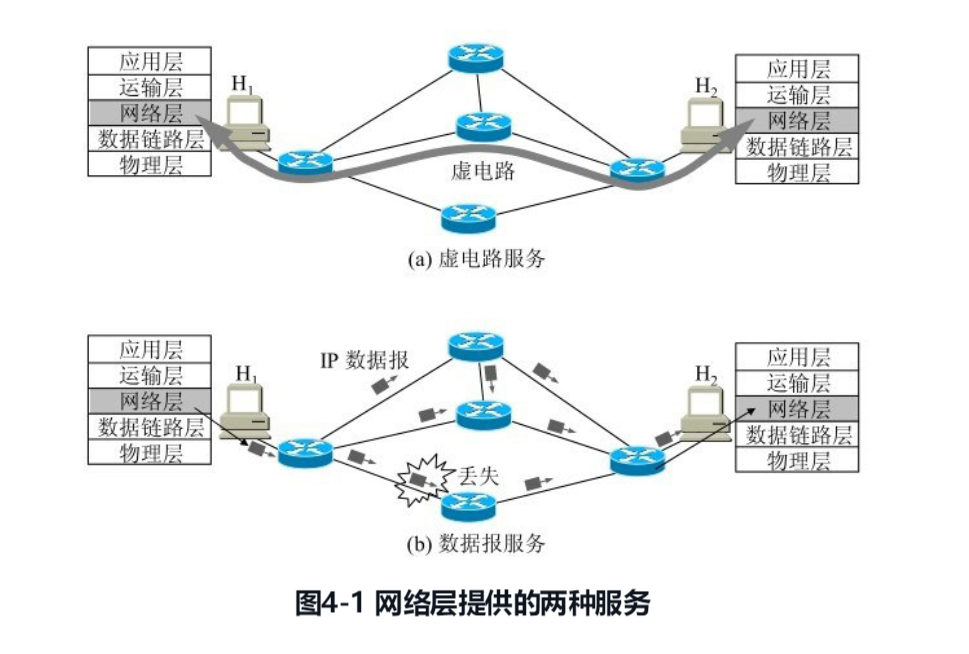
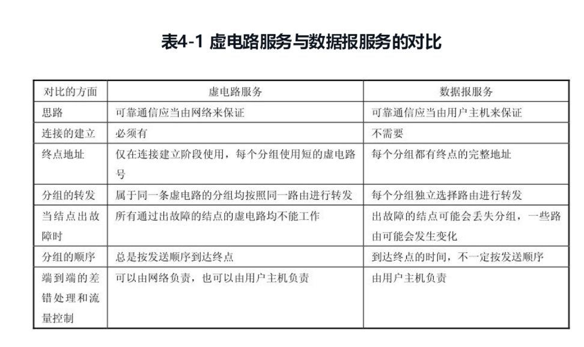
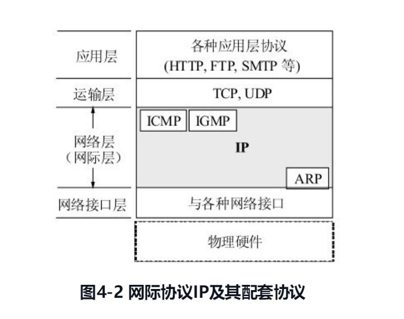
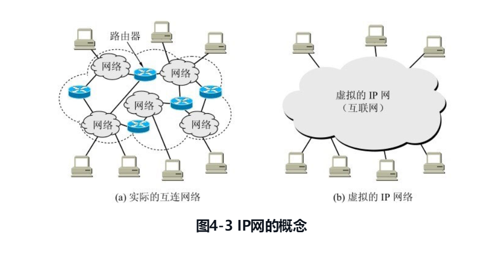
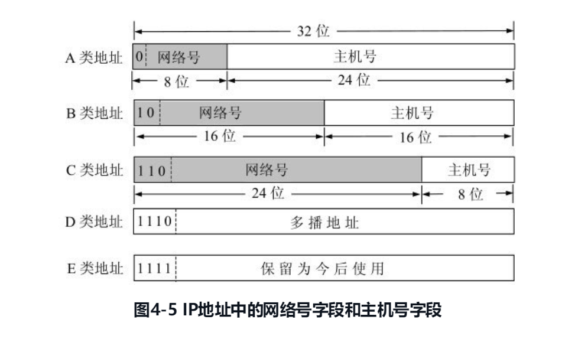
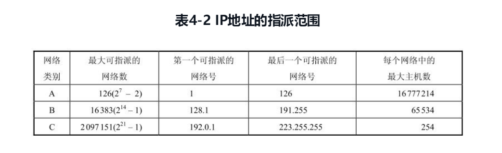
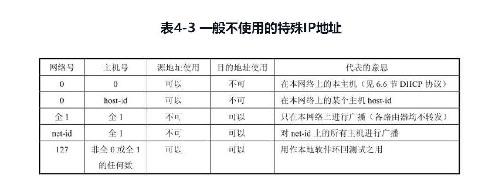
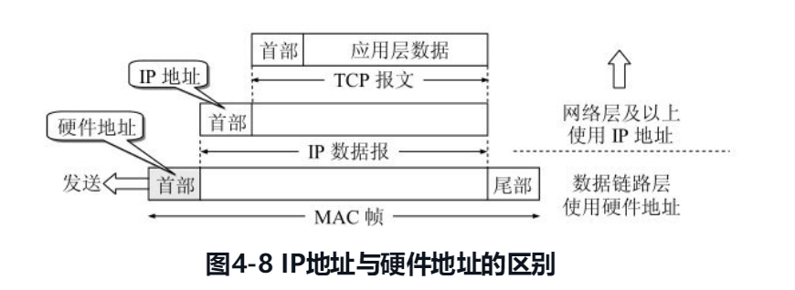
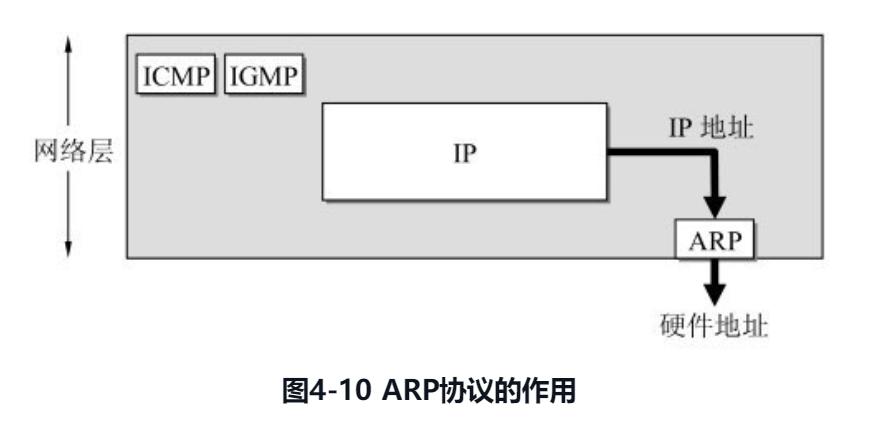
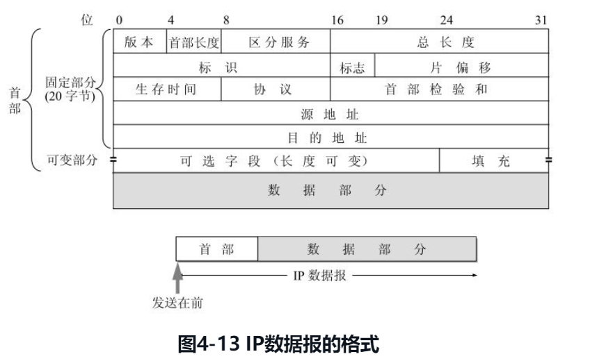

# 4.1 网络层提供的两种服务

在计算机网络领域，网络层应该向运输层提供怎样的服务（“面向连接”还是“无连接”）曾引起了长期的争论。争论焦点的实质就是：在计算机通信中，可靠交付应当由谁来负责？是网络还是端系统？

**网络层向上只提供简单灵活的、无连接的、尽最大努力交付的数据报服务**。网络在发送分组时不需要先建立连接。每一个分组（也就是 IP 数据报）独立发送，与其前后的分组无关（不进行编号）。**网络层不提供服务质量的承诺**。也就是说，所传送的分组可能出错、丢失、重复和失序（即不按序到达终点），当然也不保证分组交付的时限。

# 4.2 网际协议 IP

网际协议 IP 是 TCP/IP 体系中两个最主要的协议之一[STEV94][COME06][FORO10]，也是最重要的因特网标准协议之一。与 IP 协议配套使用的还有三个协议：

- **地址解析协议 ARP**(Address Resolution Protocol)
- **网际控制报文协议 ICMP** (Internet Control Message Protocol)
- **网际组管理协议 IGMP** (Internet Group Management Protocol)

图 4-2 画出了这三个协议和网际协议 IP 的关系。在这一层中，ARP 画在最下面，因为 IP 经常要使用这个协议。ICMP 和 IGMP 画在这一层的上部，因为它们要使用 IP 协议。这三个协议将在后面陆续介绍。由于网际协议 IP 是用来使互连起来的许多计算机网络能够进行通信，因此 TCP/IP 体系中的网络层常常称为**网际层(internetlayer)**，或 **IP 层**。

### 4.2.1 虚拟互连网络

从一般的概念来讲，将网络互相连接起来要使用一些中间设备。根据中间设备所在的层次，可以有以下四种不同的中间设备：

1. 物理层使用的中间设备叫做转发器(repeater)。
2. 数据链路层使用的中间设备叫做网桥或桥接器(bridge)。
3. 网络层使用的中间设备叫做路由器(router)[插图]。
4. 在网络层以上使用的中间设备叫做网关(gateway)。用网关连接两个不兼容的系统需要在高层进行协议的转换。

由于参加互连的计算机网络都使用相同的**网际协议 IP (InternetProtocol)**, 因此可以把互连以后的计算机网络看成如图 4-3(b)所示的一个**虚拟互连网络(internet)**。所谓虚拟互连网络也就是逻辑互连网络，它的意思就是互连起来的各种物理网络的异构性本来是客观存在的，但是我们利用 IP 协议就可以使这些性能各异的网络**在网络层上看起来好像是一个统一的网络**。这种使用 IP 协议的虚拟互连网络可简称为 **IP 网**（IP 网是虚拟的，但平常不必每次都强调“虚拟”二字）。使用 IP 网的好处是：当 IP 网上的主机进行通信时，就好像在一个单个网络上通信一样，它们看不见互连的各网络的具体异构细节（如具体的编址方案、路由选择协议，等等）。

### 4.2.2 分类的 IP 地址

在 TCP/IP 体系中，IP 地址是一个最基本的概念，一定要把它弄清楚。有关 IP 最重要的文档就是 RFC 791，它很早就成为了因特网的正式标准。

##### 1. IP 地址及其表示方法

整个的因特网就是一个**单一的、抽象的网络**。IP 地址就是给因特网上的每一个主机（或路由器）的每一个接口分配一个在全世界范围是唯一的 32 位的标识符。IP 地址的结构使我们可以在因特网上很方便地进行寻址。IP 地址现在由**因特网名字和数字分配机构 ICANN (Internet Corporation for Assigned Names and Numbers)**进行分配。

所谓“分类的 IP 地址”就是将 IP 地址划分为若干个固定类，每一类地址都由两个固定长度的字段组成，其中第一个字段是**网络号(net-id)**，它标志主机（或路由器）所连接到的网络。一个网络号在整个因特网范围内必须是唯一的。第二个字段是**主机号(host-id)**，它标志该主机（或路由器）。一个主机号在它前面的网络号所指明的网络范围内必须是唯一的。由此可见，一个 IP 地址在整个因特网范围内是唯一的。

IP 地址可以表示为：

上图中的符号“::=”表示“定义为”。图 4-5 给出了各种 IP 地址的网络号字段和主机号字段，这里 A 类、B 类和 C 类地址都是单播地址（一对一通信），是最常用的。

**从 IP 地址的结构来看，IP 地址并不仅仅指明一个主机，而是还指明了主机所连接到的网络。**

##### 2. 常用的三种类别的 IP 地址

IP 地址具有以下一些重要特点：

1. 每一个 IP 地址都由网络号和主机号组成。这个意义上说，IP 地址是一种**分等级的地址结构**。分两个等级的好处是：第一，IP 地址管理机构在分配 IP 地址时**只分配网络号**（第一级），而剩下的主机号（第二级）则由得到该网络号的单位自行分配。这样就方便了 IP 地址的管理。第二，路由器仅根据目的主机所连接的网络号来转发分组（而不考虑目的主机号），这样就可以使路由表中的项目数大幅度减少，从而**减小了路由表所占的存储空间以及查找路由表的时间。**
2. 实际上 IP 地址是标志一个主机（或路由器）和一条链路的接口。当一个主机同时连接到两个网络上时，该主机就必须同时具有两个相应的 IP 地址，其网络号必须是不同的。这种主机称为多归属主机(multihomed host)。由于一个路由器至少应当连接到两个网络，因此一个路由器至少应当有两个不同的 IP 地址。
3. 按照因特网的观点，一个网络是指具有相同网络号 net-id 的主机的集合，因此，用转发器或网桥连接起来的若干个局域网仍为一个网络，因为这些局域网都具有同样的网络号。具有不同网络号的局域网必须使用路由器进行互连。
4. 在 IP 地址中，所有分配到网络号的网络(不管是范围很小的局域网，还是可能覆盖很大地理范围的广域网)都是平等的。所谓平等，是指因特网同等对待每一个 IP 地址。

### 4.2.3 IP 地址与硬件地址

在学习 IP 地址时，很重要的一点就是要弄懂主机的 IP 地址与硬件地址的区别。

图 4-8 说明了这两种地址的区别。从层次的角度看，**物理地址是数据链路层和物理层使用的地址**，而 **IP 地址是网络层和以上各层使用的地址，是一种逻辑地址（称 IP 地址是逻辑地址是因为 IP 地址是用软件实现的）**。

在发送数据时，数据从高层下到低层，然后才到通信链路上传输。使用 IP 地址的 IP 数据报一旦交给了数据链路层，就被封装成 MAC 帧了。MAC 帧在传送时使用的源地址和目的地址都是硬件地址，这两个硬件地址都写在 MAC 帧的首部中。

连接在通信链路上的设备（主机或路由器）在接收 MAC 帧时，其根据是 MAC 帧首部中的硬件地址。在数据链路层看不见隐藏在 MAC 帧的数据中的 IP 地址。只有在剥去 MAC 帧的首部和尾部后把 MAC 层的数据上交给网络层后，网络层才能在 IP 数据报的首部中找到源 IP 地址和目的 IP 地址。

总之，**IP 地址放在 IP 数据报的首部，而硬件地址则放在 MAC 帧的首部**。**在网络层和网络层以上使用的是 IP 地址，而数据链路层及以下使用的是硬件地址**。在图 4-8 中，当 IP 数据报放入数据链路层的 MAC 帧中以后，整个的 IP 数据报就成为 MAC 帧的数据，因而在数据链路层看不见数据报的 IP 地址。

### 4.2.4 地址解析协议 ARP

在实际应用中，我们经常会遇到这样的问题：已经知道了一个机器（主机或路由器）的 IP 地址，需要找出其相应的硬件地址。地址解析协议 ARP 就是用来解决这样的问题的。图 4-10 说明了 ARP 协议的作用。

我们知道，网络层使用的是 IP 地址，但在实际网络的链路上传送数据帧时，最终还是必须使用该网络的硬件地址。但 IP 地址和下面的网络的硬件地址之间由于格式不同而不存在简单的映射关系（例如，IP 地址有 32 位，而局域网的硬件地址是 48 位）。此外，在一个网络上可能经常会有新的主机加入进来，或撤走一些主机。更换网络适配器也会使主机的硬件地址改变。地址解析协议 ARP 解决这个问题的方法是在主机 ARP 高速缓存中应存放一个从 IP 地址到硬件地址的映射表，并且这个映射表还经常动态更新（新增或超时删除）。

每一个主机都设有一个 ARP 高速缓存(ARP cache)，里面有本局域网上的各主机和路由器的 IP 地址到硬件地址的映射表，这些都是该主机目前知道的一些地址。那么主机怎样知道这些地址呢？我们可以通过下面的例子来说明。

当主机 A 要向本局域网上的某个主机 B 发送 IP 数据报时，就先在其 ARP 高速缓存中查看有无主机 B 的 IP 地址。如有，就在 ARP 高速缓存中查出其对应的硬件地址，再把这个硬件地址写入 MAC 帧，然后通过局域网把该 MAC 帧发往此硬件地址。也有可能查不到主机 B 的 IP 地址的项目。这可能是主机 B 才入网，也可能是主机 A 刚刚加电，其高速缓存还是空的。在这种情况下，主机 A 就自动运行 ARP, 然后按以下步骤找出主机 B 的硬件地址。

**请注意，ARP 是解决同一个局域网上的主机或路由器的 IP 地址和硬件地址的映射问题。**

### 4.2.5 IP 数据报的格式

IP 数据报的格式能够说明 IP 协议都具有什么功能。在 TCP/IP 的标准中，各种数据格式常常以 32 位(即 4 字节)为单位来描述。

图 4-13 是 IP 数据报的完整格式。从图 4-13 可看出，一个 IP 数据报由首部和数据两部分组成。首部的前一部分是固定长度，共 20 字节，是所有 IP 数据报必须具有的。在首部的固定部分的后面是一些可选字段，其长度是可变的。下面介绍首部各字段的意义。

