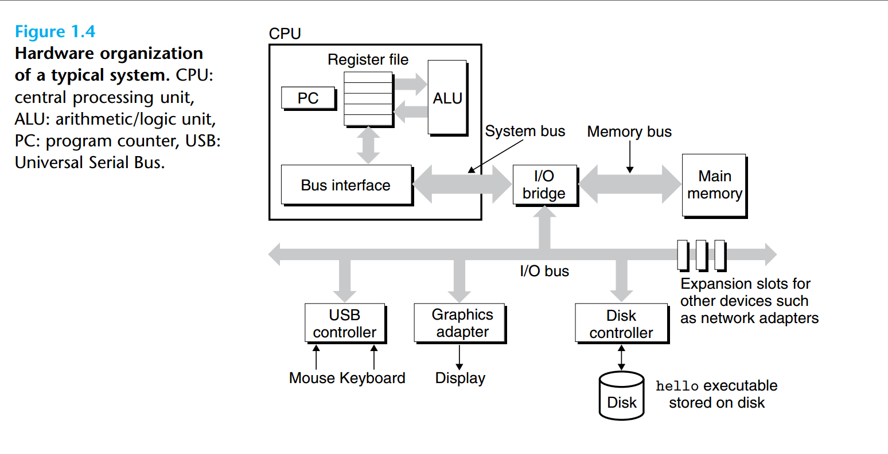

### 1.1 Information Is Bits + Context
{: id="20201016214742-y4rz57j"}

> The representation of hello.c illustrates a fundamental idea: All information
> in a system—including disk files, programs stored in memory, user data stored in
> memory, and data transferred across a network—is represented as a bunch of bits.
> The only thing that distinguishes different data objects is the context in which
> we view them. For example, in different contexts, the same sequence of bytes
> might represent an integer, floating-point number, character string, or machine
> instruction.
> {: id="20201016215406-mlqjm9d"}
{: id="20201016215405-c1pz6n5"}

### 1.2 Programs Are Translated by Other Programs into Different Forms
{: id="20201016215443-pttl6f4"}

{: id="20201016215105-080hjj7"}

### 1.3 It Pays to Understand How Compilation Systems Work
{: id="20201016220440-uuvl19z"}

### 1.4 Processors Read and Interpret Instructions Stored in Memory
{: id="20201018102451-gzcdkkm"}

{: id="20201018102458-tr7xc7h"}

{: id="20201018102558-nlamw6e"}

##### 1.4.1 Hardware Organization of a System
{: id="20201018102810-stdch8c"}

1. Buses : Running throughout the system is a collection of electrical conduits called buses
{: id="20201018102818-x6x8rbn"}

that carry bytes of information back and forth between the components.
{: id="20201018102649-yck0t1m"}

{: id="20201018102814-3mqrupc"}
