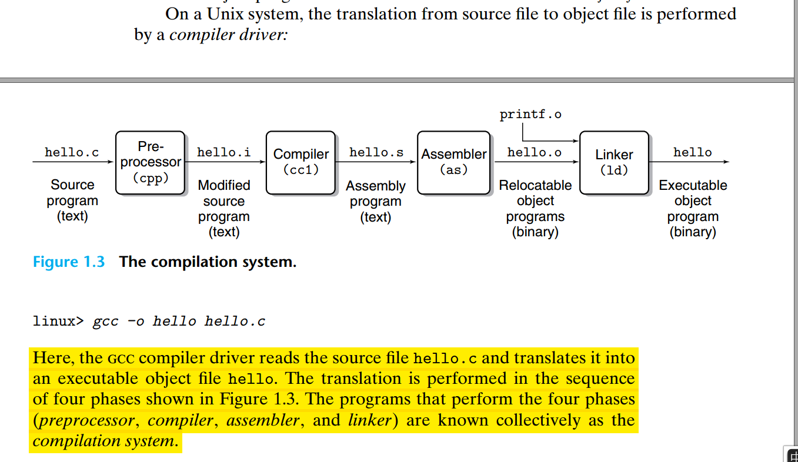

### Information Is Bits + Context
{: id="20201016214742-y4rz57j"}

这一节最核心的就是这句话：
{: id="20201016215359-ownkb6x"}

> The representation of hello.c illustrates a fundamental idea: All information
> in a system—including disk files, programs stored in memory, user data stored in
> memory, and data transferred across a network—is represented as a bunch of bits.
> The only thing that distinguishes different data objects is the context in which
> we view them. For example, in different contexts, the same sequence of bytes
> might represent an integer, floating-point number, character string, or machine
> instruction.
> {: id="20201016215406-mlqjm9d"}
{: id="20201016215405-c1pz6n5"}

在计算机的世界里，所有的信息（包括文件、内存中的程序、内存中的数据、网络中传输的数据）都是通过一些列的bits来表示的的（0或1），它们唯一的不同，就是我们看它们的上下文（context）。同样的一串bit，在不同的上下文里（context）表示不同的意思。
{: id="20201016214823-nbqblgu"}

### 1.2 Programs Are Translated by Other Programs into Different Forms
{: id="20201016215443-pttl6f4"}

{: id="20201016215105-080hjj7"}

### 1.3 It Pays to Understand How Compilation Systems Work
{: id="20201016220440-uuvl19z"}

### 1.4 Processors Read and Interpret Instructions Stored in Memory
{: id="20201018102451-gzcdkkm"}
