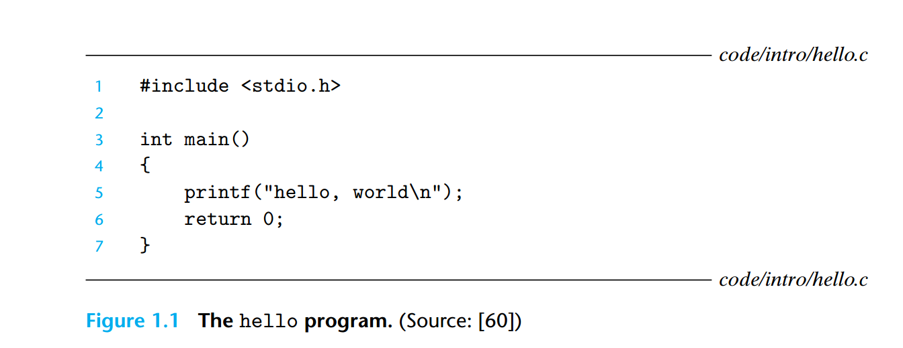
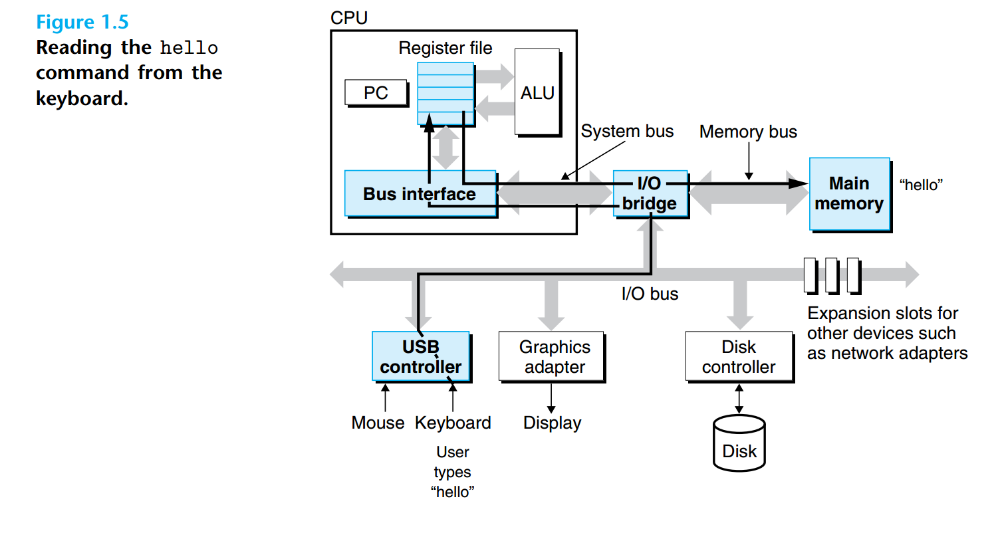
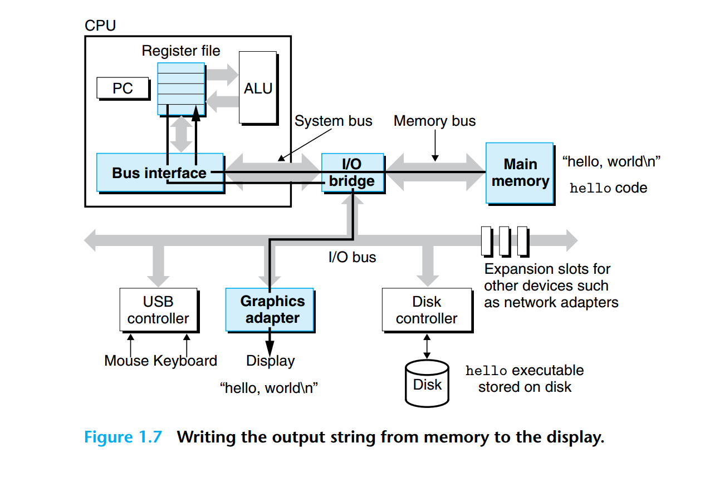
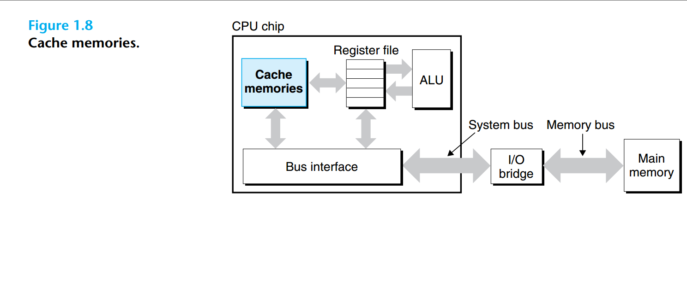
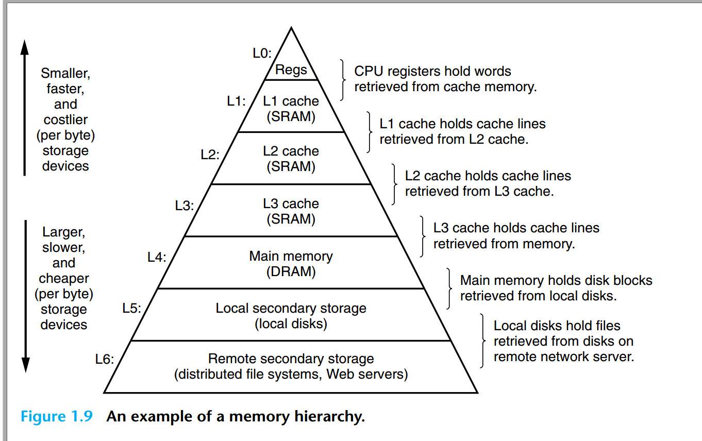

{: id="20201020165933-75w0gf0"}

{: id="20201020165935-5qdsn0e"}

# 1.1 Information Is Bits + Context
{: id="20201016214742-y4rz57j"}

> The representation of hello.c illustrates a fundamental idea: All information
> in a system—including disk files, programs stored in memory, user data stored in
> memory, and data transferred across a network—is represented as a bunch of bits.
> The only thing that distinguishes different data objects is the context in which
> we view them. For example, in different contexts, the same sequence of bytes
> might represent an integer, floating-point number, character string, or machine
> instruction.
> {: id="20201016215406-mlqjm9d"}
{: id="20201016215405-c1pz6n5"}

# 1.2 Programs Are Translated by Other Programs into Different Forms
{: id="20201016215443-pttl6f4"}

{: id="20201020165856-acbt20m"}

{: id="20201016215105-080hjj7"}

# 1.3 It Pays to Understand How Compilation Systems Work
{: id="20201016220440-uuvl19z"}

# 1.4 Processors Read and Interpret Instructions Stored in Memory
{: id="20201018102451-gzcdkkm"}

{: id="20201018102458-tr7xc7h"}

### 1.4.1 Hardware Organization of a System
{: id="20201018102810-stdch8c"}

##### Buses
{: id="20201018102958-otvnewf"}

Running throughout the system is a collection of electrical conduits called buses
{: id="20201018103001-k2ywdqa"}

that carry bytes of information back and forth between the components.
{: id="20201018102649-yck0t1m"}

##### I/O Devices
{: id="20201018103004-wpszskp"}

Input/output (I/O) devices are the system’s connection to the external world. Our
example system has four I/O devices: a keyboard and mouse for user input, a
display for user output, and a disk drive (or simply disk) for long-term storage of
data and programs. Initially, the executable hello program resides on the disk.
{: id="20201020164245-dybxiqi"}

##### Main Memory
{: id="20201020164320-0hts506"}

The main memory is a temporary storage device that holds both a program and
the data it manipulates while the processor is executing the program.Physically,
main memory consists of a collection of dynamic random access memory (DRAM)
chips. Logically, memory is organized as a linear array of bytes, each with its own
unique address (array index) starting at zero.
{: id="20201020164350-nryzbnx"}

##### Processor
{: id="20201020164352-omgibae"}

The central processing unit (CPU), or simply processor, is the engine that interprets (or executes) instructions stored in main memory. At its core is a word-size
storage device (or register) called the program counter (PC). At any point in time,
the PC points at (contains the address of) some machine-language instruction in
main memory
{: id="20201020164430-2hu1dgw"}

### 1.4.2 Running the hello Program
{: id="20201020165449-iai51so"}

{: id="20201020165452-hx4zcji"}

{: id="20201020165652-n13j88s"}

# 1.5 Caches Matter
{: id="20201020165653-l8mtuy9"}

An important lesson from this simple example is that a system spends a lot of
time moving information from one place to another. The machine instructions in
the hello program are originally stored on disk. When the program is loaded,
they are copied to main memory. As the processor runs the program, instructions are copied from main memory into the processor. Similarly, the data string
hello,world\n, originally on disk, is copied to main memory and then copied
from main memory to the display device. From a programmer’s perspective, much
of this copying is overhead that slows down the “real work” of the program. Thus,
a major goal for system designers is to make these copy operations run as fast as
possible.
{: id="20201020165707-gzqovjm"}

{: id="20201020165838-53mkcnm"}

{: id="20201020170015-322f7lr"}

{: id="20201020195440-b4ryzyq"}

{: id="20201020195447-mkwbc85"}

{: id="20201020195454-b4odv00"}

{: id="20201020195509-7ohbgxi"}

{: id="20201020195455-46l5htu"}
