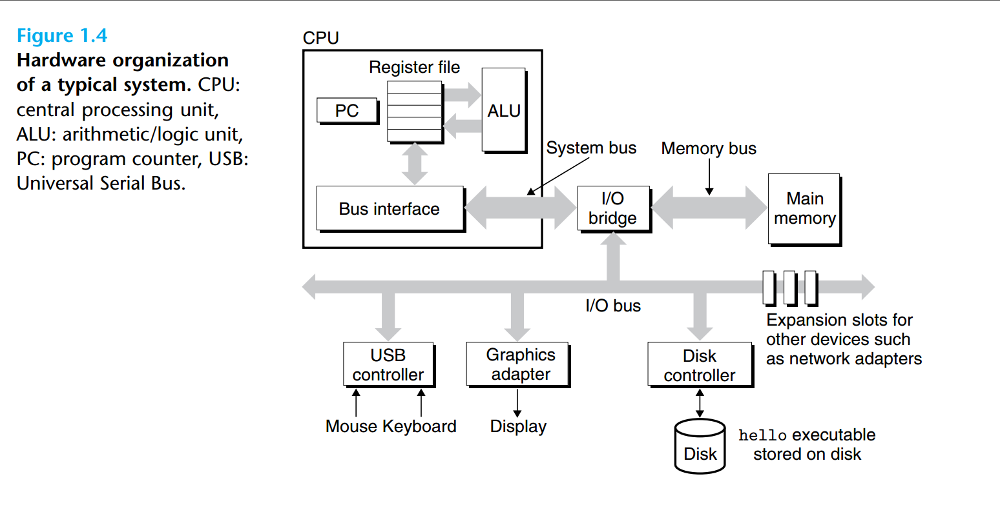
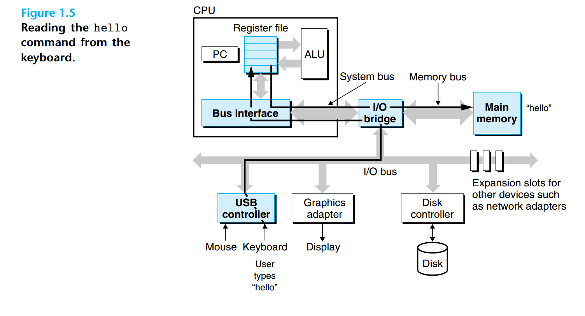
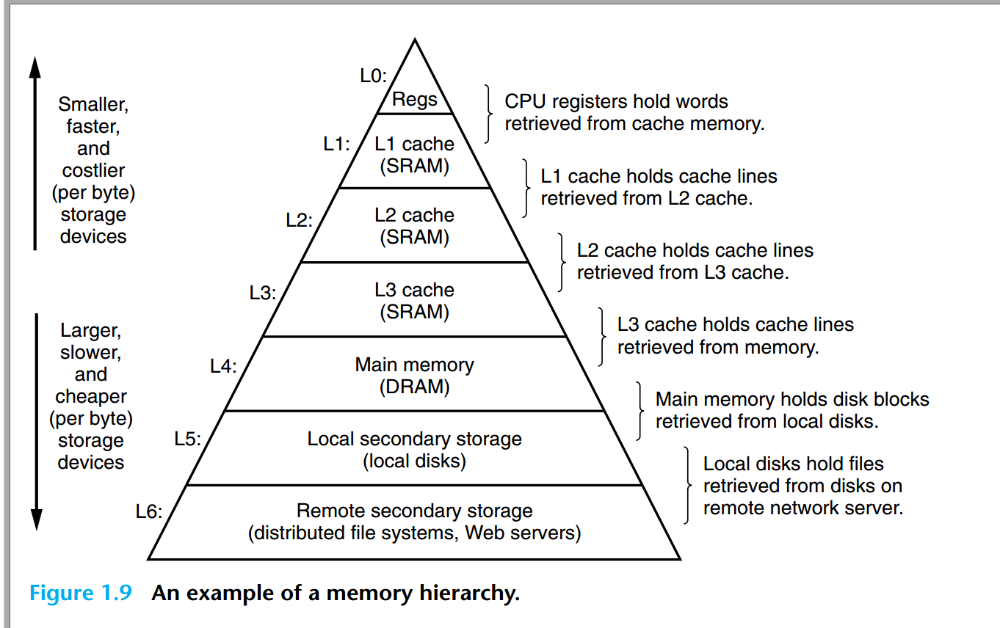
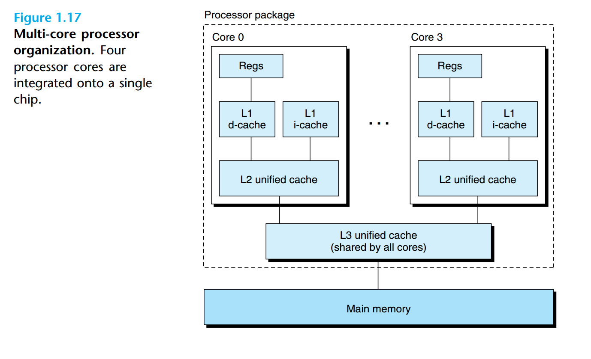

# 1.1 Information Is Bits + Context

> The representation of hello.c illustrates a fundamental idea: All information
> in a system—including disk files, programs stored in memory, user data stored in
> memory, and data transferred across a network—is represented as a bunch of bits.
> The only thing that distinguishes different data objects is the context in which
> we view them. For example, in different contexts, the same sequence of bytes
> might represent an integer, floating-point number, character string, or machine
> instruction.

# 1.2 Programs Are Translated by Other Programs into Different Forms

# 1.3 It Pays to Understand How Compilation Systems Work

# 1.4 Processors Read and Interpret Instructions Stored in Memory

### 1.4.1 Hardware Organization of a System

##### Buses

Running throughout the system is a collection of electrical conduits called buses

that carry bytes of information back and forth between the components.

##### I/O Devices

Input/output (I/O) devices are the system’s connection to the external world. Our
example system has four I/O devices: a keyboard and mouse for user input, a
display for user output, and a disk drive (or simply disk) for long-term storage of
data and programs. Initially, the executable hello program resides on the disk.

##### Main Memory

The main memory is a temporary storage device that holds both a program and
the data it manipulates while the processor is executing the program.Physically,
main memory consists of a collection of dynamic random access memory (DRAM)
chips. Logically, memory is organized as a linear array of bytes, each with its own
unique address (array index) starting at zero.

##### Processor

The central processing unit (CPU), or simply processor, is the engine that interprets (or executes) instructions stored in main memory. At its core is a word-size
storage device (or register) called the program counter (PC). At any point in time,
the PC points at (contains the address of) some machine-language instruction in
main memory

### 1.4.2 Running the hello Program

# 1.5 Caches Matter

An important lesson from this simple example is that a system spends a lot of
time moving information from one place to another. The machine instructions in
the hello program are originally stored on disk. When the program is loaded,
they are copied to main memory. As the processor runs the program, instructions are copied from main memory into the processor. Similarly, the data string
hello,world\n, originally on disk, is copied to main memory and then copied
from main memory to the display device. From a programmer’s perspective, much
of this copying is overhead that slows down the “real work” of the program. Thus,
a major goal for system designers is to make these copy operations run as fast as
possible.

The idea behind caching is that a system can get the effect of both
a very large memory and a very fast one by exploiting locality, the tendency for
programs to access data and code in localized regions. By setting up caches to hold
data that are likely to be accessed often, we can perform most memory operations
using the fast caches

# 1.6 Storage Devices Form a Hierarchy

The main idea of a memory hierarchy is that storage at one level serves as a
cache for storage at the next lower level. Thus, the register file is a cache for the
L1 cache. Caches L1 and L2 are caches for L2 and L3, respectively. The L3 cache
is a cache for the main memory, which is a cache for the disk. On some networked
systems with distributed file systems, the local disk serves as a cache for data stored
on the disks of other systems.

# 1.7 The Operating System Manages the Hardware

The operating system has two primary purposes: (1) to protect the hardware
from misuse by runaway applications and (2) to provide applications with simple
and uniform mechanisms for manipulating complicated and often wildly different
low-level hardware devices. The operating system achieves both goals via the
fundamental abstractions shown in Figure 1.11: processes, virtual memory, and
files. As this figure suggests, files are abstractions for I/O devices, virtual memory
is an abstraction for both the main memory and disk I/O devices, and processes
are abstractions for the processor, main memory, and I/O devices. We will discuss
each in turn.

### 1.7.1 Processes

A process is the operating system’s abstraction for a running program. Multiple processes can run concurrently on the same system, and each process appears to have exclusive use of the hardware.

The operating system keeps track of all the state information that the process
needs in order to run. This state, which is known as the context,

There are two concurrent processes in our example scenario: the shell process
and the hello process. Initially, the shell process is running alone, waiting for input
on the command line. When we ask it to run the hello program, the shell carries
out our request by invoking a special function known as a system call that passes
control to the operating system. The operating system saves the shell’s context,
creates a new hello process and its context, and then passes control to the new
hello process. After hello terminates, the operating system restores the context
of the shell process and passes control back to it, where it waits for the next
command-line input.

### 1.7.2 Threads

Although we normally think of a process as having a single control flow, in modern
systems a process can actually consist of multiple execution units, called threads,
each running in the context of the process and sharing the same code and global
data.

### 1.7.3 Virtual Memory

Virtual memory is an abstraction that provides each process with the illusion that it
has exclusive use of the main memory. Each process has the same uniform view of
memory, which is known as its virtual address space.

### 1.7.4 Files

A file is a sequence of bytes, nothing more and nothing less. Every I/O device,
including disks, keyboards, displays, and even networks, is modeled as a file. All
input and output in the system is performed by reading and writing files, using a
small set of system calls known as Unix I/O.

# 1.8 Systems Communicate with Other Systems Using Networks

With the advent of global networks such as the Internet, copying information
from one machine to another has become one of the most important uses of
computer systems. For example, applications such as email, instant messaging, the
World Wide Web, FTP, and telnet are all based on the ability to copy information
over a network.

# 1.9 Important Themes

### 1.9.1 Amdahl’s Law

### 1.9.2 Concurrency and Parallelism

Throughout the history of digital computers, two demands have been constant
forces in driving improvements: **we want them to do more, and we want them to
run faster.** Both of these factors improve when the processor does more things at
once. We use the term **concurrency** to refer to the general concept of a system with
multiple, simultaneous activities, and the term **parallelism** to refer to the use of
concurrency to make a system run faster. Parallelism can be exploited at multiple
levels of abstraction in a computer system. We highlight three levels here, working
from the highest to the lowest level in the system hierarchy

##### Thread-Level Concurrency

Hyperthreading, sometimes called simultaneous multi-threading, is a technique that allows a single CPU to execute multiple flows of control.

##### Instruction-Level Parallelism

##### Single-Instruction, Multiple-Data (SIMD) Parallelism

### 1.9.3 The Importance of Abstractions in Computer Systems

The use of abstractions is one of the most important concepts in computer science

On the operating system side, we have introduced three abstractions: files as
an abstraction of I/O devices, virtual memory as an abstraction of program memory, and processes as an abstraction of a running program. To these abstractions
we add a new one: the virtual machine, providing an abstraction of the entire
computer, including the operating system, the processor, and the programs.
