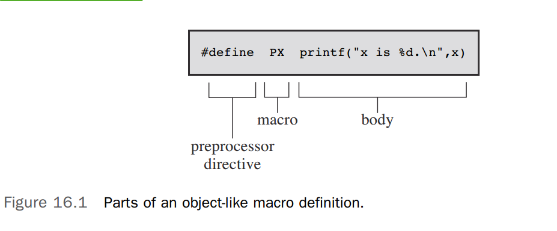

The C language proper is built on the C keywords, expressions, and statements as well as the
rules for using them. The C standard, however, goes beyond describing just the C language. It
also describes how the C preprocessor should perform, establishes which functions form the standard C library, and details how these functions work. We’ll explore the C preprocessor and
the C library in this chapter, beginning with the preprocessor.

# Manifest Constants: #define

The #define preprocessor directive, like all preprocessor directives, begins with the # symbol
at the beginning of a line. The ANSI and subsequent standards permit the # symbol to be
preceded by spaces or tabs, and it allows for space between the # and the remainder of the
directive.

```
#include<stdio.h>

#define TWO 2
# define OW "Consistency is the last refuge of the unimagina\
tive. - Oscar Wilde"
#define FOUR TWO*TWO
#define PX printf("x is %d.\n", x)

int main() {
    int x = TWO;
    PX;
    x = FOUR;
    // printf(FMT, x);
    printf("%s\n", OW);
    printf("TWO: OW\n");

    return 0;
}
```

Each #define line (logical line, that is) has three parts. The first part is the #define directive
itself. The second part is your chosen abbreviation, known as a **macro**. Some macros, like these
examples, represent values; they are called object-like macros. (C also has function-like macros,
and we’ll get to them later.) The macro name must have no spaces in it, and it must conform
to the same naming rules that C variables follow: Only letters, digits, and the underscore (_)
character can be used, and the first character cannot be a digit. The third part (the remainder
of the line) is termed the replacement list or body (see Figure 16.1). When the preprocessor finds
an example of one of your macros within your program, it almost always replaces it with the
body. (There is one exception, as we will show you in just a moment.) This process of going
from a macro to a final replacement is called macro expansion. Note that you can use standard
C comments on a #define line; as mentioned earlier, each is replaced by a space before the
preprocessor sees it



# Using Arguments with #define

```
#include<stdio.h>

#define SQUARE(x) x*x
#define PX(x) printf("x is %d\n", x)

int main() {
    printf("The 2 square is %d\n", SQUARE(2));
    int x = 10;
    PX(x);
    return 0;
}
```

Here, SQUARE is the macro identifier, the X in SQUARE(X) is the macro argument, and X*X is the
replacement list

`#define SQUARE(x) ((x)*(x))`

### Macro or Function?

The macro-versus-function choice represents a trade-off between time and space. A macro
produces inline code; that is, you get a statement in your program. If you use the macro 20
times, you get 20 lines of code inserted into your program. If you use a function 20 times, you
have just one copy of the function statements in your program, so less space is used. On the
other hand, program control must shift to where the function is and then return to the calling
program, and this takes longer than inline code.

Macros have an advantage in that they don’t worry about variable types. (This is because they
deal with character strings, not with actual values.) Therefore, the SQUARE(x) macro can be
used equally well with int or float.

# File Inclusion: #include

When the preprocessor spots an #include directive, it looks for the following filename and
includes the contents of that file within the current file. The #include directive in your source
code file is replaced with the text from the included file. It’s as though you sat down and typed
in the entire contents of the included file at that particular location in your source file. The
#include directive comes in two varieties:

**#include stdio.h**  Filename directive>> in (angle brackets)> )> (angle)>angle brackets
**#include "mystuff.h"**  Filename in double quotation marks

On a Unix system, the angle brackets tell the preprocessor to look for the file in one or more
standard system directories. The double quotation marks tell it to first look in your current
directory (or some other directory that you have specified in the filename) and then look in the
standard places:

**#include stdio.h**  Searches directive>> system directories
**#include "hot.h"** Searches your current working directory
**#include "/usr/biff/p.h"** Searches the /usr/biff directory

# Other Directives

### The #undef Directive

The #undef directive “undefines” a given #define. That is, suppose you have this definition:
`#define LIMIT 400`

Then the directive
`#undef LIMIT`

removes that definition. Now, if you like, you can redefine LIMIT so that it has a new value.
Even if LIMIT is not defined in the first place, it is still valid to undefine it. If you want to use a
particular name and you are unsure whether it has been used previously, you can undefine it to
be on the safe side.

### Being Defined—The C Preprocessor Perspective

The preprocessor follows the same rules as C about what constitutes an identifier: An identifier
can consist only of uppercase letters, lowercase letters, digits, and underscore characters, and a
digit cannot be the first character

### Conditional Compilation

You can use the other directives mentioned to set up conditional compilations. That is, you
can use them to tell the compiler to accept or ignore blocks of information or code according
to conditions at the time of compilation.

##### The #ifdef, #else, and #endif Directives

```c
#ifdef MAVIS
#include "horse.h" // gets done if MAVIS is #defined
#define STABLES 5
#else
#include "cow.h" // gets done if MAVIS isn't #defined
#define STABLES 15
#endif
```

The #ifdef directive says that if the following identifier (MAVIS) has been defined by the
preprocessor, follow all the directives and compile all the C code up to the next #else or
#endif, whichever comes first. If there is an #else, everything from the #else to the #endif
is done if the identifier isn’t defined.

```c
#include<stdio.h>

#define JUST_CHEKING
#define LIMIT 4

// #undef JUST_CHEKING

int main() {
    int i;
    int total = 0;
    for (i = 1; i <= LIMIT; i++) {
        total += 2*i*i + 1;
        #ifdef JUST_CHEKING
        printf("i=%d, running total = %d\n", i, total);
        #endif
    }
    printf("Grand total = %d\n", total);
    return 0;
}
```

##### The #ifndef Directive

The #ifndef directive can be used with #else and #endif in the same way that #ifdef is.
The #ifndef asks whether the following identifier is not defined; #ifndef is the negative of
#ifdef. This directive is often used to define a constant if it is not already defined. Here’s an
example:

```c
/* arrays.h */
#ifndef SIZE
    #define SIZE 100
#endif
```

##### The #if and #elif Directives

The #if directive is more like the regular C if. It is followed by a constant integer expression
that is considered true if nonzero, and you can use C’s relational and logical operators with it:

```c
#if SYS == 1
  #include "ibm.h"
#endif
```

### Predefined Macros

```c
#include<stdio.h>

void why_me();

int main() {
    printf("The file is %s.\n", __FILE__); // The file is predef.c.
    printf("The date is %s.\n", __DATE__); // The date is Oct 28 2020.
    printf("The time is %s.\n", __TIME__); // The time is 14:58:59.
    printf("The version is %s.\n", __VERSION__);
    printf("The line is %d.\n", __LINE__);
    printf("The fuction is %s.\n", __func__);
    return 0;
}
```

### Generic Selection (C11)

In programming, the term generic programming indicates code that is not specific to a particular type but which, once a type is specified, can be translated into code for that type

C11 adds a new sort of expression, called a generic selection expression, that
can be used to select a value on the basis of the type of an expression, that is, on whether the
expression type is int, double, or some other type. The generic selection expression is not a
preprocessor statement, but its usual use is a part of a #define macro definition that has some
aspects of generic programming

A generic selection expression looks like this: `Generic(x, int: 0, float: 1, double: 2, default: 3)`

```c
#include<stdio.h>

#define MYTYPE(x) _Generic((x),\
    int: "int",\
    float: "float",\
    double: "double",\
    default: "other"\
)

int main() {
    int d = 5;
    printf("%s\n", MYTYPE(d));          // int
    printf("%s\n", MYTYPE(2.0 * d));    // double
    printf("%s\n", MYTYPE(3L));         // other
    printf("%s\n", MYTYPE(&d));         // other
    return 0;
}
```

# The C Library
