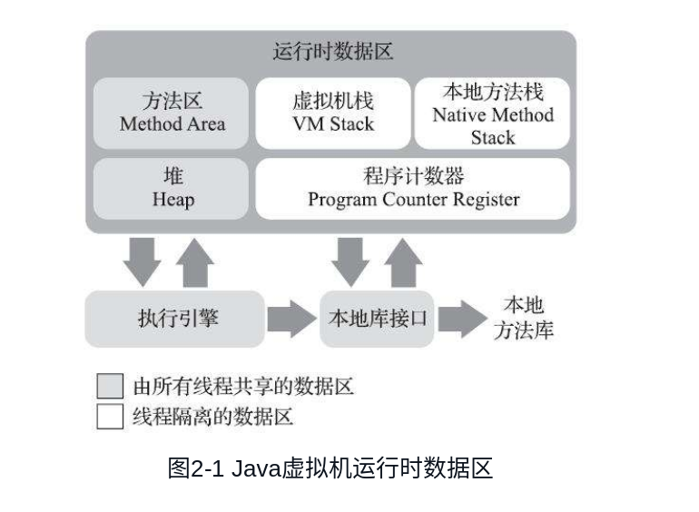

# 前言
{: id="20201216095902-vgbgiw5"}

# Java 内存区域
{: id="20201216095902-zqh6uc5"}

Java 虚拟机在执行 Java 程序的过程中会把它所管理的内存划分为若干个不同的数据区域。这些区域有各自的用途，以及创建和销毁的时间，有的区域随着虚拟机进程的启动而一直存在，有些区域则是依赖用户线程的启动和结束而建立和销毁。
{: id="20201216095902-jomnyt4"}

根据《Java 虚拟机规范》的规定，Java 虚拟机所管理的内存将会包括以下几个运行时数据区域，如图 2-1 所示。
{: id="20201216095902-v73tgzb"}

{: id="20201216095902-7hmxn71"}

### 　程序计数器
{: id="20201216095902-mv7fsca"}

**程序计数器（Program Counter Register）是一块较小的内存空间，它可以看作是当前线程所执行的字节码的行号指示器**。在 Java 虚拟机的概念模型里，字节码解释器工作时就是通过改变这个计数器的值来选取下一条需要执行的字节码指令，它是程序控制流的指示器，分支、循环、跳转、异常处理、线程恢复等基础功能都需要依赖这个计数器来完成。
{: id="20201216095902-koi6kcv"}

由于 Java 虚拟机的多线程是通过线程轮流切换、分配处理器执行时间的方式来实现的，在任何一个确定的时刻，一个处理器（对于多核处理器来说是一个内核）都只会执行一条线程中的指令。因此，为了线程切换后能恢复到正确的执行位置，**每条线程都需要有一个独立的程序计数器，各条线程之间计数器互不影响，独立存储，我们称这类内存区域为“线程私有”的内存**。
{: id="20201216095902-enjh2mk"}

如果线程正在执行的是一个 Java 方法，这个计数器记录的是正在执行的虚拟机字节码指令的地址；如果正在执行的是本地（Native）方法，这个计数器值则应为空（Undefined）。此内存区域是唯一一个在《Java 虚拟机规范》中没有规定任何 OutOfMemoryError 情况的区域。
{: id="20201216095902-8uun12t"}

### JAVA 虚拟机栈
{: id="20201216095902-r066tic"}

与程序计数器一样，Java 虚拟机栈（Java Virtual Machine Stack）也是线程私有的，它的生命周期与线程相同。**虚拟机栈描述的是 Java 方法执行的线程内存模型：每个方法被执行的时候，Java 虚拟机都会同步创建一个栈帧（Stack Frame）用于存储局部变量表、操作数栈、动态连接、方法出口等信息**。每一个方法被调用直至执行完毕的过程，就对应着一个栈帧在虚拟机栈中从入栈到出栈的过程。
{: id="20201216095902-l7vlhwx"}

经常有人把 Java 内存区域笼统地划分为堆内存（Heap）和栈内存（Stack），这种划分方式直接继承自传统的 C、C++ 程序的内存布局结构，在 Java 语言里就显得有些粗糙了，实际的内存区域划分要比这更复杂。不过这种划分方式的流行也间接说明了程序员最关注的、与对象内存分配关系最密切的区域是“堆”和“栈”两块。其中，“堆”在稍后笔者会专门讲述，**而“栈”通常就是指这里讲的虚拟机栈，或者更多的情况下只是指虚拟机栈中局部变量表部分。**
{: id="20201216144127-7945u8q"}

**局部变量表存放了编译期可知的各种 Java 虚拟机基本数据类型（boolean、byte、char、short、int、float、long、double）、对象引用（reference 类型，它并不等同于对象本身，可能是一个指向对象起始地址的引用指针，也可能是指向一个代表对象的句柄或者其他与此对象相关的位置）和 returnAddress 类型（指向了一条字节码指令的地址）。**
{: id="20201216144142-6jtq8i0"}

这些数据类型在局部变量表中的存储空间以局部变量槽（Slot）来表示，其中 64 位长度的 long 和 double 类型的数据会占用两个变量槽，其余的数据类型只占用一个。**局部变量表所需的内存空间在编译期间完成分配，当进入一个方法时，这个方法需要在栈帧中分配多大的局部变量空间是完全确定的，在方法运行期间不会改变局部变量表的大小。**
{: id="20201216144014-2i03qq7"}

### 本地方法栈
{: id="20201216144226-0495zdm"}

本地方法栈（Native Method Stacks）与虚拟机栈所发挥的作用是非常相似的，其区别只是虚拟机栈为虚拟机执行 Java 方法（也就是字节码）服务，而本地方法栈。
{: id="20201216144253-3xzcih0"}

### Java 堆
{: id="20201216144348-ataophu"}

**对于 Java 应用程序来说，Java 堆（Java Heap）是虚拟机所管理的内存中最大的一块。Java 堆是被所有线程共享的一块内存区域，在虚拟机启动时创建。此内存区域的唯一目的就是存放对象实例，Java 世界里“几乎”所有的对象实例都在这里分配内存。内存。在《Java 虚拟机规范》中对 Java 堆的描述是：“所有的对象实例以及数组都应当在堆上分配”。**
{: id="20201216144358-kv4ewle"}

### 方法区
{: id="20201216144636-njpvyp5"}

**方法区（Method Area）与 Java 堆一样，是各个线程共享的内存区域，它用于存储已被虚拟机加载的类型信息、常量、静态变量、即时编译器编译后的代码缓存等数据**。虽然《Java 虚拟机规范》中把方法区描述为堆的一个逻辑部分，但是它却有一个别名叫作“非堆”（Non-Heap），目的是与 Java 堆区分开来。
{: id="20201216144643-o01f4eg"}

### 运行时常量池
{: id="20201216144702-gr2tpx2"}

**运行时常量池（Runtime Constant Pool）是方法区的一部分。Class 文件中除了有类的版本、字段、方法、接口等描述信息外，还有一项信息是常量池表（Constant Pool Table），用于存放编译期生成的各种字面量与符号引用，这部分内容将在类加载后存放到方法区的运行时常量池中。**
{: id="20201216144823-jbfzhh5"}

{: id="20201216150301-hap58mx"}

# HotSpot 虚拟机对象探秘
{: id="20201216150252-s0f68w4"}

### 对象的创建
{: id="20201216150253-qmfjee2"}

当 Java 虚拟机遇到一条字节码 new 指令时，首先将去检查这个指令的参数是否能在常量池中定位到一个类的符号引用，并且检查这个符号引用代表的类是否已被加载、解析和初始化过。如果没有，那必须先执行相应的类加载过程。
{: id="20201216150644-hjmhqew"}

在类加载检查通过后，接下来虚拟机将为新生对象分配内存。对象所需内存的大小在类加载完成后便可完全确定，为对象分配空间的任务实际上便等同于把一块确定大小的内存块从 Java 堆中划分出来。假设 Java 堆中内存是绝对规整的，所有被使用过的内存都被放在一边，空闲的内存被放在另一边，中间放着一个指针作为分界点的指示器，那所分配内存就仅仅是把那个指针向空闲空间方向挪动一段与对象大小相等的距离，这种分配方式称为“**指针碰撞”（Bump The Pointer）**。但如果 Java 堆中的内存并不是规整的，已被使用的内存和空闲的内存相互交错在一起，那就没有办法简单地进行指针碰撞了，虚拟机就必须维护一个列表，记录上哪些内存块是可用的，在分配的时候从列表中找到一块足够大的空间划分给对象实例，并更新列表上的记录，这种分配方式称为 **“空闲列表”（Free List）** 。选择哪种分配方式由 Java 堆是否规整决定，而 Java 堆是否规整又由所采用的垃圾收集器是否带有空间压缩整理（Compact）的能力决定。因此，当使用 Serial、ParNew 等带压缩整理过程的收集器时，系统采用的分配算法是指针碰撞，既简单又高效；而当使用 CMS 这种基于清除（Sweep）算法的收集器时，理论上[插图]就只能采用较为复杂的空闲列表来分配内存。
{: id="20201216150647-j6aqfx4"}

除如何划分可用空间之外，还有另外一个需要考虑的问题：**对象创建在虚拟机中是非常频繁的行为，即使仅仅修改一个指针所指向的位置，在并发情况下也并不是线程安全的，可能出现正在给对象 A 分配内存，指针还没来得及修改，对象 B 又同时使用了原来的指针来分配内存的情况**。解决这个问题有两种可选方案：一种是对分配内存空间的动作进行同步处理——实际上虚拟机是采用 CAS 配上失败重试的方式保证更新操作的原子性；另外一种是把内存分配的动作按照线程划分在不同的空间之中进行，即每个线程在 Java 堆中预先分配一小块内存，称为本地线程分配缓冲（Thread Local Allocation Buffer，TLAB），哪个线程要分配内存，就在哪个线程的本地缓冲区中分配，只有本地缓冲区用完了，分配新的缓存区时才需要同步锁定。虚拟机是否使用 TLAB，可以通过-XX：+/-UseTLAB 参数来设定。
{: id="20201216150803-e9hdvnx"}

### 对象的内存布局
{: id="20201216150830-wbh05a1"}

在 HotSpot 虚拟机里，对象在堆内存中的存储布局可以划分为三个部分：对象头（Header）、实例数据（Instance Data）和对齐填充（Padding）。
{: id="20201216150317-cp61n3f"}

##### 对象头
{: id="20201216150831-7ko72jp"}

对象头部分包括两类信息。
{: id="20201216150844-7hw6qso"}

**第一类**是用于存储对象自身的运行时数据，如哈希码（HashCode）、GC 分代年龄、锁状态标志、线程持有的锁、偏向线程 ID、偏向时间戳等，这部分数据的长度在 32 位和 64 位的虚拟机（未开启压缩指针）中分别为 32 个比特和 64 个比特，官方称它为“Mark Word”。
{: id="20201216150854-mnmjqy2"}

{: id="20201216150852-xkt5lqb"}

对象头的另外一部分是类型指针，即对象指向它的类型元数据的指针，Java 虚拟机通过这个指针来确定该对象是哪个类的实例。
{: id="20201216151009-ny1c03k"}

##### 实例数据
{: id="20201216151056-8pa888e"}

实例数据部分是对象真正存储的有效信息，即我们在程序代码里面所定义的各种类型的字段内容，无论是从父类继承下来的，还是在子类中定义的字段都必须记录起来。
{: id="20201216151104-sg7piuz"}

##### 对齐填充
{: id="20201216151107-tg7jxsk"}

对象的第三部分是对齐填充，这并不是必然存在的，也没有特别的含义，它仅仅起着占位符的作用。由于 HotSpot 虚拟机的自动内存管理系统要求对象起始地址必须是 8 字节的整数倍，换句话说就是任何对象的大小都必须是 8 字节的整数倍。对象头部分已经被精心设计成正好是 8 字节的倍数（1 倍或者 2 倍），
{: id="20201216151126-ifj4s11"}

### 对象的访问
{: id="20201216150334-laigiqc"}

创建对象自然是为了后续使用该对象，我们的 Java 程序会通过栈上的 reference 数据来操作堆上的具体对象。由于 reference 类型在《Java 虚拟机规范》里面只规定了它是一个指向对象的引用，并没有定义这个引用应该通过什么方式去定位、访问到堆中对象的具体位置，所以对象访问方式也是由虚拟机实现而定的，主流的访问方式主要有使用句柄和直接指针两种：
{: id="20201216150340-449y521"}

- {: id="20201216151158-bhuwgqc"}如果使用句柄访问的话，Java 堆中将可能会划分出一块内存来作为句柄池，reference 中存储的就是对象的句柄地址，而句柄中包含了对象实例数据与类型数据各自具体的地址信息，其结构如图 2-2 所示。
- {: id="20201216151200-fnx3k6l"}如果使用直接指针访问的话，Java 堆中对象的内存布局就必须考虑如何放置访问类型数据的相关信息，reference 中存储的直接就是对象地址，如果只是访问对象本身的话，就不需要多一次间接访问的开销，如图 2-3 所示。
{: id="20201216151146-dv2hcbj"}

{: id="20201216151206-soygfnt"}

{: id="20201216151233-hcbpj0c"}

**这两种对象访问方式各有优势，使用句柄来访问的最大好处就是 reference 中存储的是稳定句柄地址，在对象被移动（垃圾收集时移动对象是非常普遍的行为）时只会改变句柄中的实例数据指针，而 reference 本身不需要被修改。使用直接指针来访问最大的好处就是速度更快，它节省了一次指针定位的时间开销，由于对象访问在 Java 中非常频繁，因此这类开销积少成多也是一项极为可观的执行成本，就本书讨论的主要虚拟机 HotSpot 而言，它主要使用第二种方式进行对象访问。**
{: id="20201216151234-lsb3prq"}

{: id="20201216151243-8dip2jy"}
