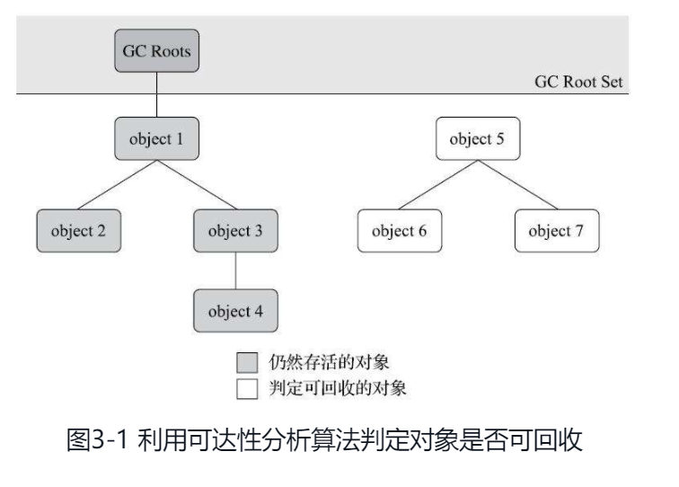
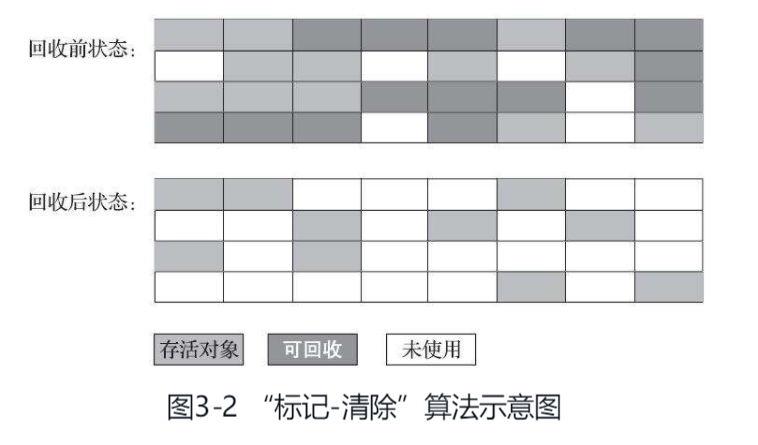
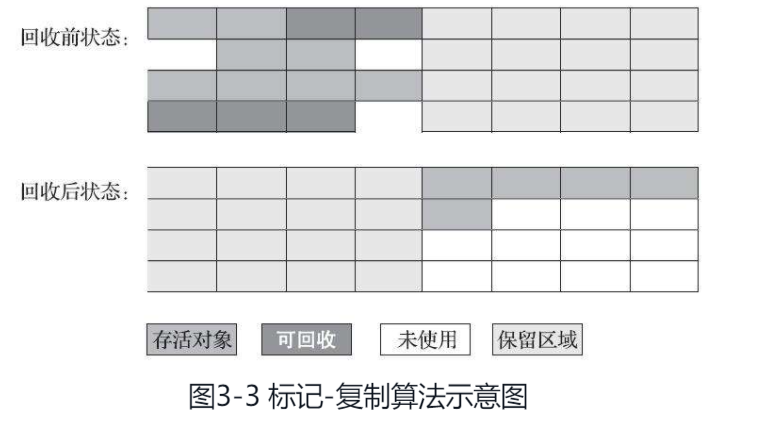
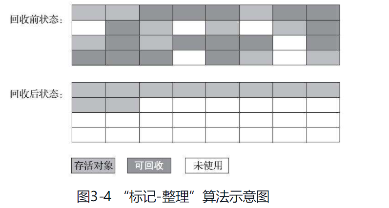

# 概述
{: id="20201216151403-yd5zpb5"}

说起垃圾收集（Garbage Collection，下文简称 GC），有不少人把这项技术当作 Java 语言的伴生产物。事实上，垃圾收集的历史远远比 Java 久远，在 1960 年诞生于麻省理工学院的 Lisp 是第一门开始使用内存动态分配和垃圾收集技术的语言。当 Lisp 还在胚胎时期时，其作者 John McCarthy 就思考过垃圾收集需要完成的三件事情：
{: id="20201216151559-qv5orho"}

- {: id="20201216151605-mzlr2ab"}哪些内存需要回收？
- {: id="20201216151608-94eehi0"}什么时候回收？
- {: id="20201216151611-scfhndh"}如何回收？
{: id="20201216151603-vet98bn"}

第 2 章介绍了 Java 内存运行时区域的各个部分，其中程序计数器、虚拟机栈、本地方法栈 3 个区域随线程而生，随线程而灭，栈中的栈帧随着方法的进入和退出而有条不紊地执行着出栈和入栈操作。每一个栈帧中分配多少内存基本上是在类结构确定下来时就已知的（尽管在运行期会由即时编译器进行一些优化，但在基于概念模型的讨论里，大体上可以认为是编译期可知的），因此这几个区域的内存分配和回收都具备确定性，在这几个区域内就不需要过多考虑如何回收的问题，当方法结束或者线程结束时，内存自然就跟随着回收了。
{: id="20201216151416-7dah7zl"}

而 Java 堆和方法区这两个区域则有着很显著的不确定性：一个接口的多个实现类需要的内存可能会不一样，一个方法所执行的不同条件分支所需要的内存也可能不一样，只有处于运行期间，我们才能知道程序究竟会创建哪些对象，创建多少个对象，这部分内存的分配和回收是动态的。垃圾收集器所关注的正是这部分内存该如何管理，本文后续讨论中的“内存”分配与回收也仅仅特指这一部分内存。
{: id="20201216151621-hp6g6a0"}

# 一、对象已死？
{: id="20201216151638-c5sd13g"}

在堆里面存放着 Java 世界中几乎所有的对象实例，垃圾收集器在对堆进行回收前，第一件事情就是要确定这些对象之中哪些还“存活”着，哪些已经“死去”（“死去”即不可能再被任何途径使用的对象）了。
{: id="20201216151736-obz9ap6"}

### 引用计数法
{: id="20201216151746-mdolheg"}

很多教科书判断对象是否存活的算法是这样的：在对象中添加一个引用计数器，每当有一个地方引用它时，计数器值就加一；当引用失效时，计数器值就减一；任何时刻计数器为零的对象就是不可能再被使用的。
{: id="20201216151755-58sxfyd"}

客观地说，引用计数算法（Reference Counting）虽然占用了一些额外的内存空间来进行计数，但它的原理简单，判定效率也很高，在大多数情况下它都是一个不错的算法。也有一些比较著名的应用案例，例如微软 COM（Component ObjectModel）技术、使用 ActionScript 3 的 FlashPlayer、Python 语言以及在游戏脚本领域得到许多应用的 Squirrel 中都使用了引用计数算法进行内存管理。**但是，在 Java 领域，至少主流的 Java 虚拟机里面都没有选用引用计数算法来管理内存，主要原因是，这个看似简单的算法有很多例外情况要考虑，必须要配合大量额外处理才能保证正确地工作，譬如单纯的引用计数就很难解决对象之间相互循环引用的问题。**
{: id="20201216151811-z4n8r12"}

### 可达性分析算法
{: id="20201216151851-p5nfpya"}

**当前主流的商用程序语言（Java、C#，上溯至前面提到的古老的 Lisp）的内存管理子系统，都是通过可达性分析（Reachability Analysis）算法来判定对象是否存活的。这个算法的基本思路就是通过一系列称为“GC Roots”的根对象作为起始节点集，从这些节点开始，根据引用关系向下搜索，搜索过程所走过的路径称为“引用链”（Reference Chain），如果某个对象到 GC Roots 间没有任何引用链相连，或者用图论的话来说就是从 GC Roots 到这个对象不可达时，则证明此对象是不可能再被使用的。**
{: id="20201216151920-q0jwdap"}

如图 3-1 所示，对象 object 5、object 6、object 7 虽然互有关联，但是它们到 GCRoots 是不可达的，因此它们将会被判定为可回收的对象。
{: id="20201216151938-vsjz8sj"}

{: id="20201216152024-8juo6ul"}

在 Java 技术体系里面，固定可作为 GC Roots 的对象包括以下几种：
{: id="20201216152045-57unv7p"}

- {: id="20201216152045-9pwt5qr"}在虚拟机栈（栈帧中的本地变量表）中引用的对象，譬如各个线程被调用的方法堆栈中使用到的参数、局部变量、临时变量等。
- {: id="20201216152046-8f8h31o"}在方法区中类静态属性引用的对象，譬如 Java 类的引用类型静态变量。
- {: id="20201216152053-34gib48"}在方法区中常量引用的对象，譬如字符串常量池（String Table）里的引用。
- {: id="20201216152059-b9665dn"}在本地方法栈中 JNI（即通常所说的 Native 方法）引用的对象。
- {: id="20201216152105-y93dxcy"}Java 虚拟机内部的引用，如基本数据类型对应的 Class 对象，一些常驻的异常对象（比如 NullPointExcepiton、OutOfMemoryError）等，还有系统类加载器。
- {: id="20201216152115-r68ywbk"}所有被同步锁（synchronized 关键字）持有的对象。
- {: id="20201216152121-4jsc2ci"}反映 Java 虚拟机内部情况的 JMXBean、JVMTI 中注册的回调、本地代码缓存等。
{: id="20201216152031-lflr002"}

### 再谈引用
{: id="20201216152126-bt3sxa4"}

定义：Java 里面的引用是很传统的定义：如果 reference 类型的数据中存储的数值代表的是另外一块内存的起始地址，就称该 reference 数据是代表某块内存、某个对象的引用。
{: id="20201216161906-gqrmf0z"}

这种定义并没有什么不对，只是现在看来有些过于狭隘了，一个对象在这种定义下只有“被引用”或者“未被引用”两种状态，对于描述一些“食之无味，弃之可惜”的对象就显得无能为力。譬如我们希望能描述一类对象：当内存空间还足够时，能保留在内存之中，如果内存空间在进行垃圾收集后仍然非常紧张，那就可以抛弃这些对象——很多系统的缓存功能都符合这样的应用场景。
{: id="20201216161929-awcbopd"}

**在 JDK 1.2 版之后，Java 对引用的概念进行了扩充，将引用分为强引用（StronglyRe-ference）、软引用（Soft Reference）、弱引用（Weak Reference）和虚引用（Phantom Reference）4 种，这 4 种引用强度依次逐渐减弱。**
{: id="20201216161943-b7ll6mc"}

- {: id="20201216162003-4c08ron"}强引用是最传统的“引用”的定义，是指在程序代码之中普遍存在的引用赋值，即类似“Object obj=new Object()”这种引用关系。无论任何情况下，只要强引用关系还存在，垃圾收集器就永远不会回收掉被引用的对象。
- {: id="20201216162013-o6wezzh"}软引用是用来描述一些还有用，但非必须的对象。**只被软引用关联着的对象，在系统将要发生内存溢出异常前，会把这些对象列进回收范围之中进行第二次回收，如果这次回收还没有足够的内存，才会抛出内存溢出异常**。在 JDK 1.2 版之后提供了 SoftReference 类来实现软引用。
- {: id="20201216162018-q0lc7a4"}弱引用也是用来描述那些非必须对象，但是它的强度比软引用更弱一些，**被弱引用关联的对象只能生存到下一次垃圾收集发生为止。当垃圾收集器开始工作，无论当前内存是否足够，都会回收掉只被弱引用关联的对象。**在 JDK 1.2 版之后提供了 WeakReference 类来实现弱引用。
- {: id="20201216162047-dw1r4pa"}虚引用也称为“幽灵引用”或者“幻影引用”，它是最弱的一种引用关系。一个对象是否有虚引用的存在，完全不会对其生存时间构成影响，也无法通过虚引用来取得一个对象实例。为一个对象设置虚引用关联的唯一目的只是为了能在这个对象被收集器回收时收到一个系统通知。在 JDK 1.2 版之后提供了 PhantomReference 类来实现虚引用。
{: id="20201216162044-e8b0fqm"}

### 生存还是死亡？
{: id="20201216162146-ic63i8d"}

即使在可达性分析算法中判定为不可达的对象，也不是“非死不可”的，这时候它们暂时还处于“缓刑”阶段，要真正宣告一个对象死亡，至少要经历两次标记过程：如果对象在进行可达性分析后发现没有与 GC Roots 相连接的引用链，那它将会被第一次标记，随后进行一次筛选，筛选的条件是此对象是否有必要执行 finalize()方法。假如对象没有覆盖 finalize()方法，或者 finalize()方法已经被虚拟机调用过，那么虚拟机将这两种情况都视为“没有必要执行”。
{: id="20201216162211-c4xqp80"}

如果这个对象被判定为确有必要执行 finalize()方法，那么该对象将会被放置在一个名为 F-Queue 的队列之中，并在稍后由一条由虚拟机自动建立的、低调度优先级的 Finalizer 线程去执行它们的 finalize()方法。这里所说的“执行”是指虚拟机会触发这个方法开始运行，但并不承诺一定会等待它运行结束。这样做的原因是，如果某个对象的 finalize()方法执行缓慢，或者更极端地发生了死循环，将很可能导致 F-Queue 队列中的其他对象永久处于等待，甚至导致整个内存回收子系统的崩溃。finalize()方法是对象逃脱死亡命运的最后一次机会，稍后收集器将对 F-Queue 中的对象进行第二次小规模的标记，如果对象要在 finalize()中成功拯救自己——只要重新与引用链上的任何一个对象建立关联即可，譬如把自己（this 关键字）赋值给某个类变量或者对象的成员变量，那在第二次标记时它将被移出“即将回收”的集合；如果对象这时候还没有逃脱，那基本上它就真的要被回收了。
{: id="20201216162311-56oz2cc"}

### 回收方法区
{: id="20201216162340-jep7p6e"}

方法区的垃圾收集主要回收两部分内容：废弃的常量和不再使用的类型。
{: id="20201216162351-ka9n50a"}

回收废弃常量与回收 Java 堆中的对象非常类似。举个常量池中字面量回收的例子，假如一个字符串“java”曾经进入常量池中，但是当前系统又没有任何一个字符串对象的值是“java”，换句话说，已经没有任何字符串对象引用常量池中的“java”常量，且虚拟机中也没有其他地方引用这个字面量。如果在这时发生内存回收，而且垃圾收集器判断确有必要的话，这个“java”常量就将会被系统清理出常量池。常量池中其他类（接口）、方法、字段的符号引用也与此类似。
{: id="20201216162434-wpxbi9k"}

**判定一个常量是否“废弃”还是相对简单，而要判定一个类型是否属于“不再被使用的类”的条件就比较苛刻了。需要同时满足下面三个条件：**
{: id="20201216163401-a8qgbq8"}

- {: id="20201216163419-7icjtus"}该类所有的实例都已经被回收，也就是 Java 堆中不存在该类及其任何派生子类的实例。
- {: id="20201216163419-4qbpw1x"}加载该类的类加载器已经被回收，这个条件除非是经过精心设计的可替换类加载器的场景，如 OSGi、JSP 的重加载等，否则通常是很难达成的。
- {: id="20201216163427-xmysxr7"}该类对应的 java.lang.Class 对象没有在任何地方被引用，无法在任何地方通过反射访问该类的方法。
{: id="20201216163410-gasuu3o"}

在大量使用反射、动态代理、CGLib 等字节码框架，动态生成 JSP 以及 OSGi 这类频繁自定义类加载器的场景中，通常都需要 Java 虚拟机具备类型卸载的能力，以保证不会对方法区造成过大的内存压力。
{: id="20201216163437-jjwiexx"}

# 二、垃圾收集算法
{: id="20201216163457-wl703pa"}

从如何判定对象消亡的角度出发，垃圾收集算法可以划分为“引用计数式垃圾收集”（Reference Counting GC）和“追踪式垃圾收集”（Tracing GC）两大类，这两类也常被称作“直接垃圾收集”和“间接垃圾收集”。由于引用计数式垃圾收集算法在本书讨论到的主流 Java 虚拟机中均未涉及，所以我们暂不把它作为正文主要内容来讲解，本节介绍的所有算法均属于追踪式垃圾收集的范畴。
{: id="20201216163535-b1nqghv"}

### 分代收集理论
{: id="20201216163601-ofin20p"}

当前商业虚拟机的垃圾收集器，大多数都遵循了“分代收集”（GenerationalCollection）的理论进行设计，分代收集名为理论，实质是一套符合大多数程序运行实际情况的经验法则，它建立在两个分代假说之上：
{: id="20201216163620-0sei5ud"}

**（1）弱分代假说（Weak Generational Hypothesis）：绝大多数对象都是朝生夕灭的。**
{: id="20201216163932-hzw48m9"}

**（2）强分代假说（Strong Generational Hypothesis）：熬过越多次垃圾收集过程的对象就越难以消亡。**
{: id="20201216163937-nstt2m7"}

这两个分代假说共同奠定了多款常用的垃圾收集器的一致的设计原则：收集器应该将 Java 堆划分出不同的区域，然后将回收对象依据其年龄（**年龄即对象熬过垃圾收集过程的次数**）分配到不同的区域之中存储。显而易见，如果一个区域中大多数对象都是朝生夕灭，难以熬过垃圾收集过程的话，那么把它们集中放在一起，每次回收时只关注如何保留少量存活而不是去标记那些大量将要被回收的对象，就能以较低代价回收到大量的空间；如果剩下的都是难以消亡的对象，那把它们集中放在一块，虚拟机便可以使用较低的频率来回收这个区域，这就同时兼顾了垃圾收集的时间开销和内存的空间有效利用。
{: id="20201216163643-lre7vbd"}

**把分代收集理论具体放到现在的商用 Java 虚拟机里，设计者一般至少会把 Java 堆划分为新生代（Young Generation）和老年代（Old Generation）两个区域。顾名思义，在新生代中，每次垃圾收集时都发现有大批对象死去，而每次回收后存活的少量对象，将会逐步晋升到老年代中存放。**
{: id="20201216163809-09pfe3m"}

假如要现在进行一次只局限于新生代区域内的收集（Minor GC），但新生代中的对象是完全有可能被老年代所引用的，为了找出该区域中的存活对象，不得不在固定的 GC Roots 之外，再额外遍历整个老年代中所有对象来确保可达性分析结果的正确性，反过来也是一样[插图]。遍历整个老年代所有对象的方案虽然理论上可行，但无疑会为内存回收带来很大的性能负担。为了解决这个问题，就需要对分代收集理论添加第三条经验法则：
{: id="20201216163812-79egtju"}

**（3）跨代引用假说（Intergenerational Reference Hypothesis）：跨代引用相对于同代引用来说仅占极少数。**
{: id="20201216163942-githr2x"}

这其实是可根据前两条假说逻辑推理得出的隐含推论：存在互相引用关系的两个对象，是应该倾向于同时生存或者同时消亡的。举个例子，如果某个新生代对象存在跨代引用，由于老年代对象难以消亡，该引用会使得新生代对象在收集时同样得以存活，进而在年龄增长之后晋升到老年代中，这时跨代引用也随即被消除了。
{: id="20201216164014-4vl89cd"}

##### 名词解释：
{: id="20201216164032-q125kf0"}

1. {: id="20201216164116-xjqt71w"}部分收集（Partial GC）：指目标不是完整收集整个 Java 堆的垃圾收集，其中又分
   {: id="20201216164152-0rh9h1l"}

   - {: id="20201216164158-fy70rks"}新生代收集（Minor GC/Young GC）：指目标只是新生代的垃圾收集。
   - {: id="20201216164159-d4n97a7"}老年代收集（Major GC/Old GC）：指目标只是老年代的垃圾收集。目前只有 CMS 收集器会有单独收集老年代的行为。另外请注意“Major GC”这个说法现在有点混淆，在不同资料上常有不同所指，读者需按上下文区分到底是指老年代的收集还是整堆收集。
   - {: id="20201216164204-w70sna7"}混合收集（Mixed GC）：指目标是收集整个新生代以及部分老年代的垃圾收集。目前只有 G1 收集器会有这种行为。
   {: id="20201216164152-j8oavv5"}
2. {: id="20201216164135-c7psq7v"}整堆收集（Full GC）：收集整个 Java 堆和方法区的垃圾收集。
   {: id="20201216164152-4athmha"}
{: id="20201216164103-l66mz13"}

### 标记-清除算法
{: id="20201216163927-4t94mmv"}

最早出现也是最基础的垃圾收集算法是“标记-清除”（Mark-Sweep）算法，在 1960 年由 Lisp 之父 John McCarthy 所提出。**如它的名字一样，算法分为“标记”和“清除”两个阶段：首先标记出所有需要回收的对象，在标记完成后，统一回收掉所有被标记的对象，也可以反过来，标记存活的对象，统一回收所有未被标记的对象。**标记过程就是对象是否属于垃圾的判定过程，这在前一节讲述垃圾对象标记判定算法时其实已经介绍过了。
{: id="20201216164310-e5gxzfi"}

之所以说它是最基础的收集算法，是因为后续的收集算法大多都是以标记-清除算法为基础，对其缺点进行改进而得到的。它的主要缺点有两个：第一个是执行效率不稳定，如果 Java 堆中包含大量对象，而且其中大部分是需要被回收的，这时必须进行大量标记和清除的动作，导致标记和清除两个过程的执行效率都随对象数量增长而降低；第二个是内存空间的碎片化问题，标记、清除之后会产生大量不连续的内存碎片，空间碎片太多可能会导致当以后在程序运行过程中需要分配较大对象时无法找到足够的连续内存而不得不提前触发另一次垃圾收集动作。标记-清除算法的执行过程如图 3-2 所示。
{: id="20201216164328-b9z0qhk"}

{: id="20201216164349-nh4mdhf"}

### 标记-复制算法
{: id="20201216163704-yr36k2n"}

标记-复制算法常被简称为复制算法。为了解决标记-清除算法面对大量可回收对象时执行效率低的问题，1969 年 Fenichel 提出了一种称为“半区复制”（SemispaceCopying）的垃圾收集算法，**它将可用内存按容量划分为大小相等的两块，每次只使用其中的一块。当这一块的内存用完了，就将还存活着的对象复制到另外一块上面，然后再把已使用过的内存空间一次清理掉。如果内存中多数对象都是存活的，这种算法将会产生大量的内存间复制的开销，但对于多数对象都是可回收的情况，算法需要复制的就是占少数的存活对象，而且每次都是针对整个半区进行内存回收，分配内存时也就不用考虑有空间碎片的复杂情况，只要移动堆顶指针，按顺序分配即可**。这样实现简单，运行高效，不过其缺陷也显而易见，**这种复制回收算法的代价是将可用内存缩小为了原来的一半，空间浪费未免太多了一点**。标记-复制算法的执行过程如图 3-3 所示。
{: id="20201216164418-ms3zl8a"}

{: id="20201216204216-iynrfb4"}

现在的商用 Java 虚拟机大多都优先采用了这种收集算法去回收新生代，IBM 公司曾有一项专门研究对新生代“朝生夕灭”的特点做了更量化的诠释——新生代中的对象有 98% 熬不过第一轮收集。因此并不需要按照 1∶1 的比例来划分新生代的内存空间。
{: id="20201216204244-frc84kz"}

在 1989 年，Andrew Appel 针对具备“朝生夕灭”特点的对象，提出了一种更优化的半区复制分代策略，现在称为“Appel 式回收”。HotSpot 虚拟机的 Serial、ParNew 等新生代收集器均采用了这种策略来设计新生代的内存布局。**Appel 式回收的具体做法是把新生代分为一块较大的 Eden 空间和两块较小的 Survivor 空间，每次分配内存只使用 Eden 和其中一块 Survivor。发生垃圾搜集时，将 Eden 和 Survivor 中仍然存活的对象一次性复制到另外一块 Survivor 空间上，然后直接清理掉 Eden 和已用过的那块 Survivor 空间。HotSpot 虚拟机默认 Eden 和 Survivor 的大小比例是 8∶1，也即每次新生代中可用内存空间为整个新生代容量的 90%（Eden 的 80% 加上一个 Survivor 的 10%），只有一个 Survivor 空间，即 10% 的新生代是会被“浪费”的。**当然，98% 的对象可被回收仅仅是“普通场景”下测得的数据，任何人都没有办法百分百保证每次回收都只有不多于 10% 的对象存活，因此 Appel 式回收还有一个充当罕见情况的“逃生门”的安全设计，当 Survivor 空间不足以容纳一次 Minor GC 之后存活的对象时，就需要依赖其他内存区域（实际上大多就是老年代）进行分配担保（Handle Promotion）。
{: id="20201216204302-od02uxp"}

### 标记-整理算法
{: id="20201216212224-q0gnafd"}

标记-复制算法在对象存活率较高时就要进行较多的复制操作，效率将会降低。更关键的是，如果不想浪费 50% 的空间，就需要有额外的空间进行分配担保，以应对被使用的内存中所有对象都 100% 存活的极端情况，所以在**老年代**一般不能直接选用这种算法。
{: id="20201216212233-54ih6mu"}

**针对老年代对象的存亡特征，1974 年 Edward Lueders 提出了另外一种有针对性的“标记-整理”（Mark-Compact）算法，其中的标记过程仍然与“标记-清除”算法一样，但后续步骤不是直接对可回收对象进行清理，而是让所有存活的对象都向内存空间一端移动，然后直接清理掉边界以外的内存**，“标记-整理”算法的示意图如图 3-4 所示。
{: id="20201216212259-eq0pf6s"}

{: id="20201216212329-u0rfni5"}

# HotSpot 的算法细节实现
{: id="20201216212359-kc6casw"}

{: id="20201217085416-56yygrm"}
