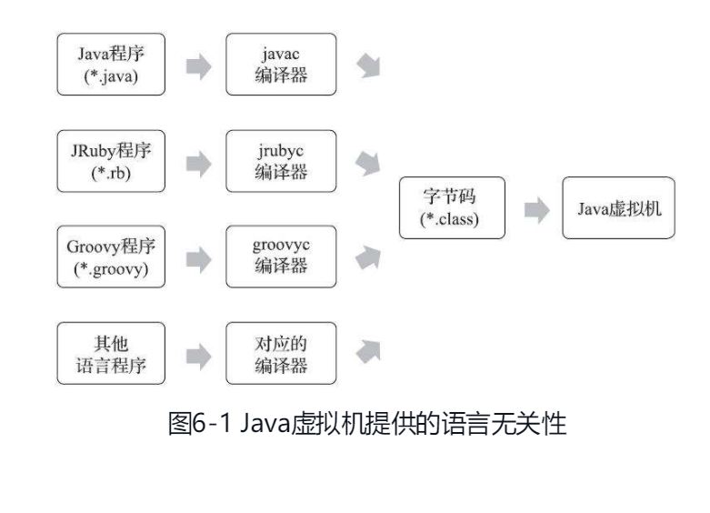

# 一、概述

曾记得在第一堂计算机程序课上老师就讲过：“计算机只认识 0 和 1，所以我们写的程序需要被编译器翻译成由 0 和 1 构成的二进制格式才能被计算机执行。”十多年过去了，今天的计算机仍然只能识别 0 和 1，但由于最近十年内虚拟机以及大量建立在虚拟机之上的程序语言如雨后春笋般出现并蓬勃发展，把我们编写的程序编译成二进制本地机器码（Native Code）已不再是唯一的选择，越来越多的程序语言选择了与操作系统和机器指令集无关的、平台中立的格式作为程序编译后的存储格式。

# 二、无关性的基石

如果全世界所有计算机的指令集就只有 x86 一种，操作系统就只有 Windows 一种，那也许就不会有 Java 语言的出现。Java 在刚刚诞生之时曾经提出过一个非常著名的宣传口号“一次编写，到处运行（Write Once，Run Anywhere）”，这句话充分表达了当时软件开发人员对冲破平台界限的渴求。在每时每刻都充满竞争的 IT 业界，不可能只有 Wintel 存在，我们也不希望出现只有 Wintel 而没有竞争者的世界，各种不同的硬件体系结构、各种不同的操作系统肯定将会长期并存发展。**“与平台无关”的理想最终只有实现在操作系统以上的应用层：Oracle 公司以及其他虚拟机发行商发布过许多可以运行在各种不同硬件平台和操作系统上的 Java 虚拟机，这些虚拟机都可以载入和执行同一种平台无关的字节码，从而实现了程序的“一次编写，到处运行”。**

**各种不同平台的 Java 虚拟机，以及所有平台都统一支持的程序存储格式——字节码（Byte Code）是构成平台无关性的基石，但本节标题中笔者刻意省略了“平台”二字，那是因为笔者注意到虚拟机的另外一种中立特性——语言无关性正在越来越被开发者所重视。** 直到今天，或许还有相当一部分程序员认为 Java 虚拟机执行 Java 程序是一件理所当然和天经地义的事情。但在 Java 技术发展之初，设计者们就曾经考虑过并实现了让其他语言运行在 Java 虚拟机之上的可能性，他们在发布规范文档的时候，也刻意把 Java 的规范拆分成了《Java 语言规范》（The Java LanguageSpecification）及《Java 虚拟机规范》（The Java Virtual MachineSpecification）两部分。并且早在 1997 年发表的第一版《Java 虚拟机规范》中就曾经承诺过：“在未来，我们会对 Java 虚拟机进行适当的扩展，以便更好地支持其他语言运行于 Java 虚拟机之上”（In the future，we will consider boundedextensions to the Java virtual machine to provide better support for otherlanguages）。Java 虚拟机发展到今天，尤其是在 2018 年，基于 HotSpot 扩展而来的 GraalVM 公开之后，当年的虚拟机设计者们已经基本兑现了这个承诺。

时至今日，商业企业和开源机构已经在 Java 语言之外发展出一大批运行在 Java 虚拟机之上的语言，如 Kotlin、Clojure、Groovy、JRuby、JPython、Scala 等。相比起基数庞大的 Java 程序员群体，使用过这些语言的开发者可能还不是特别多，但是听说过的人肯定已经不少，随着时间的推移，谁能保证日后 Java 虚拟机在语言无关性上的优势不会赶上甚至超越它在平台无关性上的优势呢？

**实现语言无关性的基础仍然是虚拟机和字节码存储格式。Java 虚拟机不与包括 Java 语言在内的任何程序语言绑定，它只与“Class 文件”这种特定的二进制文件格式所关联，Class 文件中包含了 Java 虚拟机指令集、符号表以及若干其他辅助信息。** 基于安全方面的考虑，《Java 虚拟机规范》中要求在 Class 文件必须应用许多强制性的语法和结构化约束，但图灵完备的字节码格式，保证了任意一门功能性语言都可以表示为一个能被 Java 虚拟机所接受的有效的 Class 文件。作为一个通用的、与机器无关的执行平台，任何其他语言的实现者都可以将 Java 虚拟机作为他们语言的运行基础，以 Class 文件作为他们产品的交付媒介。例如，使用 Java 编译器可以把 Java 代码编译为存储字节码的 Class 文件，使用 JRuby 等其他语言的编译器一样可以把它们的源程序代码编译成 Class 文件。虚拟机丝毫不关心 Class 的来源是什么语言，它与程序语言之间的关系如图 6-1 所示。

# 三、Class 类文件结构

Java 技术能够一直保持着非常良好的向后兼容性，Class 文件结构的稳定功不可没，任何一门程序语言能够获得商业上的成功，都不可能去做升级版本后，旧版本编译的产品就不再能够运行这种事情。尽管不同版本的《Java 虚拟机规范》对 Class 文件格式进行了几次更新，但基本上只是在原有结构基础上新增内容、扩充功能，并未对已定义的内容做出修改。

Class 文件是一组以 8 个字节为基础单位的二进制流，各个数据项目严格按照顺序紧凑地排列在文件之中，中间没有添加任何分隔符，这使得整个 Class 文件中存储的内容几乎全部是程序运行的必要数据，没有空隙存在。当遇到需要占用 8 个字节以上空间的数据项时，则会按照高位在前的方式分割成若干个 8 个字节进行存储。

**根据《Java 虚拟机规范》的规定，Class 文件格式采用一种类似于 C 语言结构体的伪结构来存储数据，这种伪结构中只有两种数据类型：“无符号数”和“表”。**

- 无符号数属于基本的数据类型，以 u1、u2、u4、u8 来分别代表 1 个字节、2 个字节、4 个字节和 8 个字节的无符号数，无符号数可以用来描述数字、索引引用、数量值或者按照 UTF-8 编码构成字符串值。
- 表是由多个无符号数或者其他表作为数据项构成的复合数据类型，为了便于区分，所有表的命名都习惯性地以“_info”结尾。表用于描述有层次关系的复合结构的数据，整个 Class 文件本质上也可以视作是一张表，这张表由表 6-1 所示的数据项按严格顺序排列构成。

class 文件格式表：

| 类型         | 名称              | 数量                  |
| ---------------- | --------------------- | ------------------------- |
| u4             | magic               | 1                       |
| u2             | minor_version       | 1                       |
| u2             | major_version       | 1                       |
| u2             | constant_pool_count | 1                       |
| cp_info        | constant_pool       | constant_pool_count - 1 |
| u2             | access_flags        | 1                       |
| u2             | this_class          | 1                       |
| u2             | super_class         | 1                       |
| u2             | interfaces_count    | 1                       |
| u2             | interfaces          | interfaces_count        |
| u2             | fileds_count        | 1                       |
| fied_info      | fileds              | fileds_count            |
| u2             | methods_count       | 1                       |
| method_info    | methods             | methods_count           |
| u2             | atrributes_count    | 1                       |
| attribute_info | attributes          | attributes_count        |

Class 的结构不像 XML 等描述语言，由于它没有任何分隔符号，所以在表 6-1 中的数据项，无论是顺序还是数量，甚至于数据存储的字节序（Byte Ordering，Class 文件中字节序为 Big-Endian）这样的细节，都是被严格限定的，哪个字节代表什么含义，长度是多少，先后顺序如何，全部都不允许改变。

### 魔数与 Class 文件的版本

**每个 Class 文件的头 4 个字节被称为魔数（MagicNumber），它的唯一作用是确定这个文件是否为一个能被虚拟机接受的 Class 文件。** Class 文件的魔数取得很有“浪漫气息”，值为 0xCAFEBABE（咖啡宝贝？）。

**紧接着魔数的 4 个字节存储的是 Class 文件的版本号：第 5 和第 6 个字节是次版本号（MinorVersion），第 7 和第 8 个字节是主版本号（MajorVersion）。** Java 的版本号是从 45 开始的，JDK1.1 之后的每个 JDK 大版本发布主版本号向上加 1（JDK 1.0～1.1 使用了 45.0～45.3 的版本号），**高版本的 JDK 能向下兼容以前版本的 Class 文件，但不能运行以后版本的 Class 文件，因为《Java 虚拟机规范》在 Class 文件校验部分明确要求了即使文件格式并未发生任何变化，虚拟机也必须拒绝执行超过其版本号的 Class 文件。**
