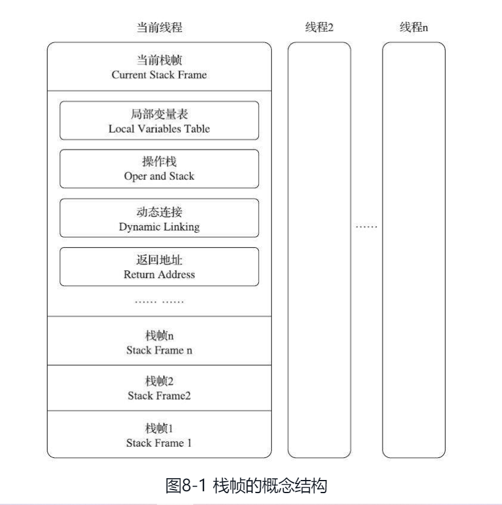

# 一、概述

**执行引擎** 是 Java 虚拟机核心的组成部分之一。“虚拟机”是一个相对于“物理机”的概念，这两种机器都有代码执行能力，其区别是物理机的执行引擎是直接建立在处理器、缓存、指令集和操作系统层面上的，而虚拟机的执行引擎则是由软件自行实现的，因此可以不受物理条件制约地定制指令集与执行引擎的结构体系，能够执行那些不被硬件直接支持的指令集格式。

在不同的虚拟机实现中，执行引擎在执行字节码的时候，通常会有 **解释执行（通过解释器执行）** 和 **编译执行（通过即时编译器产生本地代码执行）** 两种选择，也可能两者兼备，还可能会有同时包含几个不同级别的即时编译器一起工作的执行引擎。但从外观上来看， **所有的 Java 虚拟机的执行引擎输入、输出都是一致的：输入的是字节码二进制流，处理过程是字节码解析执行的等效过程，输出的是执行结果，** 本章将主要从概念模型的角度来讲解虚拟机的方法调用和字节码执行。

# 二、运行时栈帧结构

**Java 虚拟机以方法作为最基本的执行单元，“栈帧”（Stack Frame）则是用于支持虚拟机进行方法调用和方法执行背后的数据结构，它也是虚拟机运行时数据区中的虚拟机栈（Virtual Machine Stack）的栈元素。**

每一个方法从调用开始至执行结束的过程，都对应着一个栈帧在虚拟机栈里面从入栈到出栈的过程。

**每一个栈帧都包括了局部变量表、操作数栈、动态连接、方法返回地址和一些额外的附加信息。在编译 Java 程序源码的时候，栈帧中需要多大的局部变量表，需要多深的操作数栈就已经被分析计算出来，并且写入到方法表的 Code 属性之中。换言之，一个栈帧需要分配多少内存，并不会受到程序运行期变量数据的影响，而仅仅取决于程序源码和具体的虚拟机实现的栈内存布局形式。**

图 8-1 所示的就是虚拟机栈和栈帧的总体结构：

### 2.1 局部变量表

**局部变量表（Local Variables Table）是一组变量值的存储空间，用于存放方法参数和方法内部定义的局部变量。在 Java 程序被编译为 Class 文件时，就在方法的 Code 属性的 max_locals 数据项中确定了该方法所需分配的局部变量表的最大容量。**

### 2.2 操作数栈

操作数栈（Operand Stack）也常被称为操作栈，它是一个后入先出（Last InFirst Out，LIFO）栈。同局部变量表一样，操作数栈的最大深度也在编译的时候被写入到 Code 属性的 max_stacks 数据项之中。操作数栈的每一个元素都可以是包括 long 和 double 在内的任意 Java 数据类型。32 位数据类型所占的栈容量为 1，64 位数据类型所占的栈容量为 2。

### 2.3 动态连接

每个栈帧都包含一个指向运行时常量池中该栈帧所属方法的引用，持有这个引用是为了支持方法调用过程中的动态连接（Dynamic Linking）。

### 2.4 方法返回地址

当一个方法开始执行后，只有两种方式退出这个方法。第一种方式是执行引擎遇到任意一个方法返回的字节码指令，这时候可能会有返回值传递给上层的方法调用者（调用当前方法的方法称为调用者或者主调方法），方法是否有返回值以及返回值的类型将根据遇到何种方法返回指令来决定，这种退出方法的方式称为“正常调用完成”（Normal Method Invocation Completion）。

另外一种退出方式是在方法执行的过程中遇到了异常，并且这个异常没有在方法体内得到妥善处理。无论是 Java 虚拟机内部产生的异常，还是代码中使用 athrow 字节码指令产生的异常，只要在本方法的异常表中没有搜索到匹配的异常处理器，就会导致方法退出，这种退出方法的方式称为“异常调用完成（Abrupt MethodInvocation Completion）”。一个方法使用异常完成出口的方式退出，是不会给它的上层调用者提供任何返回值的。

无论采用何种退出方式，在方法退出之后，都必须返回到最初方法被调用时的位置，程序才能继续执行，方法返回时可能需要在栈帧中保存一些信息，用来帮助恢复它的上层主调方法的执行状态。一般来说，方法正常退出时，主调方法的 PC 计数器的值就可以作为返回地址，栈帧中很可能会保存这个计数器值。而方法异常退出时，返回地址是要通过异常处理器表来确定的，栈帧中就一般不会保存这部分信息。

### 三、方法调用
