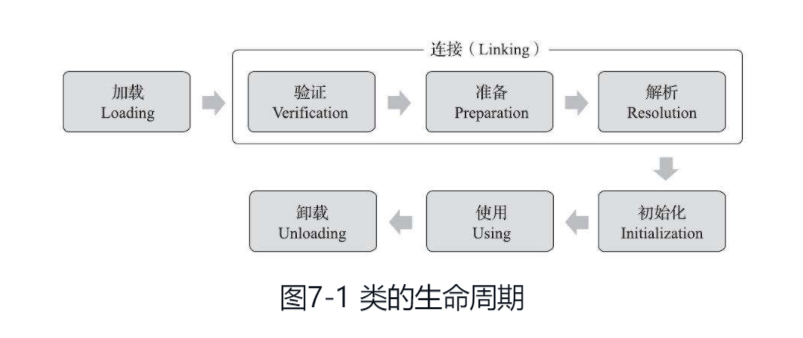
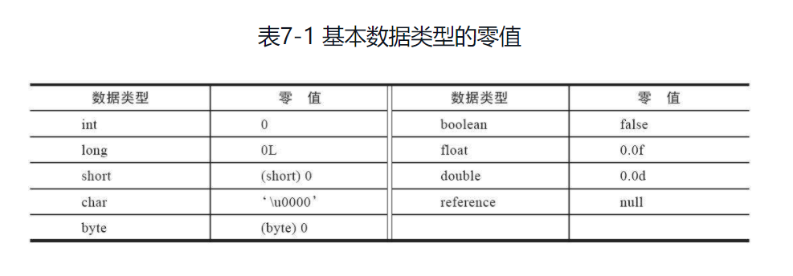
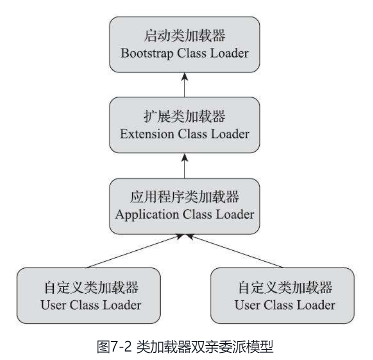

# 一、概述
{: id="20201229150349-dpi9bfr"}

**Java 虚拟机把描述类的数据从 Class 文件加载到内存，并对数据进行校验、转换解析和初始化，最终形成可以被虚拟机直接使用的 Java 类型，这个过程被称作虚拟机的类加载机制。** 与那些在编译时需要进行连接的语言不同，在 Java 语言里面，类型的加载、连接和初始化过程都是在程序运行期间完成的，这种策略让 Java 语言进行提前编译会面临额外的困难，也会让类加载时稍微增加一些性能开销，但是却为 Java 应用提供了极高的扩展性和灵活性，Java 天生可以动态扩展的语言特性就是依赖运行期动态加载和动态连接这个特点实现的。
{: id="20201229150429-7d5so5f"}

# 二、类加载时机
{: id="20201229150725-0c675de"}

一个类型从被加载到虚拟机内存中开始，到卸载出内存为止，它的整个生命周期将会经历加载（Loading）、验证（Verification）、准备（Preparation）、解析（Resolution）、初始化（Initialization）、使用（Using）和卸载（Unloading）七个阶段，其中验证、准备、解析三个部分统称为连接（Linking）。这七个阶段的发生顺序如图 7-1 所示。
{: id="20201229150741-25x64b1"}


{: id="20201229150753-12cnmnj"}

其中，加载、验证、准备、初始化和卸载这五个阶段的顺序是确定的，类型的加载过程必须按照这种顺序按部就班地开始，而解析阶段则不一定：它在某些情况下可以在初始化阶段之后再开始，这是为了支持 Java 语言的运行时绑定特性（也称为动态绑定或晚期绑定）。
{: id="20201229153757-jnsaro3"}

对于初始化阶段，《Java 虚拟机规范》则是严格规定了 **有且只有六种情况必须立即对类进行“初始化”** （而加载、验证、准备自然需要在此之前开始）：
{: id="20201229153808-3fv4iz1"}

**（1）** **遇到 new、getstatic、putstatic 或 invokestatic 这四条字节码指令时，如果类型没有进行过初始化，则需要先触发其初始化阶段。能够生成这四条指令的典型 Java 代码场景有：**
{: id="20201229153915-ec7468a"}

- {: id="20201229154102-f44w0rf"}使用 new 关键字实例化对象的时候。
- {: id="20201229154113-yglvrt1"}读取或设置一个类型的静态字段（被 final 修饰、已在编译器把结果放入常量池的静态字段除外）的时候。
- {: id="20201229154159-89vj0ra"}调用一个类型的静态方法的时候。
{: id="20201229154058-oj0vtvo"}

**（2）** **使用 java.lang.reflect 包的方法对类型进行反射调用的时候，如果类型没有进行初始化，则需要先触发其初始化。**
{: id="20201229154212-cz5l2de"}

**（3）** **当初始化类的时候，如果发现其父类还没有进行过初始化，则需要先触发其父类的初始化。**
{: id="20201229154305-ri8d3ue"}

**（4）** **当虚拟机启动时，用户需要指定一个要执行的主类（包含 main() 方法的那个类），虚拟机会先初始化这个类。**
{: id="20201229154345-zsxrgzn"}

**（5）** **当使用 JDK 7 新加入的动态语言支持时，如果一个 java.lang.invoke.MethodHandle 实例最后的解析结果为 REF_getStatic、REF_putStatic、REF_invokeStatic、REF_newInvokeSpecial 四种类型的方法句柄，并且这个方法句柄对应的类没有进行过初始化，则需要先触发其初始化。**
{: id="20201229154449-nhgzjsj"}

**（6）** **当一个接口中定义了 JDK 8 新加入的默认方法（被 default 关键字修饰的接口方法）时，如果有这个接口的实现类发生了初始化，那该接口要在其之前被初始化。**
{: id="20201229154500-i4bh32w"}

对于这六种会触发类型进行初始化的场景，《Java 虚拟机规范》中使用了一个非常强烈的限定语——“有且只有”，这六种场景中的行为称为对一个类型进行主动引用。除此之外，所有引用类型的方式都不会触发初始化，称为被动引用。
{: id="20201229154634-txbzfsp"}

接口的加载过程与类加载过程稍有不同，针对接口需要做一些特殊说明：接口也有初始化过程，这点与类是一致的，上面的代码都是用静态语句块“static{}”来输出初始化信息的，而接口中不能使用“static{}”语句块，但编译器仍然会为接口生成“`<clinit()>`”类构造器，用于初始化接口中所定义的成员变量。 **接口与类真正有所区别的是前面讲述的六种“有且仅有”需要触发初始化场景中的第三种：当一个类在初始化时，要求其父类全部都已经初始化过了，但是一个接口在初始化时，并不要求其父接口全部都完成了初始化，只有在真正使用到父接口的时候（如引用接口中定义的常量）才会初始化。**
{: id="20201229154636-k87vws9"}

# 三、类加载过程
{: id="20201229160007-4ii9lxx"}

### 3.1 加载
{: id="20201229160012-vb3hst2"}

“加载”（Loading）阶段是整个“类加载”（Class Loading）过程中的一个阶段，希望读者没有混淆这两个看起来很相似的名词。在加载阶段，Java 虚拟机需要完成以下三件事情：
{: id="20201229160047-3488aik"}

**（1）** 通过一个类的全限定名来获取定义此类的二进制字节流。
{: id="20201229160056-x4sqzrl"}

**（2）** 将这个字节流所代表的静态存储结构转化为方法区的运行时数据结构。
{: id="20201229160121-ncuaqys"}

**（3）** 在内存中生成一个代表这个类的 java.lang.Class 对象，作为方法区这个类的各种数据的访问入口。
{: id="20201229160125-jr94x61"}

**注意：** 对于数组类而言，情况就有所不同，数组类本身不通过类加载器创建，它是由 Java 虚拟机直接在内存中动态构造出来的。
{: id="20201229160417-287dy85"}

加载阶段结束后，Java 虚拟机外部的二进制字节流就按照虚拟机所设定的格式存储在方法区之中了，方法区中的数据存储格式完全由虚拟机实现自行定义，《Java 虚拟机规范》未规定此区域的具体数据结构。类型数据妥善安置在方法区之后，会在 Java 堆内存中实例化一个 java.lang.Class 类的对象，这个对象将作为程序访问方法区中的类型数据的外部接口。
{: id="20201229160435-jrfzxri"}

### 3.2 验证
{: id="20201229160709-jwgiy8l"}

验证是连接阶段的第一步，这一阶段的目的是确保 Class 文件的字节流中包含的信息符合《Java 虚拟机规范》的全部约束要求，保证这些信息被当作代码运行后不会危害虚拟机自身的安全。
{: id="20201229160717-9gtmm4n"}

验证阶段大致上会完成下面四个阶段的检验动作：文件格式验证、元数据验证、字节码验证和符号引用验证。
{: id="20201229160725-bb68is0"}

##### 1. 文件格式验证
{: id="20201229160800-hd1wcqd"}

第一阶段要验证字节流是否符合 Class 文件格式的规范，并且能被当前版本的虚拟机处理。这一阶段可能包括下面这些验证点：
{: id="20201229160812-bx77oen"}

- {: id="20201229160826-11l6gxd"}是否以魔数 0xCAFEBABE 开头。
- {: id="20201229160826-d2yinyl"}主、次版本号是否在当前 Java 虚拟机接受范围之内。
- {: id="20201229160832-6mk2oao"}常量池的常量中是否有不被支持的常量类型（检查常量 tag 标志）。
- {: id="20201229160851-fxfcqw3"}....
{: id="20201229160821-s4tvw86"}

##### 2. 元数据验证
{: id="20201229160854-jcgq2he"}

第二阶段是对字节码描述的信息进行语义分析，以保证其描述的信息符合《Java 语言规范》的要求，这个阶段可能包括的验证点如下：
{: id="20201229161034-lk3uv7u"}

- {: id="20201229161049-jx08mce"}这个类是否有父类（除了 java.lang.Object 之外，所有的类都应当有父类）。
- {: id="20201229161050-hny7nvq"}这个类的父类是否继承了不允许被继承的类（被 final 修饰的类）。
- {: id="20201229161055-0vnb12s"}如果这个类不是抽象类，是否实现了其父类或接口之中要求实现的所有方法。
- {: id="20201229161101-y1sc8yb"}类中的字段、方法是否与父类产生矛盾（例如覆盖了父类的 final 字段，或者出现不符合规则的方法重载，例如方法参数都一致，但返回值类型却不同等）。
- {: id="20201229161110-msu9thb"}...
{: id="20201229161040-cfbbupc"}

第二阶段的主要目的是对类的元数据信息进行语义校验，保证不存在与《Java 语言规范》定义相悖的元数据信息。
{: id="20201229161114-gkmcy7y"}

##### 3. 字节码验证
{: id="20201229161139-i3xhhb2"}

第三阶段是整个验证过程中最复杂的一个阶段，主要目的是通过数据流分析和控制流分析，确定程序语义是合法的、符合逻辑的。例如：
{: id="20201229161149-p2ko0tz"}

- {: id="20201229161229-wx1ud5c"}保证任意时刻操作数栈的数据类型与指令代码序列都能配合工作，例如不会出现类似于“在操作栈放置了一个 int 类型的数据，使用时却按 long 类型来加载入本地变量表中”这样的情况。
- {: id="20201229161229-wfng1qv"}保证方法体中的类型转换总是有效的，例如可以把一个子类对象赋值给父类数据类型，这是安全的，但是把父类对象赋值给子类数据类型，甚至把对象赋值给与它毫无继承关系、完全不相干的一个数据类型，则是危险和不合法的。
- {: id="20201229161240-6ewnqqp"}...
{: id="20201229161212-uba7ngf"}

由于数据流分析和控制流分析的高度复杂性，Java 虚拟机的设计团队为了避免过多的执行时间消耗在字节码验证阶段中，在 JDK 6 之后的 Javac 编译器和 Java 虚拟机里进行了一项联合优化，把尽可能多的校验辅助措施挪到 Javac 编译器里进行。
{: id="20201229161244-cckpps9"}

##### 4. 符号引用验证
{: id="20201229161303-g8ydqkh"}

最后一个阶段的校验行为发生在虚拟机将符号引用转化为直接引用的时候，这个转化动作将在连接的第三阶段——解析阶段中发生。
{: id="20201229161308-vb8xsg3"}

符号引用验证可以看作是对类自身以外（常量池中的各种符号引用）的各类信息进行匹配性校验，通俗来说就是，该类是否缺少或者被禁止访问它依赖的某些外部类、方法、字段等资源。本阶段通常需要校验下列内容：
{: id="20201229161319-z3gj7ab"}

- {: id="20201229161341-8rt8hsd"}符号引用中通过字符串描述的全限定名是否能找到对应的类。
- {: id="20201229161341-c5bq8cs"}在指定类中是否存在符合方法的字段描述符及简单名称所描述的方法和字段。
- {: id="20201229161403-vaou7qi"}符号引用中的类、字段、方法的可访问性（private、protected、public、<package>）是否可被当前类访问。
- {: id="20201229161409-j08oung"}....
{: id="20201229161334-7byqgvl"}

验证阶段对于虚拟机的类加载机制来说，是一个非常重要的、但却不是必须要执行的阶段，因为验证阶段只有通过或者不通过的差别，只要通过了验证，其后就对程序运行期没有任何影响了。如果程序运行的全部代码（包括自己编写的、第三方包中的、从外部加载的、动态生成的等所有代码）都已经被反复使用和验证过，在生产环境的实施阶段就可以考虑使用-Xverify：none 参数来关闭大部分的类验证措施，以缩短虚拟机类加载的时间。
{: id="20201229161414-0cpi3hq"}

### 3.3 准备
{: id="20201229161157-99olo5v"}

**准备阶段是正式为类中定义的变量（即静态变量，被 static 修饰的变量）分配内存并设置类变量初始值的阶段，** 关于准备阶段，还有两个容易产生混淆的概念笔者需要着重强调，**首先是这时候进行内存分配的仅包括类变量，而不包括实例变量，实例变量将会在对象实例化时随着对象一起分配在 Java 堆中。** 其次是这里所说的初始值“通常情况”下是数据类型的零值，假设一个类变量的定义为：
{: id="20201229161443-ihdgr1p"}

```java
private static int value = 123;
```
{: id="20201229161615-8b09zza"}

**那变量 value 在准备阶段过后的初始值为 0 而不是 123，** 因为这时尚未开始执行任何 Java 方法，而把 value 赋值为 123 的 putstatic 指令是程序被编译后，存放于类构造器<clinit>()方法之中，**所以把 value 赋值为 123 的动作要到类的初始化阶段才会被执行。**
{: id="20201229161438-e4lrfog"}


{: id="20201229161706-z9csp9o"}

如果类字段的字段属性表中存在 ConstantValue 属性，那在准备阶段变量值就会被初始化为 ConstantValue 属性所指定的初始值，假设上面类变量 value 的定义修改为：
{: id="20201229161735-gr7wuqi"}

```java
private static final int value = 123;
```
{: id="20201229161810-ouetrht"}

**编译时 Javac 将会为 value 生成 ConstantValue 属性，在准备阶段虚拟机就会根据 Con-stantValue 的设置将 value 赋值为 123。**
{: id="20201229161824-z21denb"}

### 3.4 解析
{: id="20201229161834-xnvwvv3"}

解析阶段是 Java 虚拟机将常量池内的符号引用替换为直接引用的过程，符号引用在第 6 章讲解 Class 文件格式的时候已经出现过多次，在 Class 文件中它以 CONSTANT_Class_info、CONSTANT_Fieldref_info、CONSTANT_Methodref_info 等类型的常量出现，那解析阶段中所说的直接引用与符号引用又有什么关联呢？
{: id="20201229161842-ra7c7bs"}

- {: id="20201229161955-a9u5sq2"}符号引用（Symbolic References）：符号引用以一组符号来描述所引用的目标，符号可以是任何形式的字面量，只要使用时能无歧义地定位到目标即可。符号引用与虚拟机实现的内存布局无关，引用的目标并不一定是已经加载到虚拟机内存当中的内容。各种虚拟机实现的内存布局可以各不相同，但是它们能接受的符号引用必须都是一致的，因为符号引用的字面量形式明确定义在《Java 虚拟机规范》的 Class 文件格式中。
- {: id="20201229161955-q05079p"}直接引用（Direct References）：直接引用是可以直接指向目标的指针、相对偏移量或者是一个能间接定位到目标的句柄。直接引用是和虚拟机实现的内存布局直接相关的，同一个符号引用在不同虚拟机实例上翻译出来的直接引用一般不会相同。如果有了直接引用，那引用的目标必定已经在虚拟机的内存中存在。
{: id="20201229161948-yebixwd"}

### 3.5 初始化
{: id="20201229162002-w7progb"}

类的初始化阶段是类加载过程的最后一个步骤，之前介绍的几个类加载的动作里，除了在加载阶段用户应用程序可以通过自定义类加载器的方式局部参与外，其余动作都完全由 Java 虚拟机来主导控制。直到初始化阶段，Java 虚拟机才真正开始执行类中编写的 Java 程序代码，将主导权移交给应用程序。
{: id="20201229195005-qh74en6"}

初始化阶段就是执行类构造器 `<clinit>()` 方法的过程。`<clinit>()` 并不是程序员在 Java 代码中直接编写的方法，它是 Javac 编译器的自动生成物，但我们非常有必要了解这个方法具体是如何产生的，以及 `<clinit>()` 方法执行过程中各种可能会影响程序运行行为的细节，这部分比起其他类加载过程更贴近于普通的程序开发人员的实际工作。
{: id="20201229195016-hljzdd4"}

- {: id="20201229195758-hjj8344"}`<clinit>()` 方法是由编译器自动收集类中的所有类变量的赋值动作和静态语句块（static{}块）中的语句合并产生的，编译器收集的顺序是由语句在源文件中出现的顺序决定的， **静态语句块中只能访问到定义在静态语句块之前的变量，定义在它之后的变量，在前面的静态语句块可以赋值，但是不能访问。**
- {: id="20201229195803-kt8a8go"}`<clinit>()` 方法与类的构造函数（即在虚拟机视角中的实例构造器  `init()` 方法）不同，它不需要显式地调用父类构造器，Java 虚拟机会保证在子类的 <clinit>()方法执行前，父类的 `<clinit>()` 方法已经执行完毕。因此在 Java 虚拟机中第一个被执行的 `<clinit>()` 方法的类型肯定是 java.lang.Object。
- {: id="20201229195844-65r1dvb"}由于父类的 `<clinit>()` 方法先执行，也就意味着父类中定义的静态语句块要优先于子类的变量赋值操作。
- {: id="20201229200051-5w1t8ze"}接口中不能使用静态语句块，但仍然有变量初始化的赋值操作，因此接口与类一样都会生成 `<clinit>()` 方法。但接口与类不同的是，执行接口的 `<clinit>()` 方法不需要先执行父接口的 `<clinit>()` 方法，因为只有当父接口中定义的变量被使用时，父接口才会被初始化。此外，接口的实现类在初始化时也一样不会执行接口的 `<clinit>()` 方法。
- {: id="20201229200141-2en9h6v"}Java 虚拟机必须保证一个类的 `<clinit>()` 方法在多线程环境中被正确地加锁同步，如果多个线程同时去初始化一个类，那么只会有其中一个线程去执行这个类的 `<clinit>()` 方法，其他线程都需要阻塞等待，直到活动线程执行完毕<clinit>()方法。如果在一个类的 `<clinit>()` 方法中有耗时很长的操作，那就可能造成多个进程阻塞，在实际应用中这种阻塞往往是很隐蔽的。
{: id="20201229195314-ux57s5o"}

# 四、类加载器
{: id="20201229195434-1spz7ck"}

Java 虚拟机设计团队有意把类加载阶段中的“通过一个类的全限定名来获取描述该类的二进制字节流”这个动作放到 Java 虚拟机外部去实现，以便让应用程序自己决定如何去获取所需的类。实现这个动作的代码被称为“类加载器”（ClassLoader）。类加载器可以说是 Java 语言的一项创新，它是早期 Java 语言能够快速流行的重要原因之一。类加载器最初是为了满足 Java Applet 的需求而设计出来的，在今天用在浏览器上的 Java Applet 技术基本上已经被淘汰，但类加载器却在类层次划分、OSGi、程序热部署、代码加密等领域大放异彩，成为 Java 技术体系中一块重要的基石，可谓是失之桑榆，收之东隅。
{: id="20201229201516-sd82fb4"}

### 4.1 类与类加载器
{: id="20201229201544-ncn8lb6"}

**类加载器虽然只用于实现类的加载动作，但它在 Java 程序中起到的作用却远超类加载阶段。对于任意一个类，都必须由加载它的类加载器和这个类本身一起共同确立其在 Java 虚拟机中的唯一性，每一个类加载器，都拥有一个独立的类名称空间。这句话可以表达得更通俗一些：比较两个类是否“相等”，只有在这两个类是由同一个类加载器加载的前提下才有意义，否则，即使这两个类来源于同一个 Class 文件，被同一个 Java 虚拟机加载，只要加载它们的类加载器不同，那这两个类就必定不相等。**
{: id="20201229201628-zdg662s"}

这里所指的“相等”，包括代表类的 Class 对象的 equals()方法、isAssignableFrom()方法、isInstance()方法的返回结果，也包括了使用 instanceof 关键字做对象所属关系判定等各种情况。
{: id="20201229201653-iaou7vo"}

### 4.2 双亲委派模型
{: id="20201230094909-ny02765"}

**站在 Java 虚拟机的角度来看，只存在两种不同的类加载器：一种是启动类加载器（Bootstrap ClassLoader），这个类加载器使用 C++ 语言实现，是虚拟机自身的一部分；另外一种就是其他所有的类加载器，这些类加载器都由 Java 语言实现，独立存在于虚拟机外部，并且全都继承自抽象类 java.lang.ClassLoader。**
{: id="20201230094936-r3feeth"}

- {: id="20201230095047-pf1a8fk"}**启动类加载器（Bootstrap Class Loader）**：前面已经介绍过，这个类加载器负责加载存放在 <JAVA_HOME>\lib 目录，或者被-Xbootclasspath 参数所指定的路径中存放的，而且是 Java 虚拟机能够识别的（按照文件名识别，如 rt.jar、tools.jar，名字不符合的类库即使放在 lib 目录中也不会被加载）类库加载到虚拟机的内存中。
- {: id="20201230095055-ukziwoc"}**扩展类加载器（Extension Class Loader）**：这个类加载器是在类 sun.misc.Launcher$ExtClassLoader 中以 Java 代码的形式实现的。它负责加载 <JAVA_HOME>\lib\ext 目录中，或者被 java.ext.dirs 系统变量所指定的路径中所有的类库。
- {: id="20201230095137-fqvgsao"}**应用程序类加载器（Application Class Loader）**：这个类加载器由 sun.misc.Launcher$AppClassLoader 来实现。由于应用程序类加载器是 ClassLoader 类中的 getSystem-ClassLoader()方法的返回值，所以有些场合中也称它为“系统类加载器”。它负责加载用户类路径（ClassPath）上所有的类库，开发者同样可以直接在代码中使用这个类加载器。 **如果应用程序中没有自定义过自己的类加载器，一般情况下这个就是程序中默认的类加载器。**
{: id="20201230095132-anlwual"}


{: id="20201230095226-i2fl50m"}

{: id="20201230095350-1iv016p"}

{: id="20201230095350-k9a9igq"}
