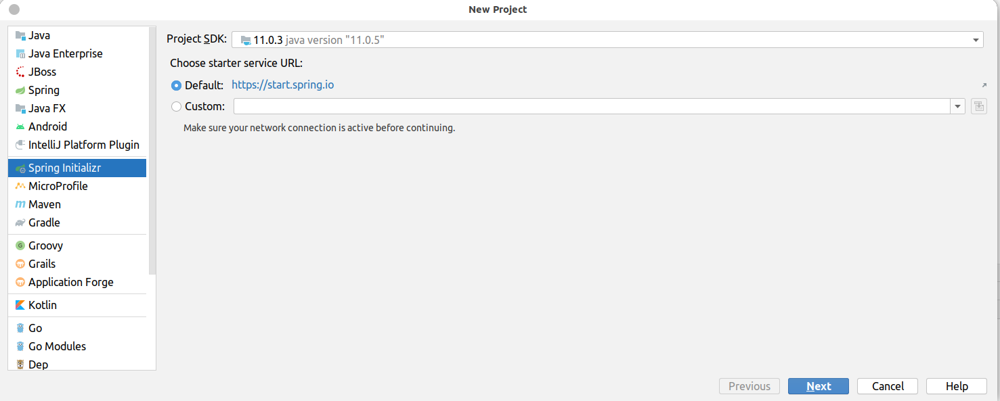

# 前言
{: id="20201012204945-qycrbnq"}

本篇文章主要记录一下在IDEA中运行SpringBoot项目的一些技巧，主要包括两个小技巧，第一个小技巧：以不同端口号多次运行一个SpringBoot项目；第二个小技巧，将多个SpringBoot项目运行在services管理界面，这样更加方便管理。
{: id="20201012204946-t7hx03j"}

# 小技巧一：以不同的端口号同时运行同一个SpringBoot项目
{: id="20201012210413-a21os4k"}

### 1. 创建一个SpringBoot项目
{: id="20201012210445-jalvkju"}

创建过程很简单，在IDEA中，依次点击Fiel -> New -> Project 然后进入下面的界面即可创建SpringBoot项目了
{: id="20201012210507-i7hodkg"}

{: id="20201012210937-i5dnpsa"}

### 2. 配置
{: id="20201012210956-83th3dt"}
